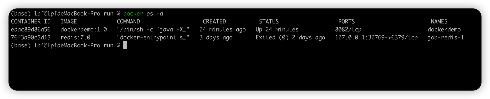
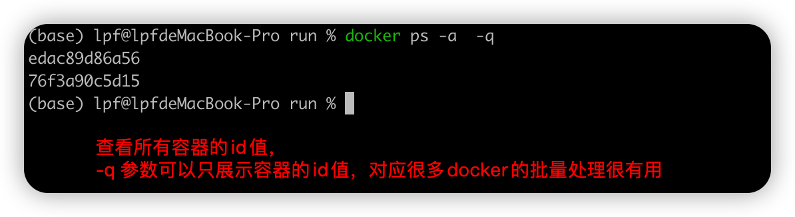
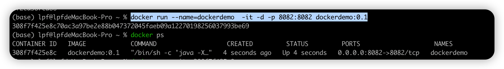
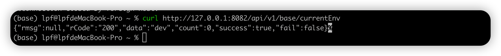
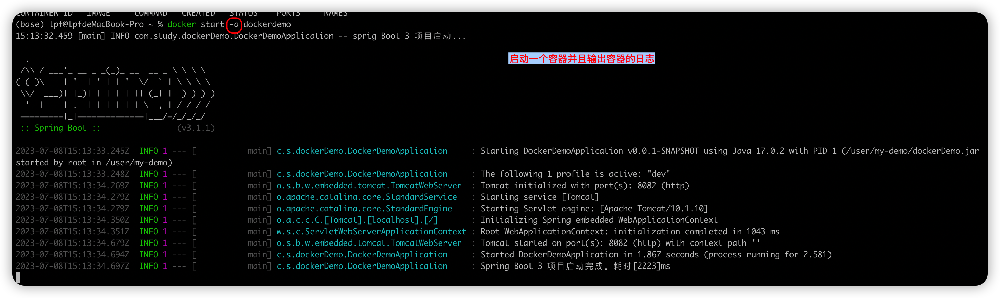
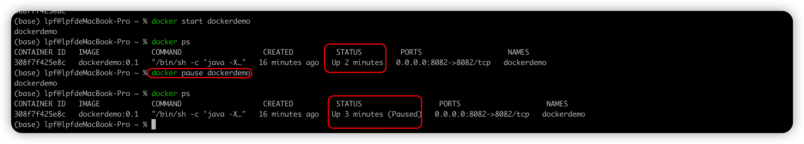

# docker 相关命令

## 镜像相关的命令

```shell
查看相关的镜像信息
    docker images

根据镜像id值删除相关的镜像
    docker rmi 镜像id值

根据镜像名和标签名来删除镜像
    docker rmi 镜像名:标签名
```

## 容器相关的命令

- 查看正在运行的镜像

  ```shell
    docker ps
  ```

  

- 查看所有的容器信息（包括正在运行和未运行的容器）

  ```shell
      docker ps -a
  ```

  

- 查看所有容器的 id 值

  ```shell
    docker ps -a -q
  ```

  
  这里的-q 参数支持只展示 id 值，对于很多的 docker 批处理命令是很有用的。

* 通过镜像启动一个容器 （该容器第一次生成）

  ```shell
  docker run --name=dockerdemo  -it -d -p 8082:8082 dockerdemo:0.1

  # docker run --name 设置容器名 -it -d -p [宿主机端口号]:[容器启动端口号] 要启动的镜像
  #-d 作用在镜像启动之后不进入容器内部，使容器在后台运行
  #-i 交互式操作
  #-t 终端
  #/bin/bash 为了希望存在一个交互式的shell （可以不写）
  ```

  
  通过 curl 命令查看 docker 容器是否运行成功  
  这里 docker 容器里面是一个 springboot3 的项目
  

* 进入容器内部

```shell
  docker exec -it [容器 id/容器名称] /bin/bash
```

```text
我们需要了解Docker容器的状态。Docker容器可以有三种状态：

Running: 容器正在运行中。
Exited: 容器已经停止运行。
Paused: 容器处于被暂停的状态。

```

- docker 直接启动一个容器

```shell
  docker start 308f7f425e8c
  # docker start 容器id 或者容器名称， 启动之后会返回一个该docker的容器id值
```


通过-a 参数，docker 启动一个容器并且打印 docker 容器的日志


- docker 停止一个容器正在运行或者暂停状态的容器)

```shell
    $> docker stop 容器名或者容器id
```

- docker 恢复一个正在运行的容器

```shell
    $> docker unpause my_container
```

- docker 暂停一个正在运行的容器

```shell
  docker pause 容器名
```

  

## docker search 搜索相关命令

##
