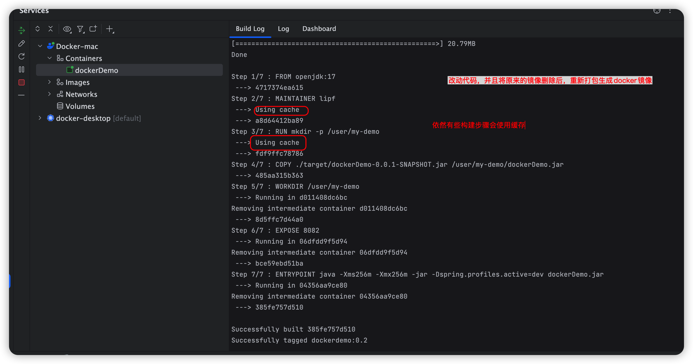

# idea2023 整合 docker 完成 springboot3 项目的部署和更新

1. 配置 idea 连接 docker 服务
   
   打开配置面版，配置 idea 连接 mac 系统上面的 docker 应用。

前提： 需要先将 mac 系统中的 docker 应用启动起来


配置连接 idea 的详细信息


通过上面的配置后，我们可以在 idea 的 Services 面版来直接操作 docker


2. 编写 Dockerfile 来定义生成镜像的规则以及后续容器启动时执行的命令，相关内容如下

```Dockerfile
FROM openjdk:17
# 指定作者
MAINTAINER lipf

RUN mkdir -p /user/my-demo

COPY ./target/dockerDemo-0.0.1-SNAPSHOT.jar /user/my-demo/dockerDemo.jar

# 指定工作路径，下面ENTRYPOINT中命令执行所在的位置
WORKDIR /user/my-demo

EXPOSE 8082

ENTRYPOINT java -Xms256m -Xmx256m -jar -Dspring.profiles.active=dev dockerDemo.jar

```

3. 配置 Configuration
   选中 Dockerfile 文件，然后右键，选择[Modify Run Configuration]
   

具体的内容如下

其中 Command 的值为：

```shell
docker stop dockerdemo && docker rm dockerdemo && docker build . --tag dockerdemo:0.2 && docker run --name=dockerdemo  -it -d -p 8082:8082 dockerdemo:0.2

## 1. 这里先将运行的容器停止，
## 2 然后删除容器
## 3. 根据Dockerfile文件构建新的镜像
## 4. 启动镜像来生成新的容器
```

定义构建 docker 镜像前的操作


接下来，右键 Dockerfile 来执行 docker 镜像的构建操作，


通过命令查看生成的镜像以及启动的容器


接下来，我们修改代码，然后重新生成 docker 镜像并启动容器，查看情况。

修改代码之后，我们重新生成相关的 docker 镜像并且运行成功


## 注意：

1. 如果代码没有改动，重新生成 docker 镜像，是不会重新生成的，新镜像的 id 值是不变的。
   

## 改进

1. 重新打包后，可以看到老的镜像依然存在只不过 tag 和 REPOSITORY 都是〈none〉
   解决办法：每次重新打包之前，都将原来的镜像删除掉。
   修改后命令如下

   ```shell
   docker stop dockerdemo && docker rm dockerdemo && docker rmi dockerdemo:02 && docker build . --tag dockerdemo:0.2 && docker run --name=dockerdemo  -it -d -p 8082:8082 dockerdemo:0.2
   ```

   代码不变的情况下，即使将镜像删除，成功生成镜像，还是会使用 cache，性能很好
   

   问题还是没有解决

相关代码参考 dockerDemo 的 tag 为 tag-0.1 时的代码
