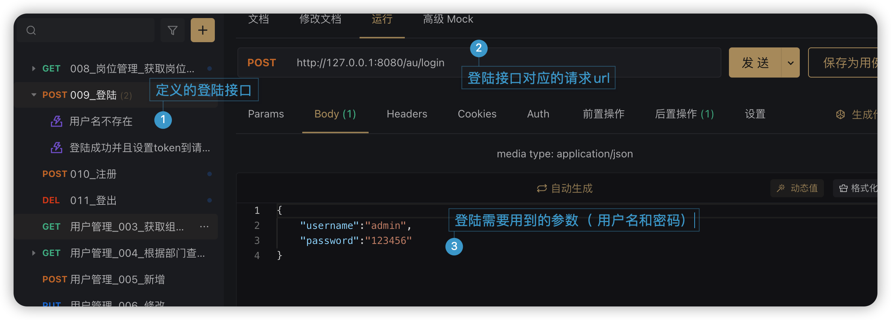
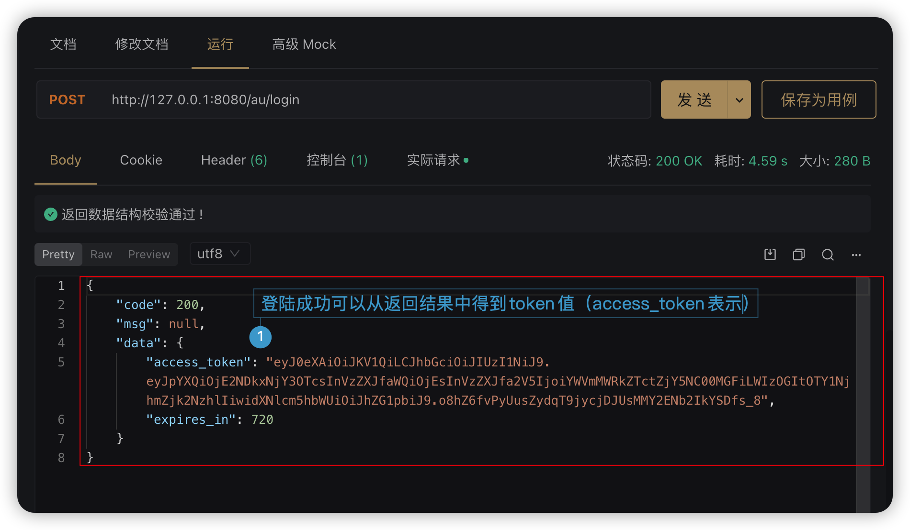
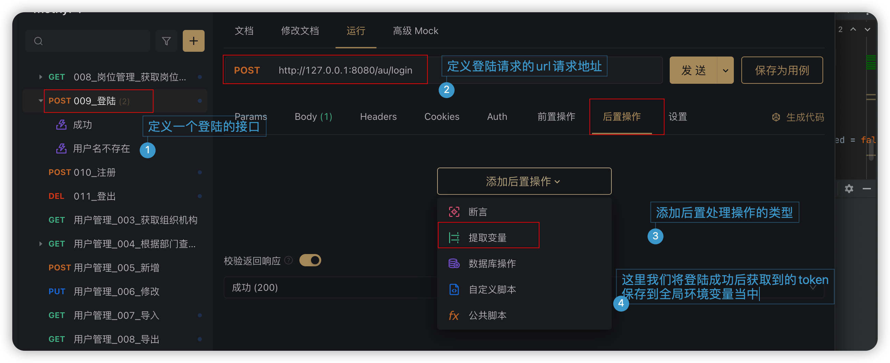
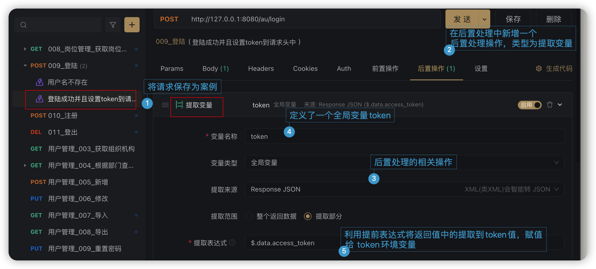
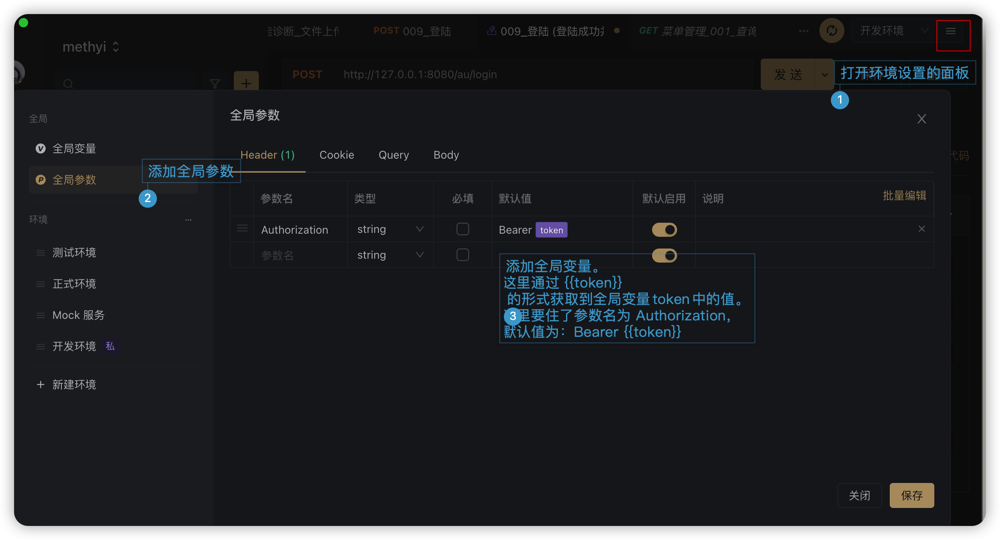

# Apifox 软件的使用

## 接口定义

### 利用后置处理去将登陆的到的token保存到全局参数参数的请求头中

1. 定义一个登陆接口，如下图

   

2. 验证该登陆接口可以正确获取到token值

   

3. 对该请求添加后置处理器，提前返回值的token值到token变量当中

   添加一个后置处理操作

   

   通过后置处理提前返回值中的值到全局变量中。 

   

4. 在全局参数设置中， 通过 {{token}} 获取全局变量token的取值。

   

## 备注

apifox的帮助文档

https://www.apifox.cn/help/    

