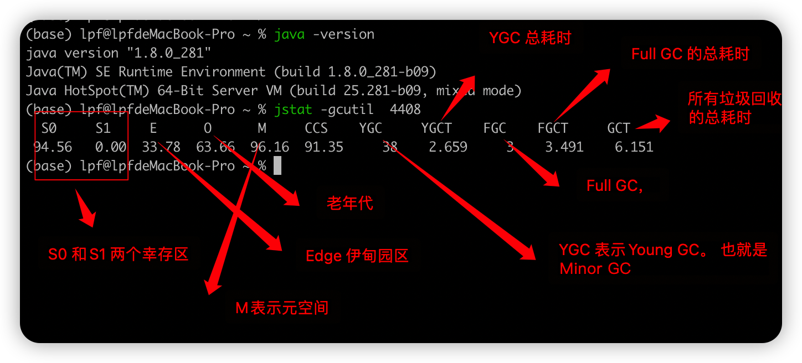
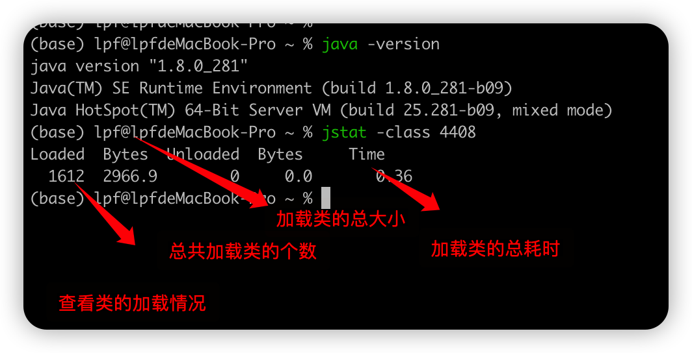

# JDK自带工具的使用


## jstat 虚拟机统计信息监视工具

jstat 查看虚拟机的统计信息： 主要分为三类： 类加载， 垃圾收集，运行期编译状况


下面的命令查看垃圾收集的相关信息
```shell
  jstat -gcutil  LVMID
```



下面的命令查看类加载的统计信息
```shell
  jstat -class LVMID 
```



综上，jstat命令的使用命令如下：
jstat [option vmid [inteval] [s|ms] [count]]


