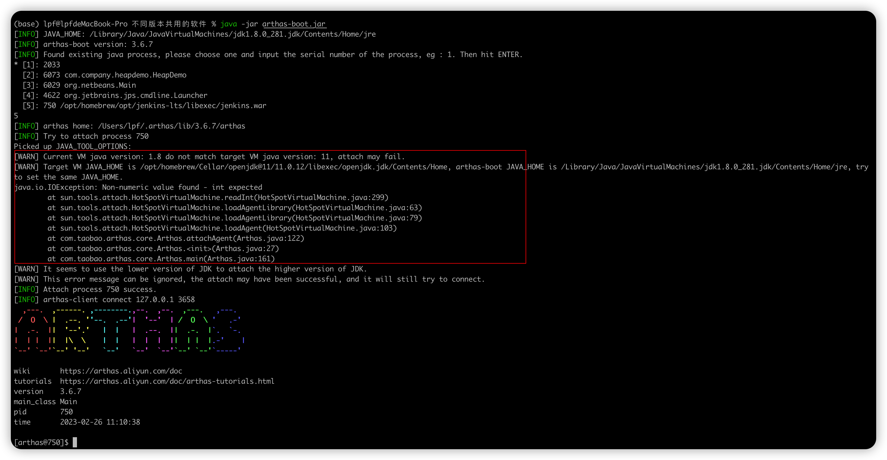

# Arthas的使用

Arthas（阿尔萨斯） 是Alibaba开源的Java诊断工具

## 下载
wget https://arthas.aliyun.com/arthas-boot.jar --no-check-certificate


## 遇到的问题
* 启动时报错
  
  ```
    Target VM JAVA_HOME is /opt/homebrew/Cellar/openjdk@11/11.0.12/   
     libexec/openjdk.jdk/Contents/Home, arthas-boot JAVA_HOME is /  
    Library/Java/JavaVirtualMachines/jdk1.8.0_281.jdk/Contents/Home/jre,
    try to set the same JAVA_HOME.
    java.io.IOException: Non-numeric value found - int expected
  ```


## 版本变化
20230226 星期日开始学习使用Arthas 来监控jvm的运行情况


TODO
* 以 Java Agent 的方式启动  通过agent方式启动的时候，找不到 arthas-agent.jar 
  * 2023-02-28 
* 通过select功能选择 attach 的进程  
  * 没有操作成功
* 