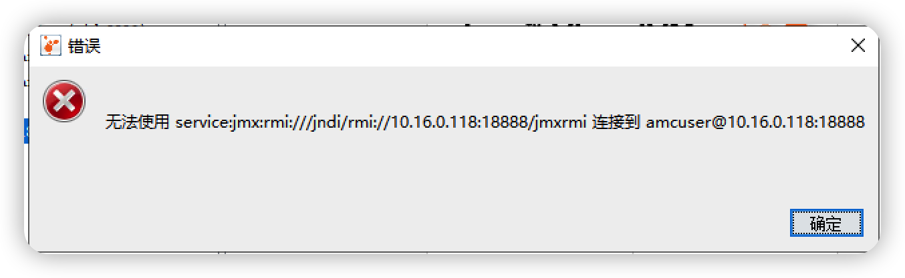

```shell
java -jar -Djava.rmi.server.hostname=远程服务ip  -Dcom.sun.management.jmxremote.port=18888  -Dcom.sun.management.jmxremote=true -Dcom.sunmanagement.jmxremote.ssl=false -Dcom.sun.managementote.ssl=false -Dcom.sun.management.jmxremote.authenticate=false  xxx.jar


nohup java -jar -Djava.rmi.server.hostname=10.16.0.118  -Dcom.sun.management.jmxremote.port=18888  -Dcom.sun.management.jmxremote=true -Dcom.sunmanagement.jmxremote.ssl=false -Dcom.sun.managementote.ssl=false -Dcom.sun.management.jmxremote.authenticate=false  ts-biz-0.0.1-SNAPSHOT.jar >2>1&ts-biz.log & 
```



```
  无法使用 service:jmx:rmi///jndi/rmi://ip:端口/jmxrmi 连接到
```

