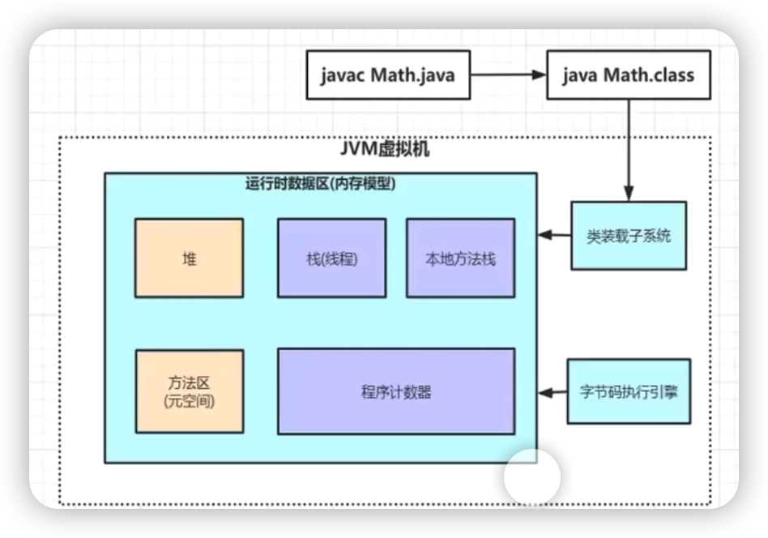
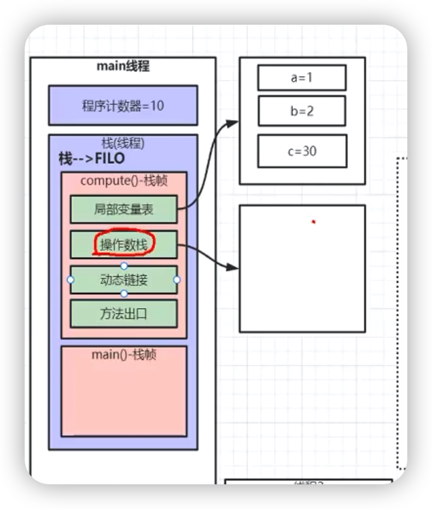
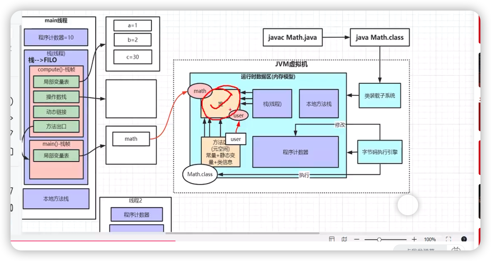
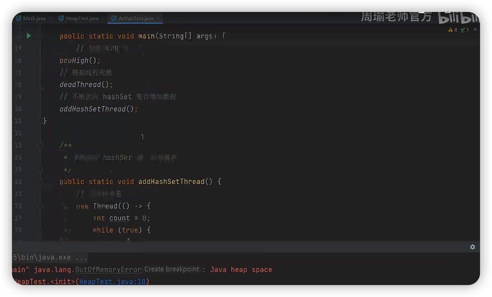
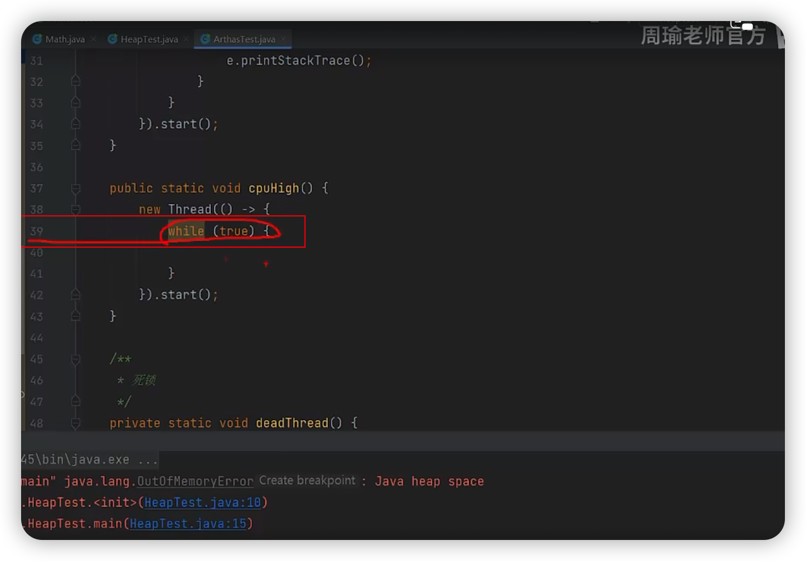
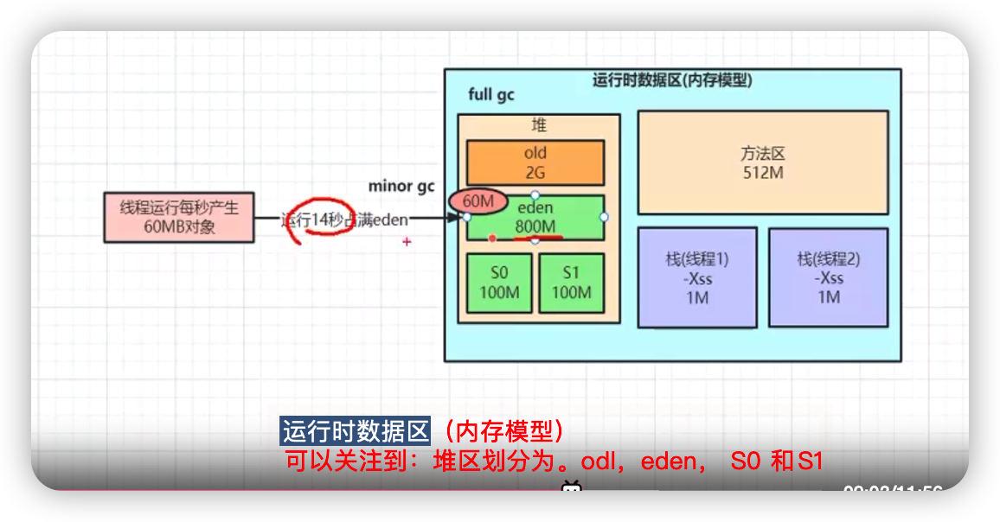
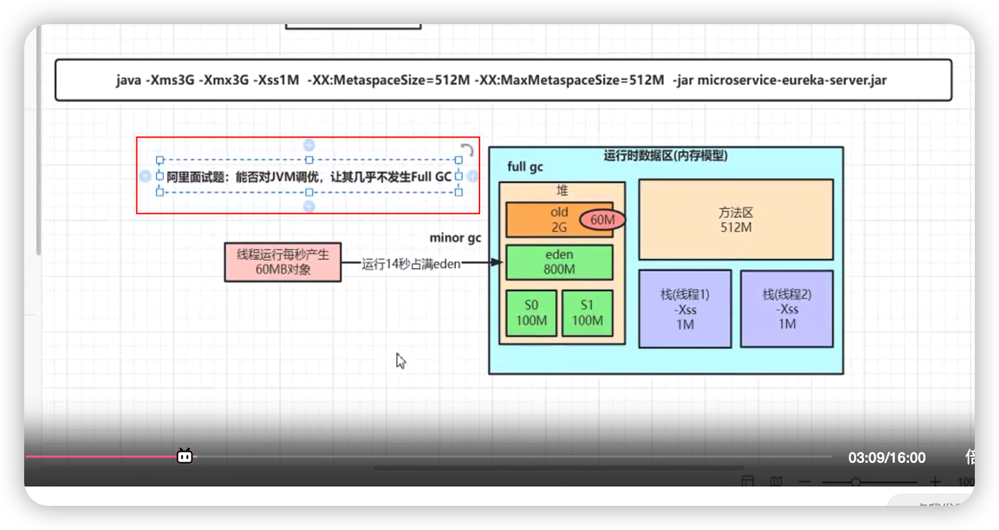
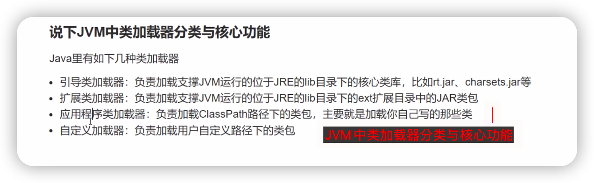

# 图灵学院的JVM

基于JDK8 进行讲解

## 课程内容：
* 深入字节码剖析Java虚拟机内存模型
* 面试必问的JVM垃圾收集机制详解
* 从蚂蚁金服面试题窥探STW机制
* 阿里巴巴内部JVM调优工具Arthas详解
* 双十一亿级电商网站JVM参数调优实战
* 单机几十万并发的系统化JVM如何优化
* 垃圾收集器CMS&G1&ZGC设计原理详解
* 深入Hotspot源码理解CMS&G1&ZGC的区别
* 动手实战优化自己公司线上系统JVM


## JVM8 的内存模型
JVM8的内存结构


JVM8内存结构中属于线程的内存结构

   通过javap -c 反编译一个class文件，对某个方法的字节码进行分析
对下面的方法进行反编译
```java
  public class HelloMath {
    
    public static final int initData = 666;
    User user = new User();
    /**
     * 一个方法对应一块栈帧内存区域
     * @return
     */
    public int compute(){
        int a = 1;
        int b = 2;
        int c = (a + b) * 10;
        return c;
    }
    
    public static void main(String[] args) {
        HelloMath math = new HelloMath();
        math.compute();
        System.out.println("end");
    }
}
```

将符号引用转变为直接地址引用 （借助于 特定线程中内存模型的[动态连接]）

* 本地方法栈 执行的是java中被native 修饰的方法。是一套专门开辟的内存空间。 
* 本地方法栈，每个线程都独自分配一块区域


堆和方法区（元空间） 是所有线程共享的，而栈，本地方法栈， 程序计数器是每个线程各自创建自己的。 

* minor gc 回收的是年轻代的内存空间
* full gc 回收的是年轻代和老年代的内存空间


**jvisualvm 的 Visual GC 标签页查看JVM内存变化**


## java 的class文件的反编译，生成字节码文件
```shell
  javap -c class类文件 
```


## 阿里巴巴的Arthas详解
  阿里提供的JVM调优工具。 
Arthas 调优工具的使用

相关的命令
* java -jar artThas-boot.jar 
* dashboard  查看Arthas的监控情况
* thread + 线程号 查看线程相关的内容
* thread -b 查看死锁线程
* jd 类的全限定类名 来对指定的类进行反编译，查看反编译后的代码

参考：
Arthas使用教程(8大分类)
https://blog.csdn.net/lydms/article/details/125238249

github的地址：
https://github.com/alibaba/arthas
码云的地址：
http://arthas.gitee.io/

测试内容




JVM调优的真正目的
* 减少 STW （stop the world）

JVM调优的一个思路
* 让一些朝生夕死的对象，不要进行老年代，尽量避免full gc， full gc和minor gc 都会触发 STW，但是full gc触发的STW 的时间比较长。 对系统影响大，系统是可感知到的。 


运行时内存区域如下图：



java项目启动设置一些JVM参数



## JVM中类加载器分类与核心功能



## TODO:
1. 去那里下载JVM指令手册
2. 自己反编译Math.java 的字节码文件，并且进行解析
3. 使用java的 javaVisial 查看Java运行过程中内存的占用情况。 了解对象如何在堆区是如何移动的。 （借助 javaVisi的 Visual GC 面板进行查看）（Visual GC 面板需要自己安装一下相关的插件）
4. 


补充：
jclasslib bytecode viewer  类文件的字节码查看插件（idea）
