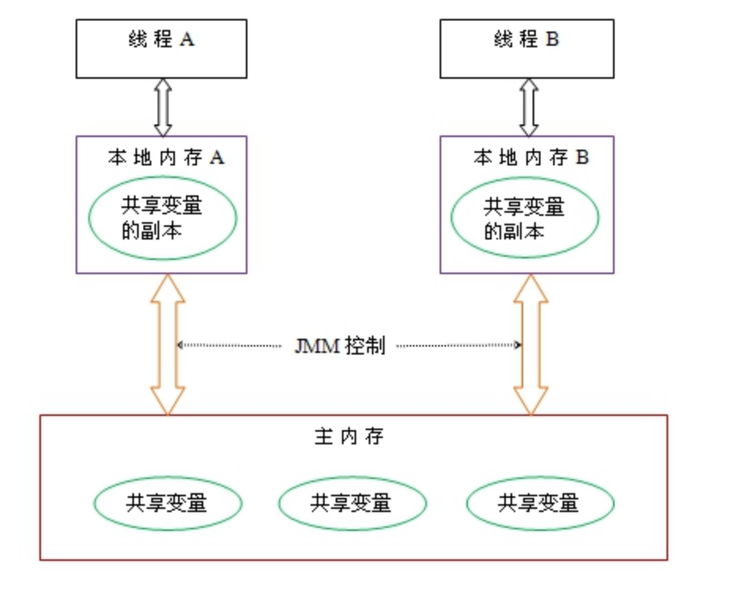

# Java多线程相关知识

## 多线程入门

### 线程，进程以及协程的区别


### 为什么要是有多线程


### 多线程的创建方式

* 继承Thread类
* 实现Runable接口
* 实现Callable接口

Callable接口和Runable接口功能类似，但是Callable接口功能比Runable更强大

* Callable可以在任务结束的时候，提供一个返回值，Runable无法提供这个功能
* Callable 的call 方法可以抛出异常，而Runable的run方法不能抛出异常


### 线程中的异常处理

线程设计的理念： 线程的问题应该线程自己本身来解决，而不是要委托到外部。 


**方式一：**

在线程方法内，使用try-catch 包装所有的方法体

**方式二**

给某个thread设置一个UncaughtExceptionHandler，可以确保在该线程出现异常时能通过回调 UncaughtExceptionHandler 接口的public void uncaughtException(Thread t, Thowable e) 方法来处理异常，这样的好处是可以在线程代码边界之外(Thread的run() 方法之外) ，有一个地方能处理捕获异常。 

需要明确的是：虽然是在回调方法中处理异常，但这个回调方法在执行时依然孩子抛出异常的这个线程中。另外还要特别说明一点：如果线程是通过线程池创建，线程异常发生时UncaughtExceptionHandler 接口不一定会立即回调。


### 线程的分类

Java中有两种线程，一种是用户线程，另一种是守护线程。

 用户线程是指用户自定义创建的线程，主线程停止，用户线程不会停止

守护线程当进程不存在或主线程停止，守护线程也会被停止。

 使用setDaemon(true)方法设置为守护线程


### 线程的生命周期

* 新建

* 就绪

  * 线程调用start方法之后，就处于就绪状态

* 运行状态

  * 获取到CUP后就处于运行状态

* 阻塞状态

   线程运行过程中，可能由于各种原因进入阻塞状态

  * 线程通过调用sleep方法进入睡眠状态
  * 线程调用一个在I/O 上被阻塞的操作，即该操作在输入输出操作完成之前不会返回到它的调用者
  * 线程视图得到一个锁，而该锁正被其他线程持有
  * 线程在等待某个触发条件(不太明白)

* 死亡状态

  * run方法执行完之后，自然死亡
  * 一个未捕获的异常终止了run方法而使线程死亡

   为了确定线程在当前是否存活着（就是要么是可运行的，要么是被阻塞了），需要使用isAlive方法。如果是可运行或被阻塞，这个方法返回true； 如果线程仍旧是new状态且不是可运行的， 或者线程死亡了，则返回false.


### Thread类常用的方法

* join() 方法

  在很多情况下，都由主线程创建并运行子线程，如果子线程中需要大量的耗时操作，主线程往往早于子线程结束。如果主线程想要等待子线程完成后再执行。比如子线程处理一个数据运算，而主线程想要获取这个数据，可以用join方法。 

​		方法join() 的作用就是使属性的线程对象x(子线程) 执行run 方法中的任务，而使得当前线程z(主线程) 进行无限期的阻塞，等待线程x销毁后再继续执行z后面的代码。 


* yield() 方法


## 线程之间实现同步

### 线程安全的解决方法

* 同步代码块
* 同步函数
* 静态同步函数


同步代码块使用的是 对象锁或者类锁。

synchronized修饰方法使用的锁是当前的this锁

synchronzed 修饰静态方法使用的锁是当前类锁，是当前类的字节码文件。 


### 多线程的三大特性

**原子性**，**可见性**，**有序性**

多线程编程，只有满足这三个条件，才能保证多线程结果的准确性，才能保证线程安全。 


### Java共享内存模式

共享内存模型指的就是Java内存模型(简称JMM) 。 JMM 决定了一个线程对其他共享变量的写入时，能对另一个线程可见。从抽象的角度来看，JMM定义了线程和主内存之间的抽象关系，线程之间的共享变量存储在主内存(main memory)中。 每个线程都有一个私有的本地内存(local memory),  本地内存中存储了线程以读/写 共享变量的副本。

本地内存是JMM的衣蛾抽象概念，并不真实存在。 它涵盖了缓存，写缓冲区，寄存器以及其他的硬件和编译器优化。 


飞： JMM 是隔离不同机器的一种抽象。 




总结：

java内存模型简称jmm，定义了一个线程对另一个线程可见。共享变量存放在主内存中，每个线程都有自己的本地内存，当多个线程同时访问一个数据的时候，可能本地内存没有及时刷新到主内存，所以就会发生线程安全问题。


### Volatile

多个线程之间，相互修改状态，有时候，可能会存在无法生效的情况，

原因： 线程之前不可见，读取的是副本，没有及时读取到主内存结构。

解决办法使用volatile 关键字将解决线程之间的可见性，强制线程每次读取该值的时候都去主内存中取值。 


### volatile 和synchronized之间的区别

仅靠volatile不能保证线程的安全性。（原子性）

①volatile轻量级，只能修饰变量。synchronized重量级，还可修饰方法

②volatile只能保证数据的可见性，不能用来同步，因为多个线程并发访问volatile修饰的变量不会阻塞。

synchronized不仅保证可见性，而且还保证原子性，因为，只有获得了锁的线程才能进入临界区，从而保证临界区中的所有语句都全部执行。多个线程争抢synchronized锁对象时，会出现阻塞。

***\*线程安全性\****

线程安全性包括两个方面，①可见性。②原子性。

从上面自增的例子中可以看出：仅仅使用volatile并不能保证线程安全性。而synchronized则可实现线程的安全性。


### ThreadLocal

ThreadLocal提高一个线程的局部变量，访问某个线程拥有自己局部变量。

 当使用ThreadLocal维护变量时，ThreadLocal为每个使用该变量的线程提供独立的变量副本，所以每一个线程都可以独立地改变自己的副本，而不会影响其它线程所对应的副本。

ThreadLocal的接口方法

ThreadLocal类接口很简单，只有4个方法，我们先来了解一下：

· void set(Object value)设置当前线程的线程局部变量的值。

· public Object get()该方法返回当前线程所对应的线程局部变量。

· public void remove()将当前线程局部变量的值删除，目的是为了减少内存的占用，该方法是JDK 5.0新增的方法。需要指出的是，当线程结束后，对应该线程的局部变量将自动被垃圾回收，所以显式调用该方法清除线程的局部变量并不是必须的操作，但它可以加快内存回收的速度。

protected Object initialValue()返回该线程局部变量的初始值，该方法是一个protected的方法，显然是为了让子类覆盖而设计的。这个方法是一个延迟调用方法，在线程第1次调用get()或set(Object)时才执行，并且仅执行1次。ThreadLocal中的缺省实现直接返回一个null。


## 多线程之间通信


### wait，notify，notifyall

wait，notify，notifyall 都是object对象的方法。 


**wait和notify 必须在同步代码块中使用。** 


关于Object类中的wait和notify方法(生产者和消费者模式)

1. wait 和notify 方法不是线程对象的方法，是java中任何一个java对象都有的方法，因为这来哥哥方式是Object类中自带的
2. wait方法和notify方法不是通过线程对象调用
3. wait（） 方法的作用。 
   1. 让正在对象上活动的线程进程等待状态，无期限等待，知道被唤醒为止
   2. o.wait方法的调用，会让当前线程(正在o对象上活动的线程)进入等待状态
4. notify方法的作用
   1. notify表示唤醒正在对象上等待的线程。

5. notifyAll 方法是唤醒在在线程上等待的所有线程


**飞：wait，notify 一般和synchronized 配合使用。**

```java
Object obj = new Object();
sychronized(obj){
  	obj.notify();
    obj.wait();
}
```

notify 方法可以唤醒争抢 obj对象的所有线程， wait 方法可以让当前获取obj对象的线程休眠。 


## 思考

1. 一个有3个CPU的计算机，当有两个线程的时候，如何让这两个线程分散在不同的CPU上？


