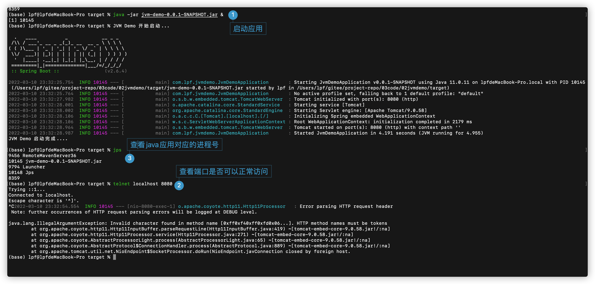
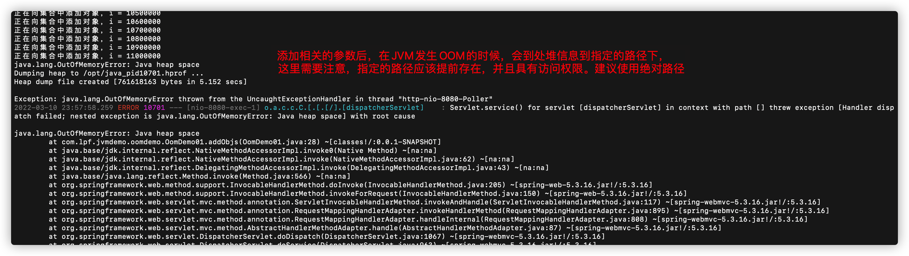
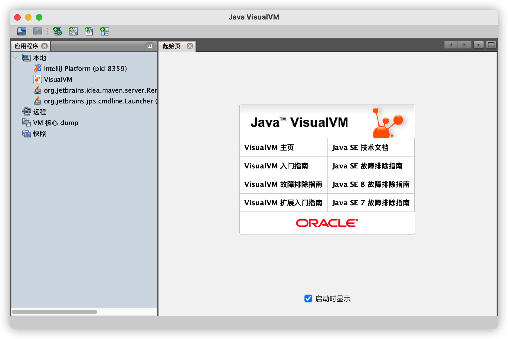
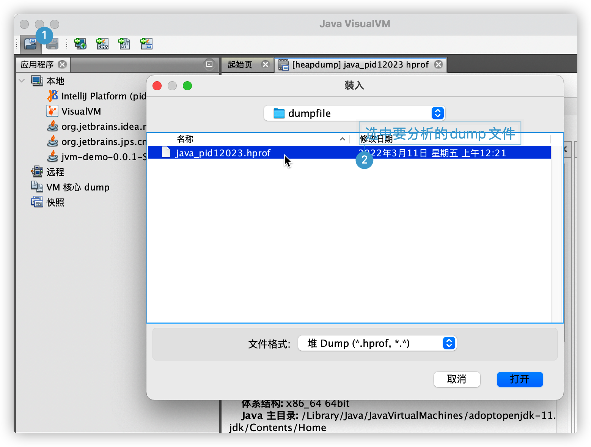
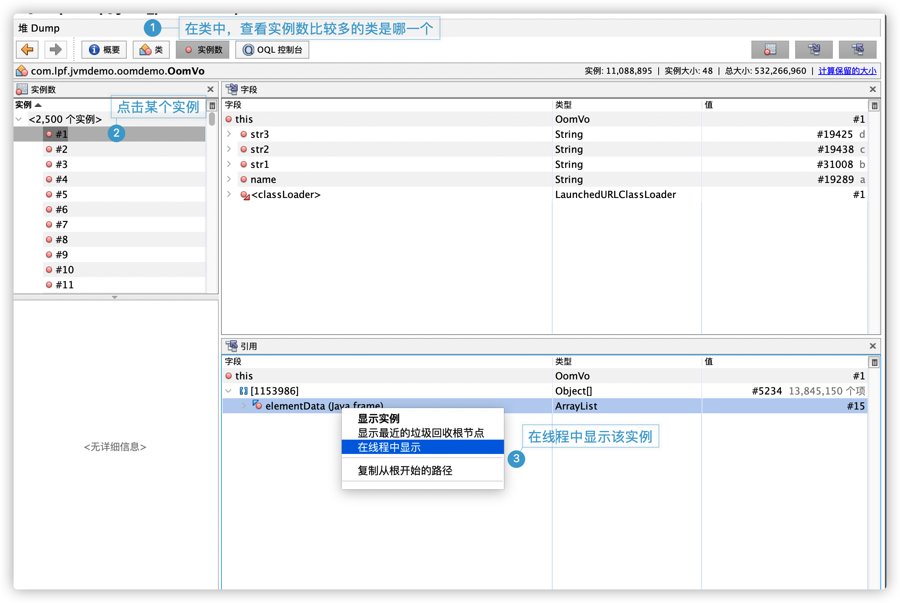
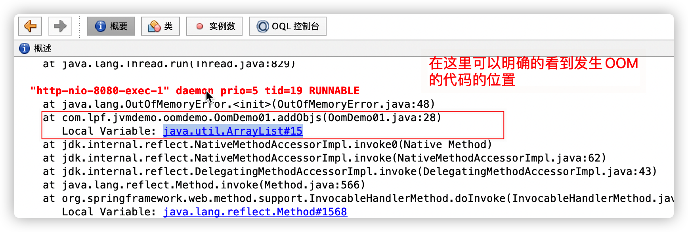
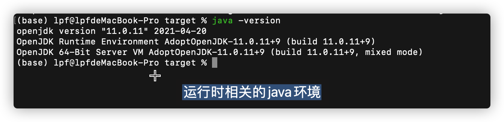
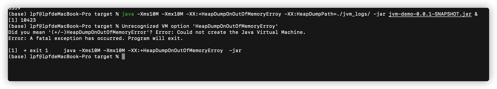
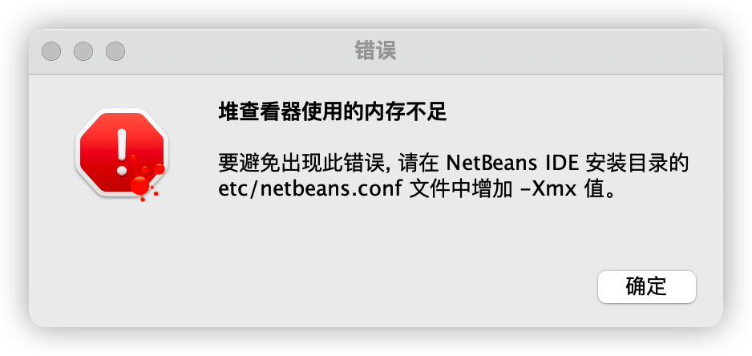

# 如何定位线上OOM

[TOC]

## 造成OOM的原因

1. 一次性申请的对象太多，比如一次性从数据库中夹在过多的数据

   解决方案：更改申请对象的数量

2. 内存资源耗尽未释放

   解决方案：找到未释放的对象进行释放

   3. 本身资源不足

      通过 jmap -heap 查看堆信息

      


## 如何快速定位出现OOM的原因


### 模拟OOM现象

整体思路：使用spring-boot编写一个简单的web程序，

场景一复现：在一个方法中，不断的创建一个对象，并且向List中加入，看看什么时候会发生OOM

场景二复现：通过JDBC 多次查询海量数据


1. 编写好的demo，通过 如下命令启动，之前通过浏览器触发：

```shell
java -jar jvmdemo.jar &
```

​         这里通过 & 让java程序在后台运行，而不是一直占用着控制台。在实际生产中，还需要对启动过程中的日志进行重定向。 

2. 启动之后，通过如下命令来插件JVM 运行的堆栈信息

   ```shell
   $> jmap -haap 进程号
   ```



通过浏览器触发向list中添加对象的方法

http://127.0.0.1:8080/addObjs


## 解决方案

方案一：启动时添加相关参数，在发生OOM的时候导出堆信息，启动程序的命令如下

```shell
$> java -Xms10M -Xmx10M -XX:+HeapDumpOnOutOfMemoryError -XX:HeapDumpPath=./jvm_logs/ -jar jvm-demo-0.0.1-SNAPSHOT.jar &
```

这里要注意： heap文件导出的路径应该存在，并且有访问权限，否则导不出相关的文件。 





使用 jvisualvm 命令查看导出的Dump文件 














## 验证环境




## 学习过程中遇到的问题：

1. 启动的时候添加参数异常

   


2. 分析Dump文件的软件异常

   

​					   解决方案：启动时指定堆的最大内存

​						$> jvisualvm -J-client -J-Xmx1024m 

