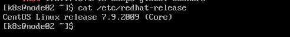
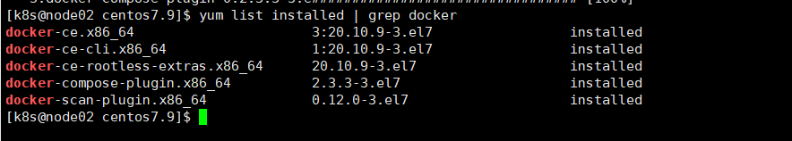
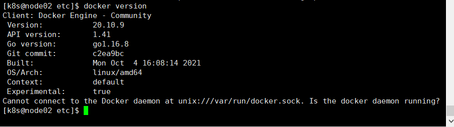
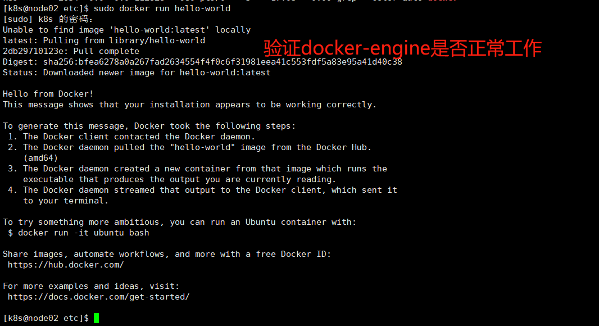
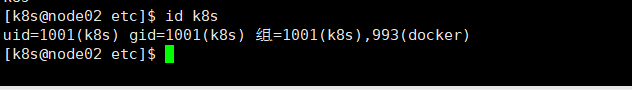
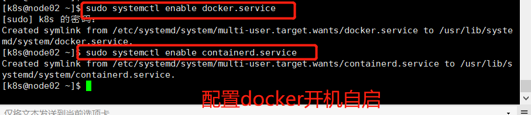

# 01_Docker的安装


## 安装方式

### 1. 离线安装

通过浏览器访问 https://download.docker.com/linux/centos/ 来下载离线安装文件 rpm

在该地址下载的时候，需要根据centos系统的版本来下载指定的安装包 

在centos 系统中，执行如下命令查看centos的版本

```shell
$> cat /etc/redhat-release
```

效果如下：




根据centos的版本号，在指定的网站路径 https://download.docker.com/linux/centos/7/x86_64/stable/Packages/ 下选择自己要下载的软件包:

在该页面中，需要下载的软件包包括如下:(共7个)

* containerd.io-.x86_64.rpm 

* docker-ce-xxxx.x86_64.rpm

* docker-ce-cli-xxxx.x86_64.rpm

* docker-ce-rootless-extras-xxx.x86_64.rpm

* docker-ce-selinux-xxx.rmp

* docker-compose-plugin

* docker-scan-plugin-xxx.rmp  

将所有的软件都下载最新版本的。 

这些软件安装的时候有一定的依赖关系：

docker-ce 依赖于 docker-ce-cli和 docker-ce-rootless-extras

docker-ce-cli 依赖于 docker-scan-plugin

这些软件之间相互依赖，所以安装的时候，最好一次性安装，不要一个一个安装。 

同时，本人在安装过程中，会提示不需要安装containerd.io。 


#### 安装之前检查

安装docker之前，需要确保本地没有安装过docker ，如果安装过，需要根据实际情况看看是否需要卸载重装

通过如下命令查看centos 之前有没有安装docker 

```shell
$> yum list installed | grep docker
```

如果有安装，需要执行如下命令将安装的docker软件依次删除

```shell
$> yum remove 软件名
```


下载好相关的rpm 软件包之后，通过 rpm 命令来安装 rpm包，相关命令如下

```shell
$> sudo rpm -ivh /path/**/package.rpm
```

安装好之后，查看已安装的软件包括：




执行命令之后，docker就安装好了，不过，此时docker 并没有被启动。同时也会创建一个group 用户组，不过该用户组内没有一个用户。 

通过执行如下命令，可以知道 linux系统创建了一个docker 的用户组。 

```shell
$> cat /etc/group | grep docker
```

可以看到docker用户组和其对应的id值。 

通过如下命令可以知道docker 在刚安装好之后，并没有在运行 

```shell
$> ps aux | grep docker
```

通过如下命令查看docker的版本信息，说明docker已经安装成功了。

```shell
$> docker version
```

效果如下：




## 启动

执行如下命令来启动docker

```shell
$> sudo systemctl start docker
```

执行之后，可以通过ps aux  | grep docker 来查看docker 是否启动成功。 


docker启动之后，可以通过执行如下的命令来验证docker-engine 是否正常工作

```shell
$> sudo docker run hello-world
```

效果如下：




## 安装docker之后的操作

### linux系统安装docker之后的优化

参考 官方资料[https://docs.docker.com/engine/install/linux-postinstall/]

执行下面的一些操作是为了让docker在linux操作系统中更好的运行。 

* #### 使用一个非root账号来管理docker

  docker 后台进程绑定一个Unix 套接字而不是TCP端口，默认情况下，Unix 套接字是被root用户拥有的，其他用户如果想要访问，需要使用sudo 来授权。 同样，Docker 的后台进程也是被root 用户所管理的。 

  如果你不想执行docker命令的时候，前面带一个sudo命令，那么创建一个叫做docker的unix group，并且将要执行docker命令的用户添加到该组中。 这样，docker 用户组中的用户执行docker命令的时候，就不需要使用sudo 命令了。 

  默认情况下，安装好docker 软件之后，会自动创建一个docker 用户组，可以通过查看 /etc/group 文件来确定是否创建了docker 用户组，如果没有安装则可以通过如下的命令来进行创建。

  ```shell
  # 创建一个docker 用户组
  $> sudo groupadd docker 
  # 添加当前用户到docker 用户组 
  $> sudo usermod -aG docker $USER
  # 查看指定用户在不在docker 用户组
  $> id 用户名
  # 效果如下
  ```

  

​		通过图中，我们可以知道k8s用户已经在docker 用户组内。 

​	   此时，我们直接执行 docker run hello-world 命令是不行的，则说明用户和用户组的绑定关系还没有被整个系统承认，我们需要执行如下的命令来刷新配置

```shell
$> newgrp docker
```

之后，我们再次执行如下命令来验证我们的配置生效了。

```shell
$> docker run hello-world
```


* #### 配置docker 开机自启

​	执行如下的命令配置docker 开机自启

```shell
$> sudo systemctl enable docker.service
$> sudo systemctl enable containerd.service
```

效果如下：



 

如果想禁止docker 的开机自启,可以执行如下的命令

```
$> sudo systemctl disable docker.service
$> sudo systemctl disable containerd.service
```

* 使用不同的存储引擎

* 配置默认的日志驱动

  

* 配置docker监听的地址

## 相关的参考资料

https://www.cnblogs.com/eastonliu/p/11277014.html 


## 变更记录


| 类型 | 时间       | 内容                                                     |
| ---- | ---------- | -------------------------------------------------------- |
| 新增 | 2022-04-03 | 新增centos7 安装docker的过程以及一些安装后的部分优化操作 |
|      |            |                                                          |
|      |            |                                                          |

