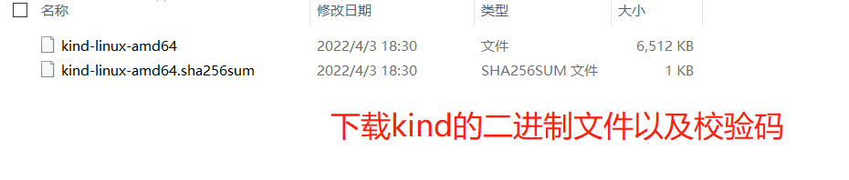
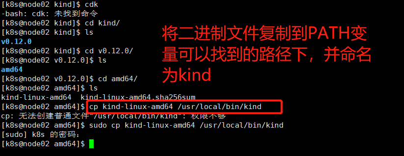
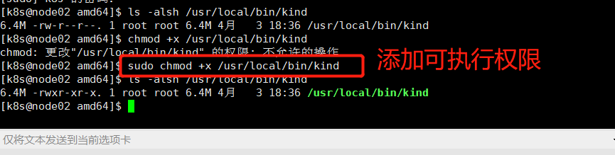
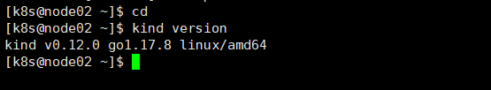
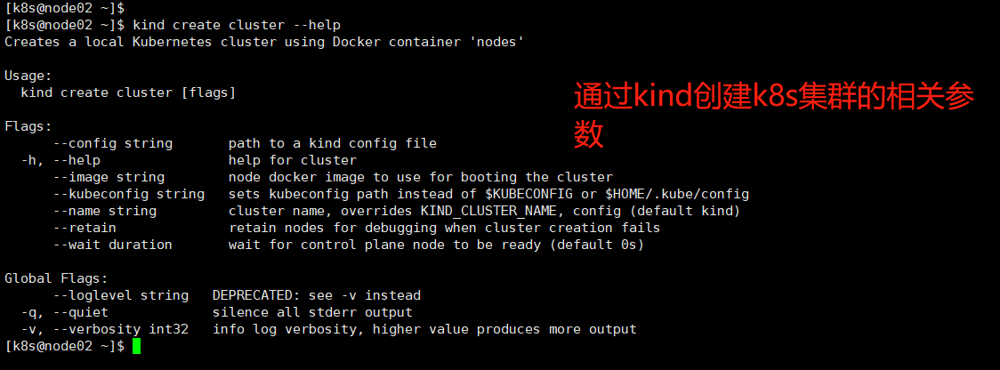
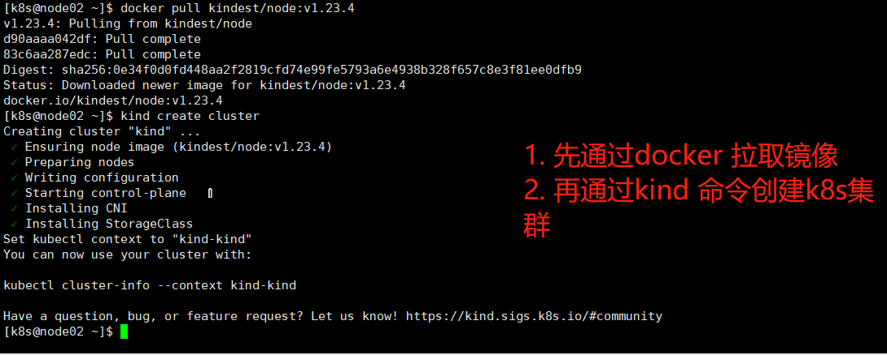

# Kind的安装和使用

[`kind`](https://kind.sigs.k8s.io/docs/) 让你能够在本地计算机上运行 Kubernetes


## 安装


### 二进制方式安装

根据要安装的操作系统平台特性，从 https://github.com/kubernetes-sigs/kind/releases 下载对应的版本。



* 下载二进制版本
* 将下载好的文件上传到linux操作系统

* 重命名为kind,并移动到PATH环境变量可以找到的路径下

  

  * 通过chmod +x   xxx/kind 为kind添加可执行权限

    ```shell
    $> chmod +x /usr/local/bin/kind
    ```

    

  

* 验证kind是否安装成功

  ```shell
  $> cd
  $> kind version
  ```

  效果如下图：

  


## 创建集群

可以使用kind命令创建kubernetes集群

```shell
$> kind create cluster --image --wait --name
```


通过如下命令可以查看kind创建k8s集群的相关帮助信息

```shell
$> kind create cluster --help
```




通过kind create cluster 命令创建的k8s集群，是通过docker 的 kindest/node 镜像来进行创建的。 

在创建k8s集群的时候，可以提前通过如下命令将相关镜像下载。 

```shell
$> docker pull kindest/node:v1.23.4
```

之后再进行集群的创建。 




## 和集群进行交互

查看创建的所有集群

```shell
$> kind get clusters
```


通过kubectl 命令和k8s集群进行交互。 

默认情况下，k8s集群的访问配置文件保存在 ${HOME}/.kube/conf 文件中，可以通过 $KUBECONFIG 配置文件来更改配置文件的存放路径。 


## 删除集群

删除默认的集群，通过kind create cluster 命令创建的k8s集群默认名称是kind。 

可以直接通过如下命令进行删除

```shell
$> kind delete cluster
```


如果要删除其他名称的k8s集群，可以通过 --name 来指定要删除的k8s集群的名称。 

```shell
$> kind delete cluster --name k8s集群名称
```


## 从集群中加载一个镜像

Docker 镜像可以被加载到你的k8s集群中通过如下的命令：

```shell
$> kind load docker-image my-custom-image-0 my-custom-image-1
```


## 构建镜像

TODO 不知道有什么用途？


## 高级

### 配置自己的Kind 集群

通过--config 来指定k8s配置文件的内容。在该配置文件中可以对k8s集群进行一些定制。 


```shell
$> kind create cluster --config kind-example-config.yaml
```

 其中，kind-example-config.yaml 文件可以在如下网站中找到。 

https://raw.githubusercontent.com/kubernetes-sigs/kind/main/site/content/docs/user/kind-example-config.yaml

你可以通过指定k8s集群创建时，依赖的node镜像的版本来自定义k8s的版本。 

可以在如下地址获取可用的 k8s依赖的镜像的版本信息：

https://github.com/kubernetes-sigs/kind/releases


相关配置内容如下：

```text
kind: Cluster
apiVersion: kind.x-k8s.io/v1alpha4
nodes:
- role: control-plane
  image: kindest/node:v1.16.4@sha256:b91a2c2317a000f3a783489dfb755064177dbc3a0b2f4147d50f04825d016f55
- role: worker
  image: kindest/node:v1.16.4@sha256:b91a2c2317a000f3a783489dfb755064177dbc3a0b2f4147d50f04825d016f55
```


### Enable feature Gates in Your Cluster


### 配置Kind使用代理

如果你在一个需要运行代理的环境中运行kind，你需要配置kind去使用这些代码。 

可以通过配置如下环境变量来指定代理信息。 

* HTTP_PROXY 或 http_proxy
* HTTPS_PROXY 或 https_proxy
* NO_PROXY 或 no_proxy


### 导出k8s集群日志

kind 有能力导出各种相关的日志。 下面的命令将默认集群中的日志导出

```shell
$> kind export logs
```

可以通过 --name 参数来导致指定k8s集群的日志。 


可以通过如下命令控制导出日志的存放位置

```shell
$> kind export logs /opt/data/logs/k8s
```

这里的  /opt/data/logs/k8s 就是要导出日志存放的路径


导出的日志信息包括 docker的运行日志以及k8s集群的相关日志。 

The logs contain information about the Docker host, the containers running kind, the Kubernetes cluster itself


## 参考资料

https://kind.sigs.k8s.io/


## 变更记录

| 类型 | 时间                 | 内容                                                 |
| ---- | -------------------- | ---------------------------------------------------- |
| 新增 | 2022年4月3日18:47:19 | 通过二进制的方式安装kind                             |
| 新增 | 2022年4月3日23:52:34 | kind的一些命令，有些内容不太熟悉。不知道是干甚用的。 |
|      |                      |                                                      |
|      |                      |                                                      |
|      |                      |                                                      |

