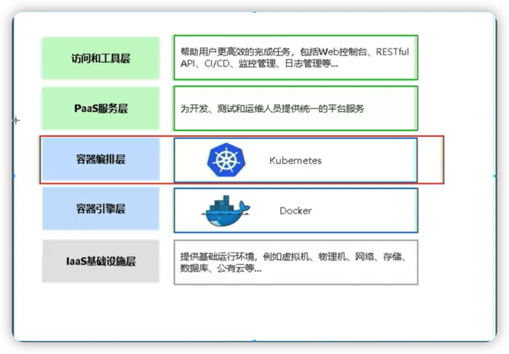
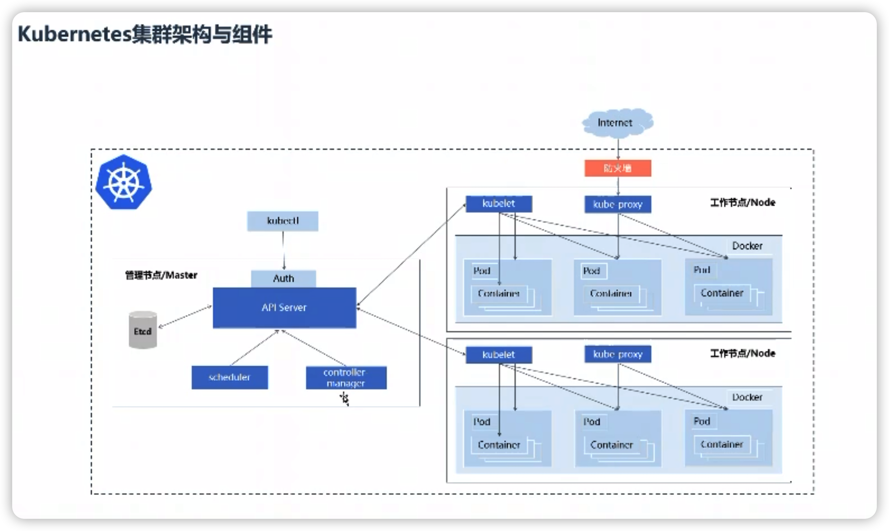

# Kubernetes 学习笔记


有了Docker ，为什么还用k8s

为了提高业务并发和高可用，会使用多台服务器，因此会面临这些问题：

* 多容器跨注解提供服务
* 多容器分布节点部署
* 多容器怎么升级
* 怎么高效管理这些容器


容器编排系统：

* kubernetes
* Swarm
* 
* Mesos Marathon





kubernetes 核心概念与基本使用

* kubernetes 是什么
* kubernetes集群架构与组件
* kubectl命令后管理工具
* 牛刀小试，快速部署一个网站
* kubernetes基本自由概念


k8s用于容易化应用程序的部署，扩展和管理，目标是让部署容器后应用简单高效。 





内容大纲

* k8s架构师课程介绍
* k8s架构师课程学习路线详解
* kubeadm高可用安装基本说明
* k8s高可用架构解析
* kubeadm基本环境配置
* kubeadm 系统及内核升级
* kubeadm基本组件安装
* kubead高可用组件安装
* kubeadm集群初始化
* 高可用Master及Token过期处理
* kubeadm Node节点配置
* Dashboard & Merics Server 安装
* 集群验证
* kuboard： dashboard另一种选择


### k8s高可用集群


k8s高可用集群中的Load Balance 可用通过keepalive + nginx来实现，也可以通过硬件负载均衡（例如F5）来实现

## 其他


## P3 2-1 kubeadm 高可用

生产环境部署k8s集群，建议通过二进制来进行安装。 

在测试环境，可以使用kubeadm 进行安装。 


### kubeadm 高可用安装k8s集群  1.18 版本

1. kubectl  debug 可以创建一个临时容器来查看问题。 
2. k8s 在1.18 版本中，内置了一个 Sidecar
3. k8s 在1.18 版本之后，不建议修改Volume的权限。 不建议更改目录权限。 
4. ConfigMap 和Secret 


#### k8s高可用架构


### kubeadm基本环境配置

1. 机器规划

   | 主机名 | ip   | 定位 |
   | ------ | ---- | ---- |
   |        |      |      |
   |        |      |      |
   |        |      |      |

   

2. 修改 /etc/hosts 文件中，为ip地址和主机名进行绑定

3. 所有节点关闭防火墙，selinux， dnsmqsq， swap 。 相关命令如下

   ```shell
   $> systemctl disable --now firewalld
   $> systemctl disable --now dnsmasq
   $> systemctl disable --now NetworkManager  $ Centos8 不需要关闭
   $> setenforce 0
   ```

   关闭SELINUX 的命令如下

   cat /etc/sysconfig/selinux 

   修改： SELINUX=disabled

   关闭swap：

   ```shell
   $> swapoff -a && sysctl -w vm.swappiness=0
   ```

   编辑 /etc/fstab 文件，将swap 相关的内容注释掉

   

4. 安装同步时间的软件。 ntpdate 

   在centos7 中使用的就是ntpdate， 在centos8中，不再是ntpdate， 需要自己了解一下同步时间的软件变成了什么。 

   TODO

5. 安装时间同步软件，并且利用阿里云的时间服务器来进行时间同步

   ```shell
   $> yum install wntp -y 
   ```

   

6. 将时间同步添加到开机自启以及linux的调度任务中，

​				通过执行如下的命令来执行同步任务

```shell
$> crontab -e 
```


7. 配置所有机器的limit 

   ```shell
   $> ulimit  -SHm 65535
   ```

   这里也可以通过修改配置文件来进行设置limit。 

   

8.  为Master01 节点设置免密登陆

   Mastesr01 节点免密登陆其他节点，安装过程中生成配置文件和证书均在Master01 上操作，集群管理也在Master01 上操作， 啊丽云或者AWS 上需要单独一台kubectl 服务器。密钥配置如下：

   

   通过shell 语言将生成的ssh密钥文件传输到其他服务器上

8.  

10. 


导入CentOS 8 的源


​		


​					内核配置：


​			更改内核启动顺序：


​				检查上面的配置的模块是否加载


​				开启一些集群中必须开启的内核参数：


注意： 网上很多其他资料，是不会升级内核，但是视频中的老师经过生产验证，内核升级到 4.18及以上是很重要的。 


ipvsadm 是一个工具也是一个命令，用于管理LVS的策略规则。

### k8s中基本组件的安装

**在选择k8s版本对应的docker版本的时候，可以通过去k8s的github的官网去查看CHANGELOG 文件中的记录。 里面会记录关于docker升级的详细信息**


设置docker 开机自启并启动启动服务。 这里--now 参数就是说设置开机自启的同时启动对应的服务。 


```shell
$> systemctl enable --now docker
```


修改kubeadm 访问的镜像地址


### 	高可用组件配置


### master节点配置keepalived 


TODO：

关于keepalive 和haProxy 的配置，在网上通过资料，系统的了解一下。 


不同的master 节点需要配置不同的keepalive信息。 


vim 设置set paste 命令有什么作用？

视频中是将粘贴的内容格式化好。


vim 中set paste 可以让复制的内容，粘贴到vim 中之后不会乱码。 


### kubeadm 集群化管理

首先需要在master节点编辑并配置： kubeadm-config.yaml 文件。 


当kubeadm 版本升级之后，可以通过kubeadm config 命令来升级相关的配置文件。 


使用 kubeadm config images pull --config kubeadm-config.yaml 命令提前下载master节点需要的镜像。


Calico 组件的安装


**高可用组件可以是keepalive + nginx**


高可用可以是keepalive + AProxy


## kubeadm集群初始化


