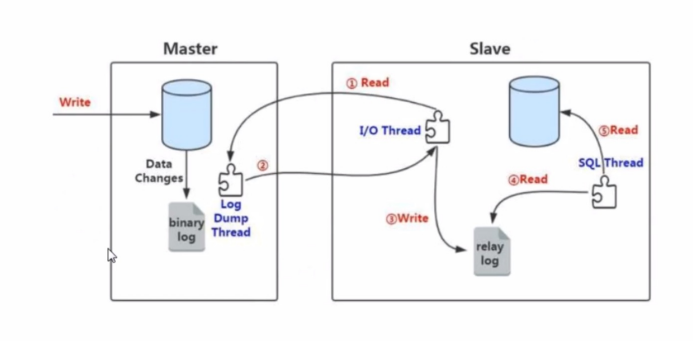

# mysql的主从复制


## 认识主从复制

数据库故障解决方案：

* 备份
* 主从复制
* 中间件

主从复制依赖于二进制日志，异步备份的多节点架构


## 部署主从复制的前提

* 至少两个数据库实例，在两台机器上分别安装mysql
* 不同数据库实例，需要配置不同的server_id
  * 查看server_id：
  * select @@server_id;
* 主库要开启二进制日志
* 创建也给复制用户 repl, replication slave
  * create user repl@'%' identified by 'repl';
  * grant replication slave on *.* to 'repl'@'%';


相关命令

* 查看主从复制的相关命令
  * mysql> help change master tol


## 操作流程

```text
* 搭建两套数据库实例
* 在主库和从库上分别创建复制用户并授权
	create user repl@'%' identified by 'repl';
	grant replication slave on *.* to 'repl'@'%';
	alter user repl@'%' require ssl;    # 强制用户必须使用ssl连接， 因为mysql8默认的认证插件 caching_sha2_password 必须通过ssl认证
	 flush privileges;
	
* 在从库上执行如下的命令（老版本命令）
   mysql> change master to \
       master_host='192.168.23.130', \
       master_user='repl', \
       master_password='repl', \
       master_port=3306,  \
       master_auto_position=1, \
       source_ssl=1, \
       master_connect_retry=10; 
   新版命令: MySQL 8.0.23+ 引入的新语法 (注意，斜杠\后面不能有空格)
   mysql>change replication source to
   		source_host='192.168.23.130',
   		source_user='repl',
   		source_password='repl',
   		source_port=3306,
   		source_auto_position=1,
   		source_ssl=1,
   		source_connect_retry=10;
	
```


## 相关命令

启动从节点

```
mysql> start slave;   (老板命令，mysql8后不建议使用)
mysql> start replica; (mysql8之后，建议使用)


mysql> stop slave;   (老板命令，mysql8后不建议使用)
mysql> stop replica; (mysql8之后，建议使用)

```


查看从节点状态：

```shell
mysql> show slave status\G   （mysql8之后不推荐）
mysql> show replica status\G
```


查看二进制日志文件(binlog)

```shell
mysql> show binary logs;

```


## 主从复制原理



* 在从库中执行，change maste to ; 会将主库的信息保存到从库中的 master.info 文件中

  * master.info 文件的内容如下：

    ```text
    
    ```

* 在从库上执行start slave;  开启 io_thread， sql_thread

* io_thread 工作； io_thread 通过master.info 文件中的主库的连接信息去连接主库; 连接成功后，主库就会开启 dump_thread;

* dump_thread 读取主库新产生的二进制日志; 然后投递给io_thread;

* io_thread 接收dump_thread 投递的新的二进制日志，将日志写入到relay log （中继日志）

* io_thread 就会等待主库dump_thread主动把新产生的二进制日志投递

* sql_thread会将relay_log 新产生的日志恢复到数据库，写到磁盘


## 从库状态讲解

```sql
mysql> show slave status\G;
```


## 注意事项

* 如果主库和从库差距大，先把主库的本分文件在从库上恢复

* 主节点和从节点都需要开启 gtid-mode=on 模式。 
* 


## 遇到的问题

1、 查看 从节点信息的时候，有个报错

​       Last_IO_Error: Error connecting to source 'repl@192.168.23.130:3306'. This was attempt 3/86400, with a delay of 10 seconds between attempts. Message: Authentication plugin 'caching_sha2_password' reported error: Authentication requires secure connection.


2、设置从节点后，有警告信息
  Level: Note
   Code: 1760
Message: Storing MySQL user name or password information in the connection metadata repository is not secure and is therefore not recommended. Please consider using the USER and PASSWORD connection options for START REPLICA; see the 'START REPLICA Syntax' in the MySQL Manual for more information.

解决方案： 执行 change replication source to 命令的时候，不要指定用户名密码， 

在启动从节点的时候指定用户名和密码： START REPLICA USER = 'repl_user', PASSWORD = '你的密码';

这样就不会将避免保存到 mysql.slave_master_info 表中， 也就避免被其它人通过某些方式获取到密码。 


**3 Last_SQL_Errno: 1396**
Last_SQL_Error: Coordinator stopped because there were error(s) in the worker(s). The most recent failure being: Worker 1 failed executing transaction '0b979ac0-8b98-11f0-92fb-0050563ca8fe:1' at source log binlog.000015, end_log_pos 351. See error log and/or performance_schema.replication_applier_status_by_worker table for more details about this failure or others, if any.


mysql的错误日志中的内容如下：

2025-09-17T07:25:43.783405+08:00 12 [ERROR] [MY-010584] [Repl] Replica SQL for channel '': Worker 1 failed executing transaction '0b979ac0-8b98-11f0-92fb-0050563ca8fe:1' at source log binlog.000015, end_log_pos 351; Error 'Operation ALTER USER failed for 'repl'@'%'' on query. Default database: ''. Query: 'ALTER USER 'repl'@'%' REQUIRE NONE', Error_code: MY-001396
2025-09-17T07:25:43.785454+08:00 11 [ERROR] [MY-010586] [Repl] Error running query, replica SQL thread aborted. Fix the problem, and restart the replica SQL thread with "START REPLICA". We stopped at log 'binlog.000015' position 157


解决方案：通过查看mysql的错误日志，推断，应该是从库没有repl用户，因此，在从库上也创建repl用户

```sql
create user repl@'%' identified by 'repl';
grant replication slave on *.* to 'repl'@'%';
alter user repl@'%' require ssl;    # 强制用户必须使用ssl连接， 因为mysql8默认的认证插件 caching_sha2_password 必须通过ssl认证
flush privileges;
```


## 参考资料

help change master to

```text
mysql> help change master to;
Name: 'CHANGE MASTER TO'
Description:
Syntax:
CHANGE MASTER TO option [, option] ... [ channel_option ]

option: {
    MASTER_BIND = 'interface_name'
  | MASTER_HOST = 'host_name'
  | MASTER_USER = 'user_name'
  | MASTER_PASSWORD = 'password'
  | MASTER_PORT = port_num
  | PRIVILEGE_CHECKS_USER = {'account' | NULL}
  | REQUIRE_ROW_FORMAT = {0|1}
  | REQUIRE_TABLE_PRIMARY_KEY_CHECK = {STREAM | ON | OFF}
  | ASSIGN_GTIDS_TO_ANONYMOUS_TRANSACTIONS = {OFF | LOCAL | uuid}
  | MASTER_LOG_FILE = 'source_log_name'
  | MASTER_LOG_POS = source_log_pos
  | MASTER_AUTO_POSITION = {0|1}
  | RELAY_LOG_FILE = 'relay_log_name'
  | RELAY_LOG_POS = relay_log_pos
  | MASTER_HEARTBEAT_PERIOD = interval
  | MASTER_CONNECT_RETRY = interval
  | MASTER_RETRY_COUNT = count
  | SOURCE_CONNECTION_AUTO_FAILOVER = {0|1}
  | MASTER_DELAY = interval
  | MASTER_COMPRESSION_ALGORITHMS = 'algorithm[,algorithm][,algorithm]'
  | MASTER_ZSTD_COMPRESSION_LEVEL = level
  | MASTER_SSL = {0|1}
  | MASTER_SSL_CA = 'ca_file_name'
  | MASTER_SSL_CAPATH = 'ca_directory_name'
  | MASTER_SSL_CERT = 'cert_file_name'
  | MASTER_SSL_CRL = 'crl_file_name'
  | MASTER_SSL_CRLPATH = 'crl_directory_name'
  | MASTER_SSL_KEY = 'key_file_name'
  | MASTER_SSL_CIPHER = 'cipher_list'
  | MASTER_SSL_VERIFY_SERVER_CERT = {0|1}
  | MASTER_TLS_VERSION = 'protocol_list'
  | MASTER_TLS_CIPHERSUITES = 'ciphersuite_list'
  | MASTER_PUBLIC_KEY_PATH = 'key_file_name'
  | GET_MASTER_PUBLIC_KEY = {0|1}
  | NETWORK_NAMESPACE = 'namespace'
  | IGNORE_SERVER_IDS = (server_id_list),
  | GTID_ONLY = {0|1}
}

channel_option:
    FOR CHANNEL channel

server_id_list:
    [server_id [, server_id] ... ]

CHANGE MASTER TO changes the parameters that the replica server uses
for connecting to the source and for reading data from the source. It
also updates the contents of the replication metadata repositories (see
https://dev.mysql.com/doc/refman/8.0/en/replica-logs.html). From MySQL
8.0.23, use CHANGE REPLICATION SOURCE TO in place of CHANGE MASTER TO,
which is deprecated from that release. In releases before MySQL 8.0.23,
use CHANGE MASTER TO.

CHANGE MASTER TO requires the REPLICATION_SLAVE_ADMIN privilege (or the
deprecated SUPER privilege).

Options that you do not specify on a CHANGE MASTER TO statement retain
their value, except as indicated in the following discussion. In most
cases, there is therefore no need to specify options that do not
change.

Values used for SOURCE_HOST and other CHANGE REPLICATION SOURCE TO
options are checked for linefeed (\n or 0x0A) characters. The presence
of such characters in these values causes the statement to fail with an
error.

The optional FOR CHANNEL channel clause enables you to name which
replication channel the statement applies to. Providing a FOR CHANNEL
channel clause applies the CHANGE MASTER TO statement to a specific
replication channel, and is used to add a new channel or modify an
existing channel. For example, to add a new channel called channel2:

CHANGE MASTER TO MASTER_HOST=host1, MASTER_PORT=3002 FOR CHANNEL 'channel2'

If no clause is named and no extra channels exist, a CHANGE MASTER TO
statement applies to the default channel, whose name is the empty
string (""). When you have set up multiple replication channels, every
CHANGE MASTER TO statement must name a channel using the FOR CHANNEL
channel clause. See
https://dev.mysql.com/doc/refman/8.0/en/replication-channels.html for
more information.

For some of the options of the CHANGE MASTER TO statement, you must
issue a STOP SLAVE statement prior to issuing a CHANGE MASTER TO
statement (and a START SLAVE statement afterwards). Sometimes, you only
need to stop the replication SQL (applier) thread or the replication
I/O (receiver) thread, not both:

o When the applier thread is stopped, you can execute CHANGE MASTER TO
  using any combination that is otherwise allowed of RELAY_LOG_FILE,
  RELAY_LOG_POS, and MASTER_DELAY options, even if the replication
  receiver thread is running. No other options may be used with this
  statement when the receiver thread is running.

o When the receiver thread is stopped, you can execute CHANGE MASTER TO
  using any of the options for this statement (in any allowed
  combination) except RELAY_LOG_FILE, RELAY_LOG_POS, MASTER_DELAY, or
  MASTER_AUTO_POSITION = 1 even when the applier thread is running.

o Both the receiver thread and the applier thread must be stopped
  before issuing a CHANGE MASTER TO statement that employs
  MASTER_AUTO_POSITION = 1, GTID_ONLY = 1, or
  ASSIGN_GTIDS_TO_ANONYMOUS_TRANSACTIONS.

You can check the current state of the replication applier thread and
replication receiver thread using SHOW SLAVE STATUS. Note that the
Group Replication applier channel (group_replication_applier) has no
receiver thread, only an applier thread.

CHANGE MASTER TO statements have a number of side-effects and
interactions that you should be aware of beforehand:

o CHANGE MASTER TO causes an implicit commit of an ongoing transaction.
  See https://dev.mysql.com/doc/refman/8.0/en/implicit-commit.html.

o CHANGE MASTER TO causes the previous values for MASTER_HOST,
  MASTER_PORT, MASTER_LOG_FILE, and MASTER_LOG_POS to be written to the
  error log, along with other information about the replica's state
  prior to execution.

o If you are using statement-based replication and temporary tables, it
  is possible for a CHANGE MASTER TO statement following a STOP SLAVE
  statement to leave behind temporary tables on the replica. A warning
  (ER_WARN_OPEN_TEMP_TABLES_MUST_BE_ZERO
  (https://dev.mysql.com/doc/mysql-errors/8.0/en/server-error-reference
  .html#error_er_warn_open_temp_tables_must_be_zero)) is issued
  whenever this occurs. You can avoid this in such cases by making sure
  that the value of the Replica_open_temp_tables or
  Slave_open_temp_tables system status variable is equal to 0 prior to
  executing such a CHANGE MASTER TO statement.

o When using a multithreaded replica (replica_parallel_workers > 0 or
  slave_parallel_workers > 0), stopping the replica can cause gaps in
  the sequence of transactions that have been executed from the relay
  log, regardless of whether the replica was stopped intentionally or
  otherwise. When such gaps exist, issuing CHANGE MASTER TO fails. The
  solution in this situation is to issue START SLAVE UNTIL
  SQL_AFTER_MTS_GAPS which ensures that the gaps are closed. From MySQL
  8.0.26, the process of checking for gaps in the sequence of
  transactions is skipped entirely when GTID-based replication and GTID
  auto-positioning are in use, because gaps in transactions can be
  resolved using GTID auto-positioning. In that situation, CHANGE
  MASTER TO can still be used.

The following options are available for CHANGE MASTER TO statements:

o ASSIGN_GTIDS_TO_ANONYMOUS_TRANSACTIONS = {OFF | LOCAL | uuid}

  Makes the replication channel assign a GTID to replicated
  transactions that do not have one, enabling replication from a source
  that does not use GTID-based replication, to a replica that does. For
  a multi-source replica, you can have a mix of channels that use
  ASSIGN_GTIDS_TO_ANONYMOUS_TRANSACTIONS, and channels that do not. The
  default is OFF, meaning that the feature is not used.

  LOCAL assigns a GTID including the replica's own UUID (the
  server_uuid setting). uuid assigns a GTID including the specified
  UUID, such as the server_uuid setting for the replication source
  server. Using a nonlocal UUID lets you differentiate between
  transactions that originated on the replica and transactions that
  originated on the source, and for a multi-source replica, between
  transactions that originated on different sources. The UUID you
  choose only has significance for the replica's own use. If any of the
  transactions sent by the source do have a GTID already, that GTID is
  retained.

  Channels specific to Group Replication cannot use
  ASSIGN_GTIDS_TO_ANONYMOUS_TRANSACTIONS, but an asynchronous
  replication channel for another source on a server instance that is a
  Group Replication group member can do so. In that case, do not
  specify the Group Replication group name as the UUID for creating the
  GTIDs.

  To set ASSIGN_GTIDS_TO_ANONYMOUS_TRANSACTIONS to LOCAL or uuid, the
  replica must have gtid_mode=ON set, and this cannot be changed
  afterwards. This option is for use with a source that has binary log
  file position based replication, so MASTER_AUTO_POSITION=1 cannot be
  set for the channel. Both the replication SQL thread and the
  replication I/O (receiver) thread must be stopped before setting this
  option.

  *Important*:

  A replica set up with ASSIGN_GTIDS_TO_ANONYMOUS_TRANSACTIONS on any
  channel cannot be promoted to replace the replication source server
  in the event that a failover is required, and a backup taken from the
  replica cannot be used to restore the replication source server. The
  same restriction applies to replacing or restoring other replicas
  that use ASSIGN_GTIDS_TO_ANONYMOUS_TRANSACTIONS on any channel.

  For further restrictions and information, see
  https://dev.mysql.com/doc/refman/8.0/en/replication-gtids-assign-anon
  .html.

o GET_MASTER_PUBLIC_KEY = {0|1}

  Enables RSA key pair-based password exchange by requesting the public
  key from the source. The option is disabled by default.

  This option applies to replicas that authenticate with the
  caching_sha2_password authentication plugin. For connections by
  accounts that authenticate using this plugin, the source does not
  send the public key unless requested, so it must be requested or
  specified in the client. If MASTER_PUBLIC_KEY_PATH is given and
  specifies a valid public key file, it takes precedence over
  GET_MASTER_PUBLIC_KEY. If you are using a replication user account
  that authenticates with the caching_sha2_password plugin (which is
  the default from MySQL 8.0), and you are not using a secure
  connection, you must specify either this option or the
  MASTER_PUBLIC_KEY_PATH option to provide the RSA public key to the
  replica.

o GTID_ONLY = {0|1}

  Stops the replication channel persisting file names and file
  positions in the replication metadata repositories. GTID_ONLY is
  available as of MySQL 8.0.27. The GTID_ONLY option is disabled by
  default for asynchronous replication channels, but it is enabled by
  default for Group Replication channels, and it cannot be disabled for
  them.

  For replication channels with this setting, in-memory file positions
  are still tracked, and file positions can still be observed for
  debugging purposes in error messages and through interfaces such as
  SHOW REPLICA STATUS statements (where they are shown as being invalid
  if they are out of date). However, the writes and reads required to
  persist and check the file positions are avoided in situations where
  GTID-based replication does not actually require them, including the
  transaction queuing and application process.

  This option can be used only if both the replication SQL (applier)
  thread and replication I/O (receiver) thread are stopped. To set
  GTID_ONLY = 1 for a replication channel, GTIDs must be in use on the
  server (gtid_mode = ON), and row-based binary logging must be in use
  on the source (statement-based replication is not supported). The
  options REQUIRE_ROW_FORMAT = 1 and SOURCE_AUTO_POSITION = 1 must be
  set for the replication channel.

  When GTID_ONLY = 1 is set, the replica uses
  replica_parallel_workers=1 if that system variable is set to zero for
  the server, so it is always technically a multi-threaded applier.
  This is because a multi-threaded applier uses saved positions rather
  than the replication metadata repositories to locate the start of a
  transaction that it needs to reapply.

  If you disable GTID_ONLY after setting it, the existing relay logs
  are deleted and the existing known binary log file positions are
  persisted, even if they are stale. The file positions for the binary
  log and relay log in the replication metadata repositories might be
  invalid, and a warning is returned if this is the case. Provided that
  SOURCE_AUTO_POSITION is still enabled, GTID auto-positioning is used
  to provide the correct positioning.

  If you also disable SOURCE_AUTO_POSITION, the file positions for the
  binary log and relay log in the replication metadata repositories are
  used for positioning if they are valid. If they are marked as
  invalid, you must provide a valid binary log file name and position
  (SOURCE_LOG_FILE and SOURCE_LOG_POS). If you also provide a relay log
  file name and position (RELAY_LOG_FILE and RELAY_LOG_POS), the relay
  logs are preserved and the applier position is set to the stated
  position. GTID auto-skip ensures that any transactions already
  applied are skipped even if the eventual applier position is not
  correct.

o IGNORE_SERVER_IDS = (server_id_list)

  Makes the replica ignore events originating from the specified
  servers. The option takes a comma-separated list of 0 or more server
  IDs. Log rotation and deletion events from the servers are not
  ignored, and are recorded in the relay log.

  In circular replication, the originating server normally acts as the
  terminator of its own events, so that they are not applied more than
  once. Thus, this option is useful in circular replication when one of
  the servers in the circle is removed. Suppose that you have a
  circular replication setup with 4 servers, having server IDs 1, 2, 3,
  and 4, and server 3 fails. When bridging the gap by starting
  replication from server 2 to server 4, you can include
  IGNORE_SERVER_IDS = (3) in the CHANGE MASTER TO statement that you
  issue on server 4 to tell it to use server 2 as its source instead of
  server 3. Doing so causes it to ignore and not to propagate any
  statements that originated with the server that is no longer in use.

  If IGNORE_SERVER_IDS contains the server's own ID and the server was
  started with the --replicate-same-server-id option enabled, an error
  results.

  *Note*:

  When global transaction identifiers (GTIDs) are used for replication,
  transactions that have already been applied are automatically
  ignored, so the IGNORE_SERVER_IDS function is not required and is
  deprecated. If gtid_mode=ON is set for the server, a deprecation
  warning is issued if you include the IGNORE_SERVER_IDS option in a
  CHANGE MASTER TO statement.

  The source metadata repository and the output of SHOW REPLICA STATUS
  provide the list of servers that are currently ignored. For more
  information, see
  https://dev.mysql.com/doc/refman/8.0/en/replica-logs-status.html, and
  [HELP SHOW REPLICA STATUS].

  If a CHANGE MASTER TO statement is issued without any
  IGNORE_SERVER_IDS option, any existing list is preserved. To clear
  the list of ignored servers, it is necessary to use the option with
  an empty list:

CHANGE MASTER TO IGNORE_SERVER_IDS = ();

  RESET REPLICA ALL clears IGNORE_SERVER_IDS.

  *Note*:

  A deprecation warning is issued if SET GTID_MODE=ON is issued when
  any channel has existing server IDs set with IGNORE_SERVER_IDS.
  Before starting GTID-based replication, check for and clear all
  ignored server ID lists on the servers involved. The SHOW REPLICA
  STATUS statement displays the list of ignored IDs, if there is one.
  If you do receive the deprecation warning, you can still clear a list
  after gtid_mode=ON is set by issuing a CHANGE MASTER TO statement
  containing the IGNORE_SERVER_IDS option with an empty list.

o MASTER_AUTO_POSITION = {0|1}

  Makes the replica attempt to connect to the source using the
  auto-positioning feature of GTID-based replication, rather than a
  binary log file based position. This option is used to start a
  replica using GTID-based replication. The default is 0, meaning that
  GTID auto-positioning and GTID-based replication are not used. This
  option can be used with CHANGE MASTER TO only if both the replication
  SQL (applier) thread and replication I/O (receiver) thread are
  stopped.

  Both the replica and the source must have GTIDs enabled
  (GTID_MODE=ON, ON_PERMISSIVE, or OFF_PERMISSIVE on the replica, and
  GTID_MODE=ON on the source). MASTER_LOG_FILE, MASTER_LOG_POS,
  RELAY_LOG_FILE, and RELAY_LOG_POS cannot be specified together with
  MASTER_AUTO_POSITION = 1. If multi-source replication is enabled on
  the replica, you need to set the MASTER_AUTO_POSITION = 1 option for
  each applicable replication channel.

  With MASTER_AUTO_POSITION = 1 set, in the initial connection
  handshake, the replica sends a GTID set containing the transactions
  that it has already received, committed, or both. The source responds
  by sending all transactions recorded in its binary log whose GTID is
  not included in the GTID set sent by the replica. This exchange
  ensures that the source only sends the transactions with a GTID that
  the replica has not already recorded or committed. If the replica
  receives transactions from more than one source, as in the case of a
  diamond topology, the auto-skip function ensures that the
  transactions are not applied twice. For details of how the GTID set
  sent by the replica is computed, see
  https://dev.mysql.com/doc/refman/8.0/en/replication-gtids-auto-positi
  oning.html.

  If any of the transactions that should be sent by the source have
  been purged from the source's binary log, or added to the set of
  GTIDs in the gtid_purged system variable by another method, the
  source sends the error ER_SOURCE_HAS_PURGED_REQUIRED_GTIDS
  (https://dev.mysql.com/doc/mysql-errors/8.0/en/server-error-reference
  .html#error_er_source_has_purged_required_gtids) to the replica, and
  replication does not start. The GTIDs of the missing purged
  transactions are identified and listed in the source's error log in
  the warning message ER_FOUND_MISSING_GTIDS
  (https://dev.mysql.com/doc/mysql-errors/8.0/en/server-error-reference
  .html#error_er_found_missing_gtids). Also, if during the exchange of
  transactions it is found that the replica has recorded or committed
  transactions with the source's UUID in the GTID, but the source
  itself has not committed them, the source sends the error
  ER_REPLICA_HAS_MORE_GTIDS_THAN_SOURCE
  (https://dev.mysql.com/doc/mysql-errors/8.0/en/server-error-reference
  .html#error_er_replica_has_more_gtids_than_source) to the replica and
  replication does not start. For information on how to handle these
  situations, see
  https://dev.mysql.com/doc/refman/8.0/en/replication-gtids-auto-positi
  oning.html.

  You can see whether replication is running with GTID auto-positioning
  enabled by checking the Performance Schema
  replication_connection_status table or the output of SHOW REPLICA
  STATUS. Disabling the MASTER_AUTO_POSITION option again makes the
  replica revert to file-based replication.

o MASTER_BIND = 'interface_name'

  Determines which of the replica's network interfaces is chosen for
  connecting to the source, for use on replicas that have multiple
  network interfaces. Specify the IP address of the network interface.
  The maximum length of the string value is 255 characters.

  The IP address configured with this option, if any, can be seen in
  the Master_Bind column of the output from SHOW REPLICA STATUS. In the
  source metadata repository table mysql.slave_master_info, the value
  can be seen as the Master_bind column. The ability to bind a replica
  to a specific network interface is also supported by NDB Cluster.

o MASTER_COMPRESSION_ALGORITHMS = 'algorithm[,algorithm][,algorithm]'

  Specifies one, two, or three of the permitted compression algorithms
  for connections to the replication source server, separated by
  commas. The maximum length of the string value is 99 characters. The
  default value is uncompressed.

  The available algorithms are zlib, zstd, and uncompressed, the same
  as for the protocol_compression_algorithms system variable. The
  algorithms can be specified in any order, but it is not an order of
  preference - the algorithm negotiation process attempts to use zlib,
  then zstd, then uncompressed, if they are specified.
  MASTER_COMPRESSION_ALGORITHMS is available as of MySQL 8.0.18.

  The value of MASTER_COMPRESSION_ALGORITHMS applies only if the
  replica_compressed_protocol or slave_compressed_protocol system
  variable is disabled. If replica_compressed_protocol or
  slave_compressed_protocol is enabled, it takes precedence over
  MASTER_COMPRESSION_ALGORITHMS and connections to the source use zlib
  compression if both source and replica support that algorithm. For
  more information, see
  https://dev.mysql.com/doc/refman/8.0/en/connection-compression-contro
  l.html.

  Binary log transaction compression (available as of MySQL 8.0.20),
  which is activated by the binlog_transaction_compression system
  variable, can also be used to save bandwidth. If you do this in
  combination with connection compression, connection compression has
  less opportunity to act on the data, but can still compress headers
  and those events and transaction payloads that are uncompressed. For
  more information on binary log transaction compression, see
  https://dev.mysql.com/doc/refman/8.0/en/binary-log-transaction-compre
  ssion.html.

o MASTER_CONNECT_RETRY = interval

  Specifies the interval in seconds between the reconnection attempts
  that the replica makes after the connection to the source times out.
  The default interval is 60.

  The attempts are limited by the MASTER_RETRY_COUNT option. If both
  the default settings are used, the replica waits 60 seconds between
  reconnection attempts (MASTER_CONNECT_RETRY=60), and keeps attempting
  to reconnect at this rate for 60 days (MASTER_RETRY_COUNT=86400).
  These values are recorded in the source metadata repository and shown
  in the replication_connection_configuration Performance Schema table.

o MASTER_DELAY = interval

  Specifies how many seconds behind the source the replica must lag. An
  event received from the source is not executed until at least
  interval seconds later than its execution on the source. interval
  must be a nonnegative integer in the range from 0 to 231−1. The
  default is 0. For more information, see
  https://dev.mysql.com/doc/refman/8.0/en/replication-delayed.html.

  A CHANGE MASTER TO statement employing the MASTER_DELAY option can be
  executed on a running replica when the replication SQL thread is
  stopped.

o MASTER_HEARTBEAT_PERIOD = interval

  Controls the heartbeat interval, which stops the connection timeout
  occurring in the absence of data if the connection is still good. A
  heartbeat signal is sent to the replica after that number of seconds,
  and the waiting period is reset whenever the source's binary log is
  updated with an event. Heartbeats are therefore sent by the source
  only if there are no unsent events in the binary log file for a
  period longer than this.

  The heartbeat interval interval is a decimal value having the range 0
  to 4294967 seconds and a resolution in milliseconds; the smallest
  nonzero value is 0.001. Setting interval to 0 disables heartbeats
  altogether. The heartbeat interval defaults to half the value of the
  replica_net_timeout or slave_net_timeout system variable. It is
  recorded in the source metadata repository and shown in the
  replication_connection_configuration Performance Schema table.

  The system variable replica_net_timeout (from MySQL 8.0.26) or
  slave_net_timeout (before MySQL 8.0.26) specifies the number of
  seconds that the replica waits for either more data or a heartbeat
  signal from the source, before the replica considers the connection
  broken, aborts the read, and tries to reconnect. The default value is
  60 seconds (one minute). Note that a change to the value or default
  setting of replica_net_timeout or slave_net_timeout does not
  automatically change the heartbeat interval, whether that has been
  set explicitly or is using a previously calculated default. A warning
  is issued if you set the global value of replica_net_timeout or
  slave_net_timeout to a value less than that of the current heartbeat
  interval. If replica_net_timeout or slave_net_timeout is changed, you
  must also issue CHANGE MASTER TO to adjust the heartbeat interval to
  an appropriate value so that the heartbeat signal occurs before the
  connection timeout. If you do not do this, the heartbeat signal has
  no effect, and if no data is received from the source, the replica
  can make repeated reconnection attempts, creating zombie dump
  threads.

o MASTER_HOST = 'host_name'

  The host name or IP address of the replication source server. The
  replica uses this to connect to the source. The maximum length of the
  string value is 255 characters. Before MySQL 8.0.17 it was 60
  characters.

  If you specify MASTER_HOST or MASTER_PORT, the replica assumes that
  the source server is different from before (even if the option value
  is the same as its current value.) In this case, the old values for
  the source's binary log file name and position are considered no
  longer applicable, so if you do not specify MASTER_LOG_FILE and
  MASTER_LOG_POS in the statement, MASTER_LOG_FILE='' and
  MASTER_LOG_POS=4 are silently appended to it.

  Setting MASTER_HOST='' (that is, setting its value explicitly to an
  empty string) is not the same as not setting MASTER_HOST at all.
  Trying to set MASTER_HOST to an empty string fails with an error.

o MASTER_LOG_FILE = 'source_log_name', MASTER_LOG_POS = source_log_pos

  The binary log file name, and the location in that file, at which the
  replication I/O (receiver) thread begins reading from the source's
  binary log the next time the thread starts. Specify these options if
  you are using binary log file position based replication.

  MASTER_LOG_FILE must include the numeric suffix of a specific binary
  log file that is available on the source server, for example,
  MASTER_LOG_FILE='binlog.000145'. The maximum length of the string
  value is 511 characters.

  MASTER_LOG_POS is the numeric position for the replica to start
  reading in that file. MASTER_LOG_POS=4 represents the start of the
  events in a binary log file.

  If you specify either of MASTER_LOG_FILE or MASTER_LOG_POS, you
  cannot specify MASTER_AUTO_POSITION = 1, which is for GTID-based
  replication.

  If neither of MASTER_LOG_FILE or MASTER_LOG_POS is specified, the
  replica uses the last coordinates of the replication SQL (applier)
  thread before CHANGE MASTER TO was issued. This ensures that there is
  no discontinuity in replication, even if the replication SQL
  (applier) thread was late compared to the replication I/O (receiver)
  thread.

o MASTER_PASSWORD = 'password'

  The password for the replication user account to use for connecting
  to the replication source server. The maximum length of the string
  value is 32 characters. If you specify MASTER_PASSWORD, MASTER_USER
  is also required.

  The password used for a replication user account in a CHANGE MASTER
  TO statement is limited to 32 characters in length. Trying to use a
  password of more than 32 characters causes CHANGE MASTER TO to fail.

  The password is masked in MySQL Server's logs, Performance Schema
  tables, and SHOW PROCESSLIST statements.

o MASTER_PORT = port_num

  The TCP/IP port number that the replica uses to connect to the
  replication source server.

  *Note*:

  Replication cannot use Unix socket files. You must be able to connect
  to the replication source server using TCP/IP.

  If you specify MASTER_HOST or MASTER_PORT, the replica assumes that
  the source server is different from before (even if the option value
  is the same as its current value). In this case, the old values for
  the source's binary log file name and position are considered no
  longer applicable, so if you do not specify MASTER_LOG_FILE and
  MASTER_LOG_POS in the statement, MASTER_LOG_FILE='' and
  MASTER_LOG_POS=4 are silently appended to it.

o MASTER_PUBLIC_KEY_PATH = 'key_file_name'

  Enables RSA key pair-based password exchange by providing the path
  name to a file containing a replica-side copy of the public key
  required by the source. The file must be in PEM format. The maximum
  length of the string value is 511 characters.

  This option applies to replicas that authenticate with the
  sha256_password or caching_sha2_password authentication plugin. (For
  sha256_password, MASTER_PUBLIC_KEY_PATH can be used only if MySQL was
  built using OpenSSL.) If you are using a replication user account
  that authenticates with the caching_sha2_password plugin (which is
  the default from MySQL 8.0), and you are not using a secure
  connection, you must specify either this option or the
  GET_MASTER_PUBLIC_KEY=1 option to provide the RSA public key to the
  replica.

o MASTER_RETRY_COUNT = count

  Sets the maximum number of reconnection attempts that the replica
  makes after the connection to the source times out, as determined by
  the replica_net_timeout or slave_net_timeout system variable. If the
  replica does need to reconnect, the first retry occurs immediately
  after the timeout. The default is 86400 attempts.

  The interval between the attempts is specified by the
  MASTER_CONNECT_RETRY option. If both the default settings are used,
  the replica waits 60 seconds between reconnection attempts
  (MASTER_CONNECT_RETRY=60), and keeps attempting to reconnect at this
  rate for 60 days (MASTER_RETRY_COUNT=86400). A setting of 0 for
  MASTER_RETRY_COUNT means that there is no limit on the number of
  reconnection attempts, so the replica keeps trying to reconnect
  indefinitely.

  The values for MASTER_CONNECT_RETRY and MASTER_RETRY_COUNT are
  recorded in the source metadata repository and shown in the
  replication_connection_configuration Performance Schema table.
  MASTER_RETRY_COUNT supersedes the --master-retry-count server startup
  option.

o MASTER_SSL = {0|1}

  Specify whether the replica encrypts the replication connection. The
  default is 0, meaning that the replica does not encrypt the
  replication connection. If you set MASTER_SSL=1, you can configure
  the encryption using the MASTER_SSL_xxx and MASTER_TLS_xxx options.

  Setting MASTER_SSL=1 for a replication connection and then setting no
  further MASTER_SSL_xxx options corresponds to setting
  --ssl-mode=REQUIRED for the client, as described in
  https://dev.mysql.com/doc/refman/8.0/en/connection-options.html#encry
  pted-connection-options. With MASTER_SSL=1, the connection attempt
  only succeeds if an encrypted connection can be established. A
  replication connection does not fall back to an unencrypted
  connection, so there is no setting corresponding to the
  --ssl-mode=PREFERRED setting for replication. If MASTER_SSL=0 is set,
  this corresponds to --ssl-mode=DISABLED.

  *Important*:

  To help prevent sophisticated man-in-the-middle attacks, it is
  important for the replica to verify the server's identity. You can
  specify additional MASTER_SSL_xxx options to correspond to the
  settings --ssl-mode=VERIFY_CA and --ssl-mode=VERIFY_IDENTITY, which
  are a better choice than the default setting to help prevent this
  type of attack. With these settings, the replica checks that the
  server's certificate is valid, and checks that the host name the
  replica is using matches the identity in the server's certificate. To
  implement one of these levels of verification, you must first ensure
  that the CA certificate for the server is reliably available to the
  replica, otherwise availability issues will result. For this reason,
  they are not the default setting.

o MASTER_SSL_xxx, MASTER_TLS_xxx

  Specify how the replica uses encryption and ciphers to secure the
  replication connection. These options can be changed even on replicas
  that are compiled without SSL support. They are saved to the source
  metadata repository, but are ignored if the replica does not have SSL
  support enabled. The maximum length of the value for the
  string-valued MASTER_SSL_xxx and MASTER_TLS_xxx options is 511
  characters, with the exception of MASTER_TLS_CIPHERSUITES, for which
  it is 4000 characters.

  The MASTER_SSL_xxx and MASTER_TLS_xxx options perform the same
  functions as the --ssl-xxx and --tls-xxx client options described in
  https://dev.mysql.com/doc/refman/8.0/en/connection-options.html#encry
  pted-connection-options. The correspondence between the two sets of
  options, and the use of the MASTER_SSL_xxx and MASTER_TLS_xxx options
  to set up a secure connection, is explained in
  https://dev.mysql.com/doc/refman/8.0/en/replication-encrypted-connect
  ions.html.

o MASTER_USER = 'user_name'

  The user name for the replication user account to use for connecting
  to the replication source server. The maximum length of the string
  value is 96 characters.

  For Group Replication, this account must exist on every member of the
  replication group. It is used for distributed recovery if the XCom
  communication stack is in use for the group, and also used for group
  communication connections if the MySQL communication stack is in use
  for the group. With the MySQL communication stack, the account must
  have the GROUP_REPLICATION_STREAM permission.

  It is possible to set an empty user name by specifying
  MASTER_USER='', but the replication channel cannot be started with an
  empty user name. In releases before MySQL 8.0.21, only set an empty
  MASTER_USER user name if you need to clear previously used
  credentials from the replication metadata repositories for security
  purposes. Do not use the channel afterwards, due to a bug in these
  releases that can substitute a default user name if an empty user
  name is read from the repositories (for example, during an automatic
  restart of a Group Replication channel). From MySQL 8.0.21, it is
  valid to set an empty MASTER_USER user name and use the channel
  afterwards if you always provide user credentials using the START
  REPLICA statement or START GROUP_REPLICATION statement that starts
  the replication channel. This approach means that the replication
  channel always needs operator intervention to restart, but the user
  credentials are not recorded in the replication metadata
  repositories.

  *Important*:

  To connect to the source using a replication user account that
  authenticates with the caching_sha2_password plugin, you must either
  set up a secure connection as described in
  https://dev.mysql.com/doc/refman/8.0/en/replication-encrypted-connect
  ions.html, or enable the unencrypted connection to support password
  exchange using an RSA key pair. The caching_sha2_password
  authentication plugin is the default for new users created from MySQL
  8.0 (for details, see
  https://dev.mysql.com/doc/refman/8.0/en/caching-sha2-pluggable-authen
  tication.html). If the user account that you create or use for
  replication uses this authentication plugin, and you are not using a
  secure connection, you must enable RSA key pair-based password
  exchange for a successful connection. You can do this using either
  the MASTER_PUBLIC_KEY_PATH option or the GET_MASTER_PUBLIC_KEY=1
  option for this statement.

o MASTER_ZSTD_COMPRESSION_LEVEL = level

  The compression level to use for connections to the replication
  source server that use the zstd compression algorithm. The permitted
  levels are from 1 to 22, with larger values indicating increasing
  levels of compression. The default level is 3.
  MASTER_ZSTD_COMPRESSION_LEVEL is available as of MySQL 8.0.18.

  The compression level setting has no effect on connections that do
  not use zstd compression. For more information, see
  https://dev.mysql.com/doc/refman/8.0/en/connection-compression-contro
  l.html.

o NETWORK_NAMESPACE = 'namespace'

  The network namespace to use for TCP/IP connections to the
  replication source server or, if the MySQL communication stack is in
  use, for Group Replication's group communication connections. The
  maximum length of the string value is 64 characters. If this option
  is omitted, connections from the replica use the default (global)
  namespace. On platforms that do not implement network namespace
  support, failure occurs when the replica attempts to connect to the
  source. For information about network namespaces, see
  https://dev.mysql.com/doc/refman/8.0/en/network-namespace-support.htm
  l. NETWORK_NAMESPACE is available as of MySQL 8.0.22.

o PRIVILEGE_CHECKS_USER = {NULL | 'account'}

  Names a user account that supplies a security context for the
  specified channel. NULL, which is the default, means no security
  context is used. PRIVILEGE_CHECKS_USER is available as of MySQL
  8.0.18.

  The user name and host name for the user account must follow the
  syntax described in
  https://dev.mysql.com/doc/refman/8.0/en/account-names.html, and the
  user must not be an anonymous user (with a blank user name) or the
  CURRENT_USER. The account must have the REPLICATION_APPLIER
  privilege, plus the required privileges to execute the transactions
  replicated on the channel. For details of the privileges required by
  the account, see
  https://dev.mysql.com/doc/refman/8.0/en/replication-privilege-checks.
  html. When you restart the replication channel, the privilege checks
  are applied from that point on. If you do not specify a channel and
  no other channels exist, the statement is applied to the default
  channel.

  The use of row-based binary logging is strongly recommended when
  PRIVILEGE_CHECKS_USER is set, and you can set REQUIRE_ROW_FORMAT to
  enforce this. For example, to start privilege checks on the channel
  channel_1 on a running replica, issue the following statements:

mysql> STOP REPLICA FOR CHANNEL 'channel_1';
mysql> CHANGE MASTER TO
         PRIVILEGE_CHECKS_USER = 'priv_repl'@'%.example.com',
         REQUIRE_ROW_FORMAT = 1,
         FOR CHANNEL 'channel_1';
mysql> START REPLICA FOR CHANNEL 'channel_1';

  For releases from MySQL 8.0.22, use START REPLICA and STOP REPLICA,
  and for releases before MySQL 8.0.22, use START SLAVE and STOP SLAVE.
  The statements work in the same way, only the terminology has
  changed.

o RELAY_LOG_FILE = 'relay_log_file' , RELAY_LOG_POS = 'relay_log_pos'

  The relay log file name, and the location in that file, at which the
  replication SQL thread begins reading from the replica's relay log
  the next time the thread starts. RELAY_LOG_FILE can use either an
  absolute or relative path, and uses the same base name as
  MASTER_LOG_FILE. The maximum length of the string value is 511
  characters.

  A CHANGE MASTER TO statement using RELAY_LOG_FILE, RELAY_LOG_POS, or
  both options can be executed on a running replica when the
  replication SQL thread is stopped. Relay logs are preserved if at
  least one of the replication SQL (applier) thread and the replication
  I/O (receiver) thread is running. If both threads are stopped, all
  relay log files are deleted unless at least one of RELAY_LOG_FILE or
  RELAY_LOG_POS is specified. For the Group Replication applier channel
  (group_replication_applier), which only has an applier thread and no
  receiver thread, this is the case if the applier thread is stopped,
  but with that channel you cannot use the RELAY_LOG_FILE and
  RELAY_LOG_POS options.

o REQUIRE_ROW_FORMAT = {0|1}

  Permits only row-based replication events to be processed by the
  replication channel. This option prevents the replication applier
  from taking actions such as creating temporary tables and executing
  LOAD DATA INFILE requests, which increases the security of the
  channel. The REQUIRE_ROW_FORMAT option is disabled by default for
  asynchronous replication channels, but it is enabled by default for
  Group Replication channels, and it cannot be disabled for them. For
  more information, see
  https://dev.mysql.com/doc/refman/8.0/en/replication-privilege-checks.
  html. REQUIRE_ROW_FORMAT is available as of MySQL 8.0.19.

o REQUIRE_TABLE_PRIMARY_KEY_CHECK = {STREAM | ON | OFF}

  Enables a replica to select its own policy for primary key checks.
  The default is STREAM. REQUIRE_TABLE_PRIMARY_KEY_CHECK is available
  as of MySQL 8.0.20.

  When the option is set to ON for a replication channel, the replica
  always uses the value ON for the sql_require_primary_key system
  variable in replication operations, requiring a primary key. When the
  option is set to OFF, the replica always uses the value OFF for the
  sql_require_primary_key system variable in replication operations, so
  that a primary key is never required, even if the source required
  one. When the REQUIRE_TABLE_PRIMARY_KEY_CHECK option is set to
  STREAM, which is the default, the replica uses whatever value is
  replicated from the source for each transaction.

  For multisource replication, setting REQUIRE_TABLE_PRIMARY_KEY_CHECK
  to ON or OFF enables a replica to normalize behavior across the
  replication channels for different sources, and keep a consistent
  setting for the sql_require_primary_key system variable. Using ON
  safeguards against the accidental loss of primary keys when multiple
  sources update the same set of tables. Using OFF allows sources that
  can manipulate primary keys to work alongside sources that cannot.

  When PRIVILEGE_CHECKS_USER is set, setting
  REQUIRE_TABLE_PRIMARY_KEY_CHECK to ON or OFF means that the user
  account does not need session administration level privileges to set
  restricted session variables, which are required to change the value
  of sql_require_primary_key to match the source's setting for each
  transaction. For more information, see
  https://dev.mysql.com/doc/refman/8.0/en/replication-privilege-checks.
  html.

o SOURCE_CONNECTION_AUTO_FAILOVER = {0|1}

  Activates the asynchronous connection failover mechanism for a
  replication channel if one or more alternative replication source
  servers are available (so when there are multiple MySQL servers or
  groups of servers that share the replicated data).
  SOURCE_CONNECTION_AUTO_FAILOVER is available as of MySQL 8.0.22. The
  default is 0, meaning that the mechanism is not activated. For full
  information and instructions to set up this feature, see
  https://dev.mysql.com/doc/refman/8.0/en/replication-asynchronous-conn
  ection-failover-replica.html.

  The asynchronous connection failover mechanism takes over after the
  reconnection attempts controlled by MASTER_CONNECT_RETRY and
  MASTER_RETRY_COUNT are exhausted. It reconnects the replica to an
  alternative source chosen from a specified source list, which you
  manage using the asynchronous_connection_failover_add_source and
  asynchronous_connection_failover_delete_source functions. To add and
  remove managed groups of servers, use the
  asynchronous_connection_failover_add_managed and
  asynchronous_connection_failover_delete_managed functions instead.
  For more information, see
  https://dev.mysql.com/doc/refman/8.0/en/replication-asynchronous-conn
  ection-failover.html.

  *Important*:

   1. You can only set SOURCE_CONNECTION_AUTO_FAILOVER = 1 when GTID
      auto-positioning is in use (MASTER_AUTO_POSITION = 1).

   2. When you set SOURCE_CONNECTION_AUTO_FAILOVER = 1, set
      MASTER_RETRY_COUNT and MASTER_CONNECT_RETRY to minimal numbers
      that just allow a few retry attempts with the same source in a
      short time, in case the connection failure is caused by a
      transient network outage. Otherwise the asynchronous connection
      failover mechanism cannot be activated promptly. Suitable values
      are MASTER_RETRY_COUNT=3 and MASTER_CONNECT_RETRY=10, which make
      the replica retry the connection 3 times with 10-second intervals
      between.

   3. When you set SOURCE_CONNECTION_AUTO_FAILOVER = 1, the replication
      metadata repositories must contain the credentials for a
      replication user account that can be used to connect to all the
      servers on the source list for the replication channel. These
      credentials can be set using the CHANGE REPLICATION SOURCE TO
      statement with the MASTER_USER and MASTER_PASSWORD options. For
      more information, see
      https://dev.mysql.com/doc/refman/8.0/en/replication-asynchronous-
      connection-failover.html.

   4. From MySQL 8.0.27, when you set SOURCE_CONNECTION_AUTO_FAILOVER =
      1, asynchronous connection failover for replicas is automatically
      activated if this replication channel is on a Group Replication
      primary in a group in single-primary mode. With this function
      active, if the primary that is replicating goes offline or into
      an error state, the new primary starts replication on the same
      channel when it is elected. If you want to use the function, this
      replication channel must also be set up on all the secondary
      servers in the replication group, and on any new joining members.
      (If the servers are provisioned using MySQL's clone
      functionality, this all happens automatically.) If you do not
      want to use the function, disable it by using the
      group_replication_disable_member_action function to disable the
      Group Replication member action
      mysql_start_failover_channels_if_primary, which is enabled by
      default. For more information, see
      https://dev.mysql.com/doc/refman/8.0/en/replication-asynchronous-
      connection-failover-replica.html.

URL: https://dev.mysql.com/doc/refman/8.0/en/change-master-to.html

```

