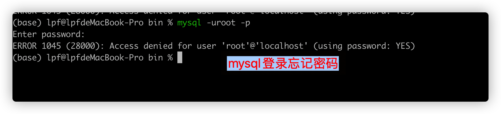

Mac 系统启动Mysql数据库

执行如下命令：

```shell
$> sudo /usr/local/mysql/support-files/mysql.server start
```


之后通过mysql 命令在命令行连接mysql数据库。 


## 遇到的问题

1. ERROR 1045 (28000): Access denied for user 'root'@'localhost' (using password: YES)



原因是密码不对：

解决办法：查找自己之前连接mysql的java代码，从配置文件中获取到密码：lpf123456!@#

