# mysql8单机版安装


## 系统环境检查
安装之前，需要将系统自带的mysql或者mariadb数据库删除掉。并且删除/etc/my.cnf （/etc/my.cnf.rpmsave）文件

执行如下命令查看相关的mysql或者mariadb的rpm包
```shell
   # 这里grep的-i 选项忽略大小写
   $> rpm -qa | grep -i mysql
   $> rpm -qa | grep -i mariadb 
```
如果上面查询出来有数据显示，通过rpm -e 将相关的rpm包进行删除
```shell
   $> rpm -e xxx 
```

卸载相关软件之后，还需要将/etc/my.cnf 文件删除(该文件可能在mysql或mariadb删除过程中被重命名)


## 软件包下载
先通过如下命令下载lrzsz软件包来进行文件上传和下载(也可以不借助该工具，通过其他方式进行上传或下载)

```shell
  yum install lrzsz 
```
mysql8安装包下载地址：    https://dev.mysql.com/downloads/mysql/
下载mysql8的tar包： mysql-8.0.32-el7-x86_64.tar.gz
*  将mysql安装包解压   
      tar -xzvf mysql-8.0.32-el7-x86_64.tar.gz -C ../
*  创建mysql用户
```shell
   $> useradd mysql8
   $> passwd mysql8
```
   通过如上的命令创建的mysql8用户所属的用户组也是mysql8。 而不需要手动创建mysql8用户组。 

* 创建数据目录(通过mysql用户)  
  mkdir -p /opt/mysql8/data/mysql8 

* 编辑 ～/.bash_profile 文件  
   export MYSQL_HOME=/opt/mysql8/mysql-8.0.32  
   export PATH=$MYSQL_HOME/bin:$PATH  
   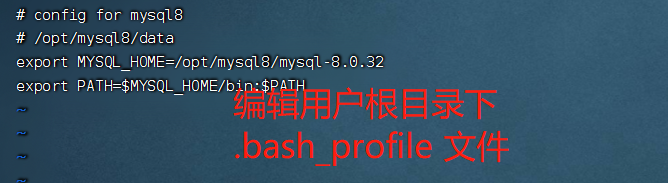

* 编辑/etc/my.cnf（使用root用户进行编辑）
   /etc/my.cnf 文件的内容如下：
   ```text
      [mysqld]
      user=mysql8
      basedir=/opt/mysql8/mysql-8.0.32
      datadir=/opt/mysql8/data/mysql8
      socket=/opt/mysql8/data/mysql8/mysql.sock
      character-set-server=utf8mb4
      lower_case_table_names=1

      [client]
      socket=/opt/mysql8/data/mysql8/mysql.sock
   ```
* 数据库初始化 
   ```shell
      $> mysqld --user=mysql8 --basedir=/opt/mysql8/mysql-8.0.32 --datadir=/opt mysql8/data/mysql8 --socket=/opt/mysql8/data/mysql8/mysql.sock  --initialize
   ```
如下图：
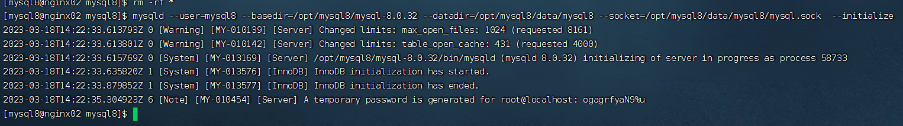


* 启动mysql服务器
```shell
   $> mysqld_safe & 
```
   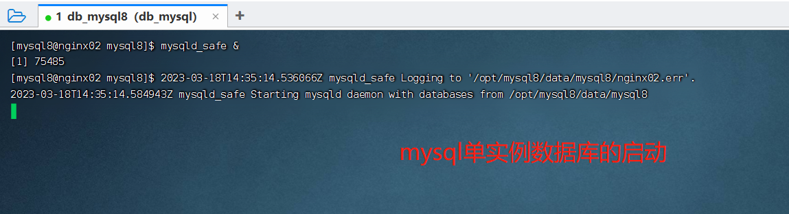
   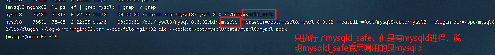

   启动之后会有两个进程一个是mysqld_safe 进程，另一个是mysqld 进程，并且
   mysqld_safe 进程是mysqld进程的父进程。 
   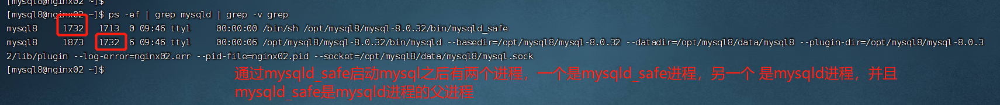

   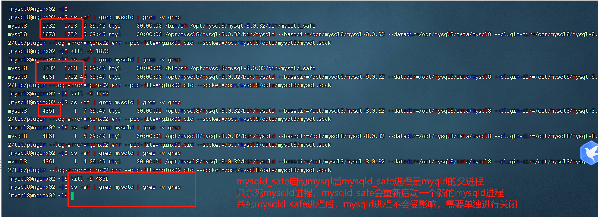

<br/>
mysql数据库创建成功后，需要修改root用户的默认密码，否则无法进行相关的操作，效果如下： 
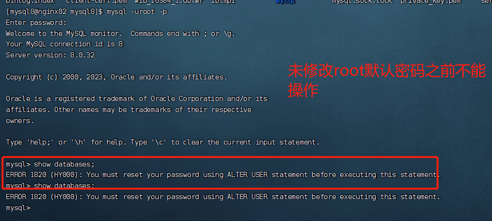


修改mysql初始化后root用户的密码.

修改之后，我们可以通过执行如下的sql查看不同账号使用不同的认证插件。
```SQL
   $> SELECT user, host, plugin from mysql.user;
```
从查询结果中，可以知道mysql8默认的认证方式是：caching_sha2_password。 mysql8之前的认证方式是 mysql_native_password
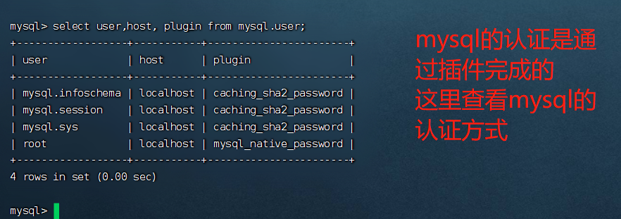


<br/><br/>
## 通过mysqladmin命令查看mysql数据库的相关信息
```shell
   # 通过套接字sock来进行连接
   $> mysqladmin -uroot -p version  
   # 通过网络进行连接
   $> mysqladmin -uroot -p -h 127.0.0.1 version 
```
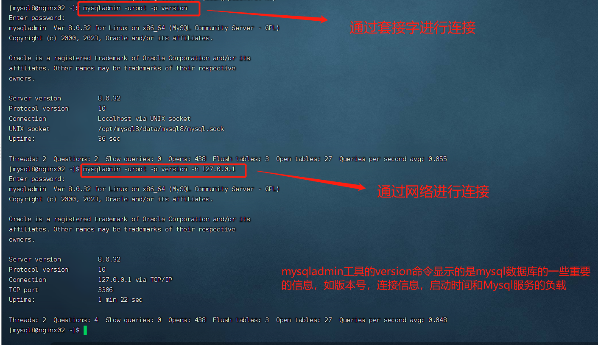
mysqladmin 工具的version参数显示的是mysql数据库的一些重要的信息，例如版本号，连接方式(sock或者网络)以及mysqld服务器运行的总时长。 


<br/>
## 通过mysqlshow命令查看已存在的数据库的相关信息  

```shell
   $> mysqlshow --vv -uroot -p  
```
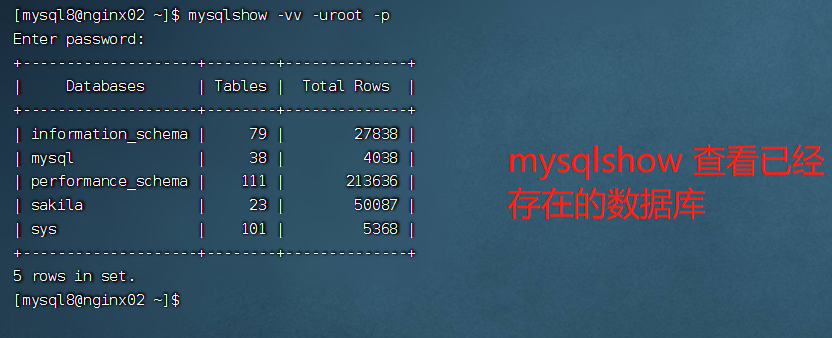


## 遇到的问题
1. 使用rz命令上传安装包的时候，上传失败。
   1. 定位到原因是磁盘空间比较小，后来新增了磁盘，并且进行分区，和挂载之后就可以解决问题

2.  ERROR 2003 : cannot connect to MySQL server on '192.168.23.129'
   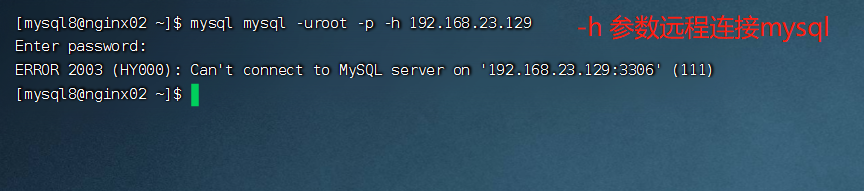
   出现这个原因是： 用户名/密码不对？ （TODO）

      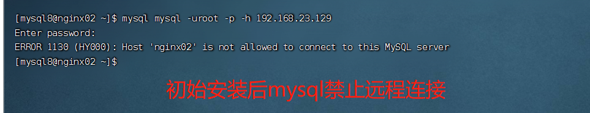
   原因： mysql初始化后，是禁止远程连接的，只支持本地连接，且默认只有四个用户，且只要root账号是未锁定的。 

   解决方案：配置root账号都可以远程访问
   ```sql
      SQL> use mysql;
      SQL> update user t set t.host = '%' where t.user = 'root';
   ```
   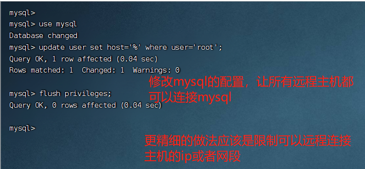


## 其他
安装后mysql的root用户的密码是123456


## TODO
* 修改mysql的配置，让指定的主机可以访问。
* 修改mysql的配置，让指定网段的主机可以远程访问
* 修改mysql的配置，让某几个ip可以远程访问
* 安装的时候，设置mysql的套接字为默认的套接字位置，是不是更好，这样在本地访问的时候，mysql命令可以快速访问，而不用指定套接字的位置


## 变更记录

| 日期              | 操作类型 | 修改内容                                               | 备注 |
| ----------------- | -------- | ------------------------------------------------------ | ---- |
| 2023-03-18 星期六 | A        | 在 centos7 上安装mysql8数据库                   |      |
| 2023-03-19 星期日 | A        | 在centos7上安装mysql8数据库整体流程梳理                   |      |
| 2023-03-20 星期一 | M        | 将操作过程中的图片添加到该文档中，让文档有血有肉                   |      |
