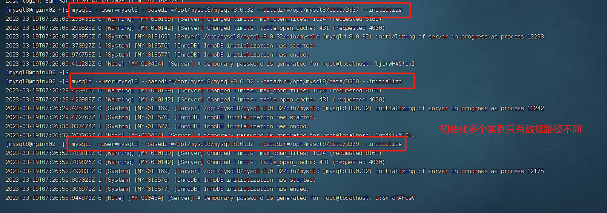
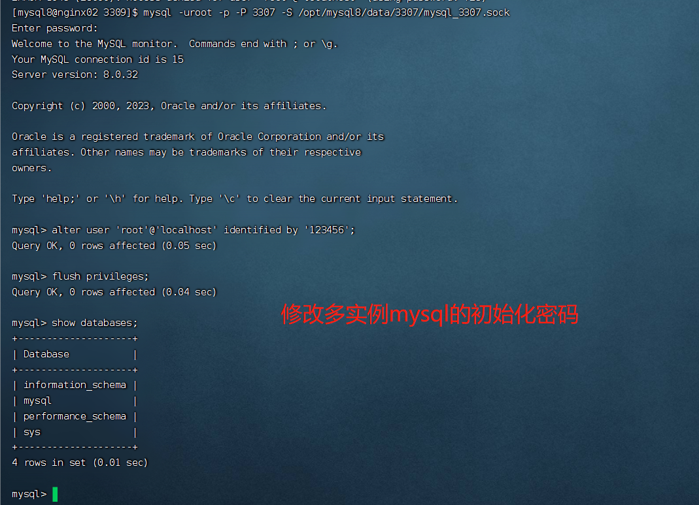
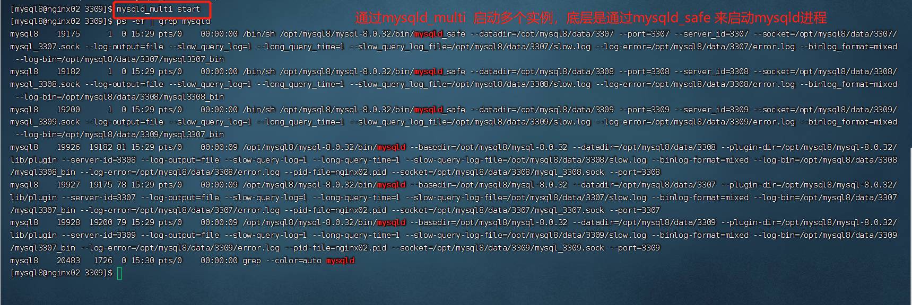
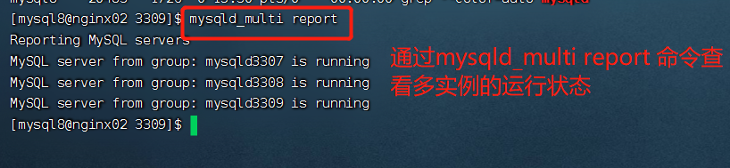
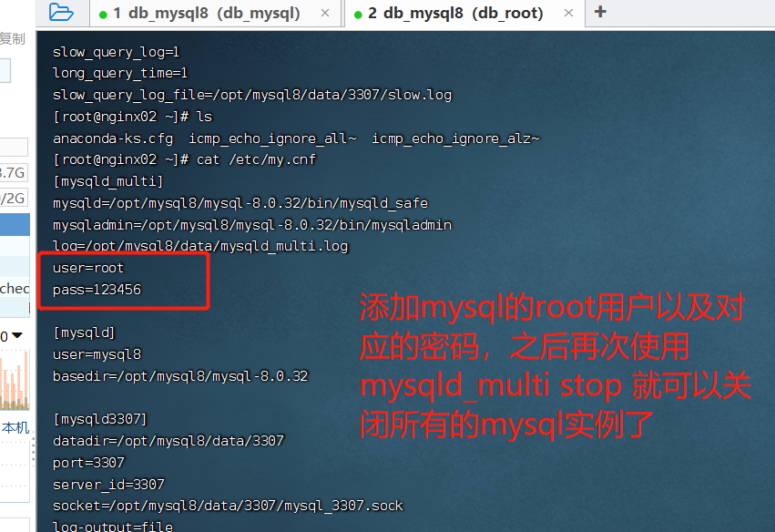
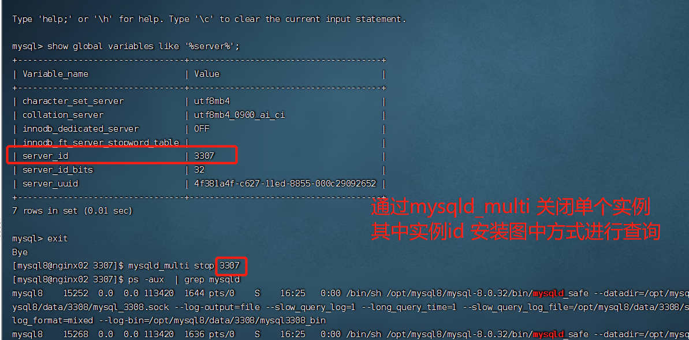
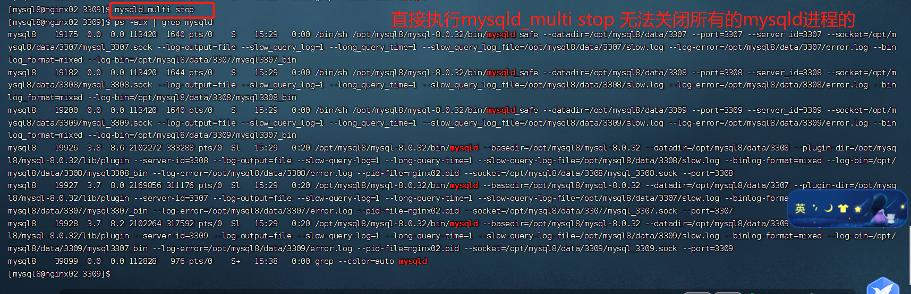
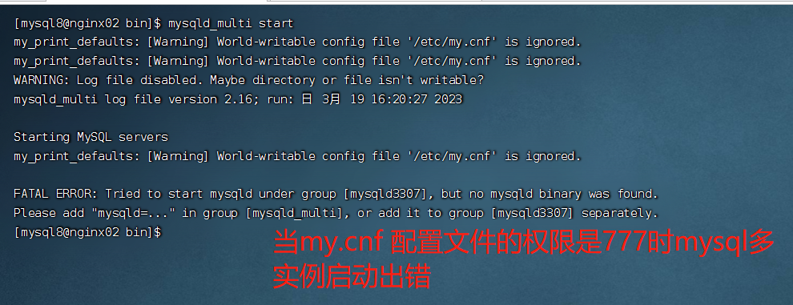

# Mysql8.0多实例安装


## 操作系统检查
删除之前安装或系统自带的mysql和mariadb数据库的信息。参考 [mysql8单击版安装.md]文档

## 软件包下载
先通过如下命令下载lrzsz软件包来进行文件上传和下载(也可以不借助该工具，通过其他方式进行上传或下载)

```shell
  yum install lrzsz 
```
mysql8安装包下载地址： https://dev.mysql.com/downloads/mysql/
下载mysql8的tar包： mysql-8.0.32-el7-x86_64.tar.gz
*  将mysql安装包解压   
      tar -xzvf mysql-8.0.32-el7-x86_64.tar.gz -C ../
*  创建mysql用户
```shell
   $> useradd mysql8
   $> passwd mysql8
```
通过如上的命令创建的mysql8用户所属的用户组也是mysql8。 而不需要手动创建mysql8用户组。 

* 创建数据目录(通过mysql用户)
```shell
    $> mkdir -p /opt/mysql8/data/3307
    $> mkdir -p /opt/mysql8/data/3308
    $> mkdir -p /opt/mysql8/data/3309
```

* 编辑 ～/.bash_profile文件
```text
export MYSQL_HOME=/opt/mysql8/mysql-8.0.32
export PATH=$MYSQL_HOME/bin:$PATH
```

* 编辑/etc/my.cnf 
```text
[mysqld_multi]
mysqld=/opt/mysql8/mysql-8.0.32/bin/mysqld_safe
mysqladmin=/opt/mysql8/mysql-8.0.32/bin/mysqladmin
log=/opt/mysql8/data/mysqld_multi.log
user=root
pass=123456

[mysqld]
user=mysql8
basedir=/opt/mysql8/mysql-8.0.32

[mysqld3307]
datadir=/opt/mysql8/data/3307
port=3307
server_id=3307
socket=/opt/mysql8/data/3307/mysql_3307.sock
log-output=file
slow_query_log=1
long_query_time=1
slow_query_log_file=/opt/mysql8/data/3307/slow.log
log-error=/opt/mysql8/data/3307/error.log
binlog_format=mixed
log-bin=/opt/mysql8/data/3307/mysql3307_bin


[mysqld3308]
datadir=/opt/mysql8/data/3308
port=3308
server_id=3308
socket=/opt/mysql8/data/3308/mysql_3308.sock
log-output=file
slow_query_log=1
long_query_time=1
slow_query_log_file=/opt/mysql8/data/3308/slow.log
log-error=/opt/mysql8/data/3308/error.log
binlog_format=mixed
log-bin=/opt/mysql8/data/3308/mysql3308_bin

[mysqld3309]
datadir=/opt/mysql8/data/3309
port=3309
server_id=3309
socket=/opt/mysql8/data/3309/mysql_3309.sock
log-output=file
slow_query_log=1
long_query_time=1
slow_query_log_file=/opt/mysql8/data/3309/slow.log
log-error=/opt/mysql8/data/3309/error.log
binlog_format=mixed
log-bin=/opt/mysql8/data/3309/mysql3307_bin
```   

* 初始化不同的mysql实例
```shell
$> mysqld --user=mysql8 --basedir=/opt/mysql8/mysql-8.0.32 --datadir=/opt mysql8/data/3307 --socket=/opt/mysql8/data/3307/mysql_3307.sock  --initialize

$> mysqld --user=mysql8 --basedir=/opt/mysql8/mysql-8.0.32 --datadir=/opt mysql8/data/3308 --socket=/opt/mysql8/data/3308/mysql_3308.sock  --initialize
   
$> mysqld --user=mysql8 --basedir=/opt/mysql8/mysql-8.0.32 --datadir=/opt mysql8/data/3309 --socket=/opt/mysql8/data/3309/mysql_3309.sock  --initialize
```
操作如下图：



修改多实例mysql数据库的初始化密码
```sql
  SQL> use mysql;
  SQL> alter user 'root'@'localhost' identified by '123456';
  SQL> flush privileges;
```



## 通过mysqld_multi管理多个实例
* 启动所有的实例
```shell
$> mysql_multi start
```

启动之后会出现三个mysqld_safe进程，三个mysqld进程。 


* 查看所有实例的状态
```shell
$> mysqld_multi report
```
显示结果如下图：



* 关闭所有的msyqld实例
    首先保证在/etc/my.cnf 文件的[mysqld_multi] 部分，添加如下内容

```text
user=root
pass=123456
```
这里user和pass 分别是mysql的root用户的密码。 (从这里也可以知道多个不同实例，root用户的密码应该一致)  
配置内容如下：  



msyqld_multi 关闭单个实例

```sql
  # 这里的server_id 3307 是配置在my.cnf中的，可以通过查询系统参数server_id 来确定
  SQL> mysqld_multi stop 3307(server_id)
```



## 遇到的问题
1. mysqld_multi stop 无法关闭多个实例

  解决方案： 编辑/etc/my.cnf 在[mysqld_multi]单元下面添加如下内容
    ```text
    user=root
    # pass 指向mysql的root用户的密码
    pass=123456 
    ```
2. my.cnf 权限不对导致的错误
  当my.cnf配置文件的权限是777时，mysql多实例启动出错。
  


## TODO 
如果多个实例的root用户的密码不一致，关闭时，该如何配置
可以配置其他用户作为关闭时的用户

<br/>
## 变更记录

| 日期              | 操作类型 | 修改内容                                               | 备注 |
| ----------------- | -------- | ------------------------------------------------------ | ---- |
| 2023-03-19 星期日 | A        | 在 centos7 上安装mysql8数据库                   |      |
| 2023-03-20 星期一 | M        |将多实例操作中的一些图片记录                  |      |
