# Mysql 的 mysql_config_editor 命令

[TOC]

Mysql_config_editor 是 mysql 自带的一款用于安全加密登陆的工具，使用这个工具，可以创建一个登陆 MySQL 的路径。

mysql_config_editor 对 .mylogin.cnf 文件进行模糊处理，因此无法将其作为明文读取，因此使用 cat 是不能查看的。不过 mysql_config_editor 提供了一个 print 命令用于显示登陆路径文件内容的命令.

使用 mysql_config_editor 可以管理一台 MySQL 实例，也可以用于管理多台 MySQL 实例。 最重要的是能免除在命令行，脚本里输入明文密码，带来一系列的安全隐患了。

## 支持的选项

- set
- remove
- print
- reset
- help

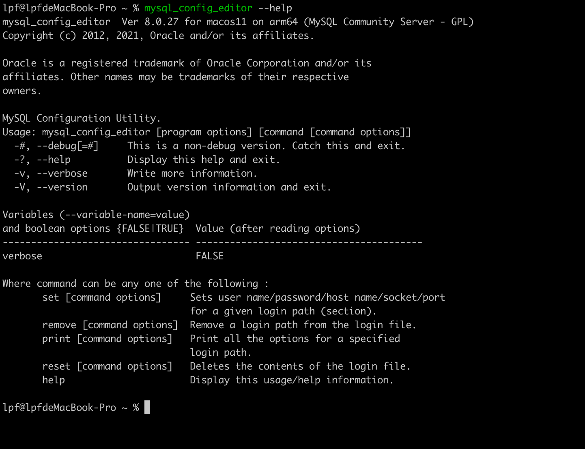

### set 选项

set 选项用于设置 login path 的值，

在使用 set 进行配置的时候，密码不能明文输入，否则会报错
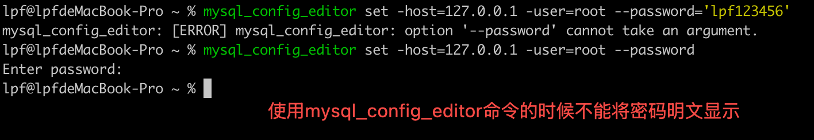

在执行的时候，要注意相关参数的全称和简称，
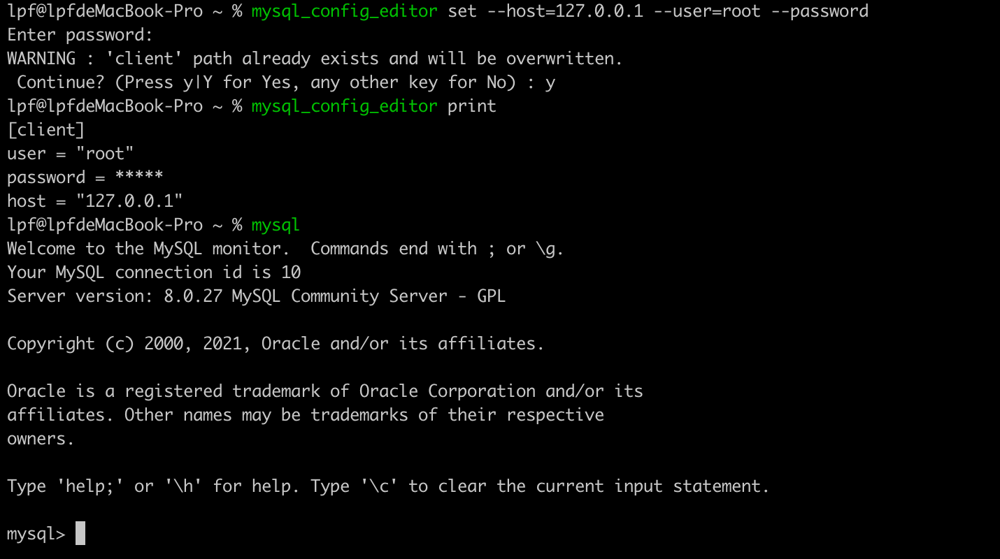

默认情况下，生成的文件保存在 $HOME/.mylogin.cnf 文件中
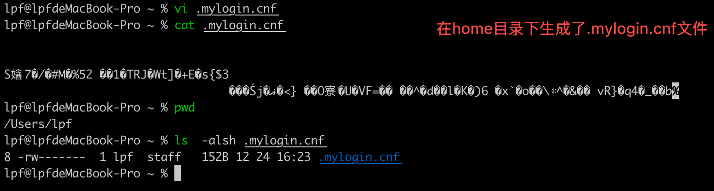
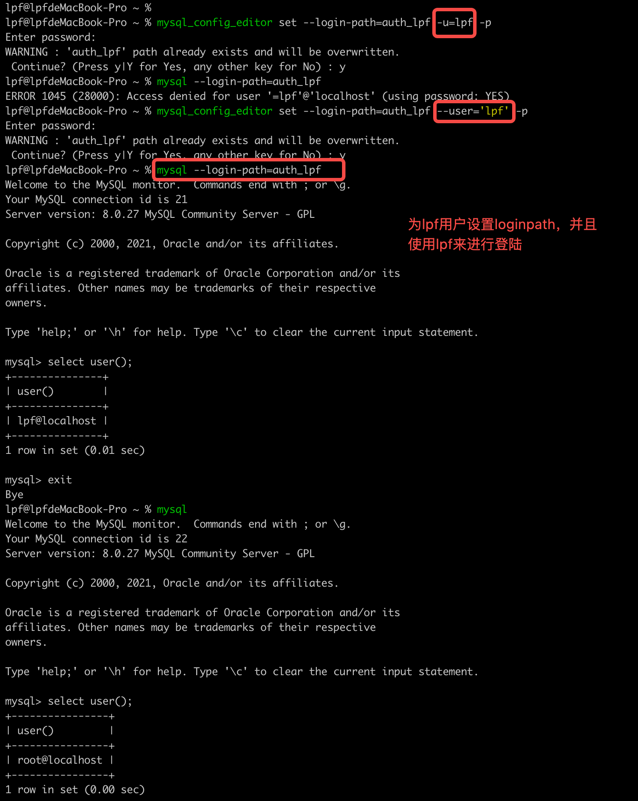

### 使用

在登陆的时候通过--login-path 来指定使用哪个账号来进行登陆

### print 选项

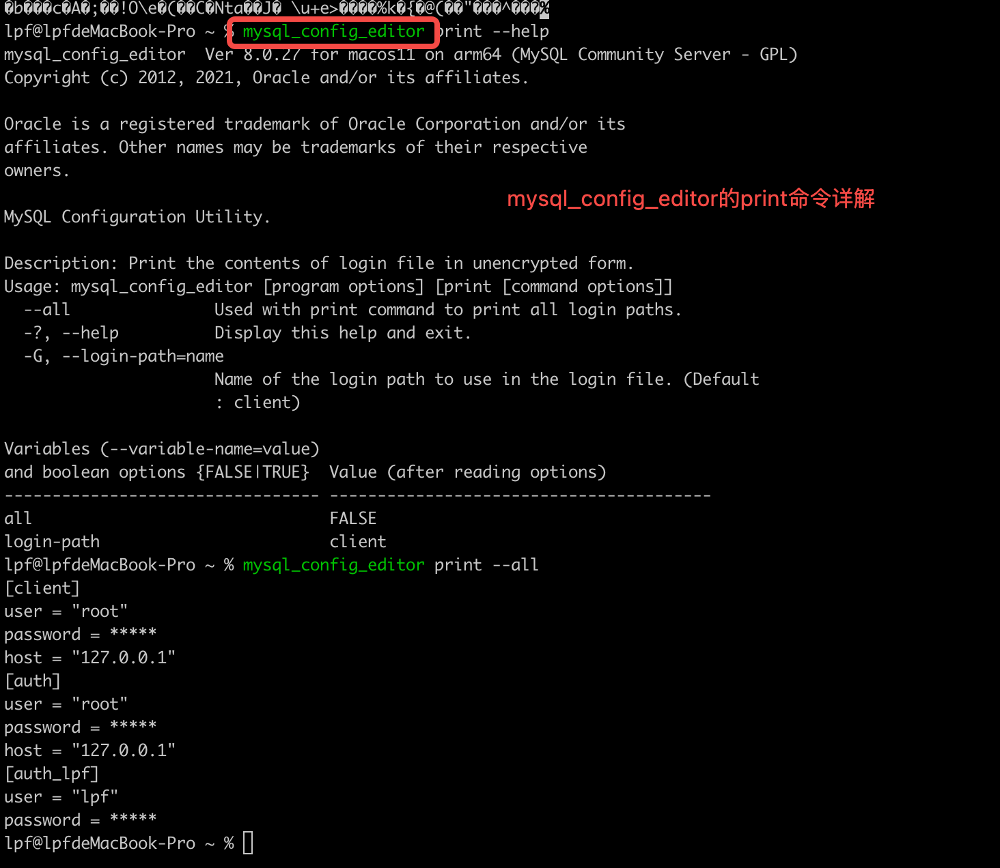

通过 print 选项可以查看 mysql*config_editor 配置过的 login-path 信息

查看所有 login-path 的配置信息
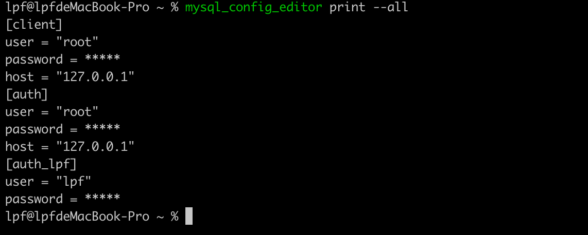

### reset 选项

reset:清空登录路径文件的全部内容

### remove 选项

remove 选项可以移除某个 loginpath 或者某个 loginpath 中的某个参数
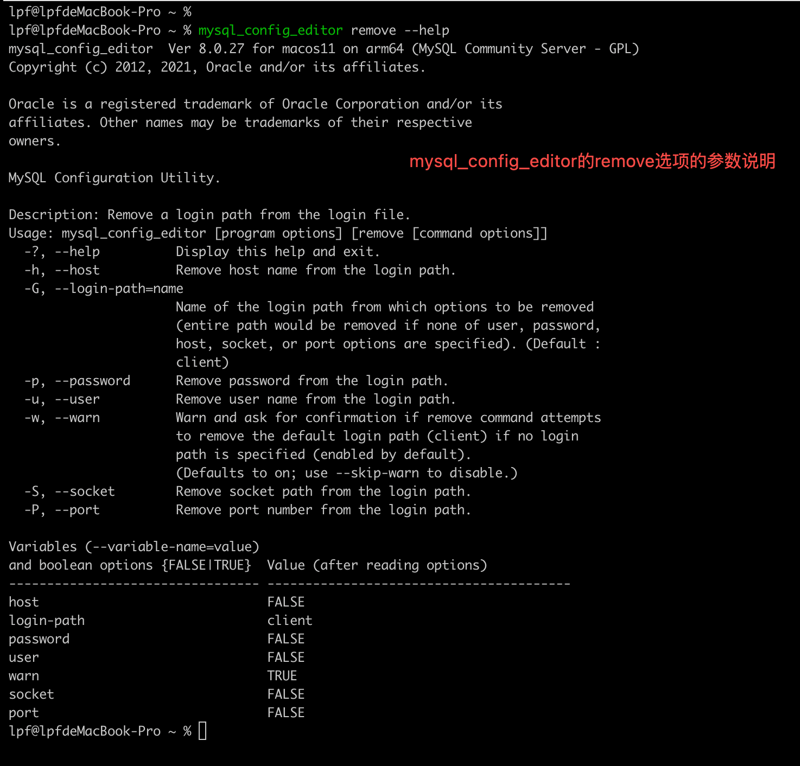

移除指定的 loginpath 的登录信息
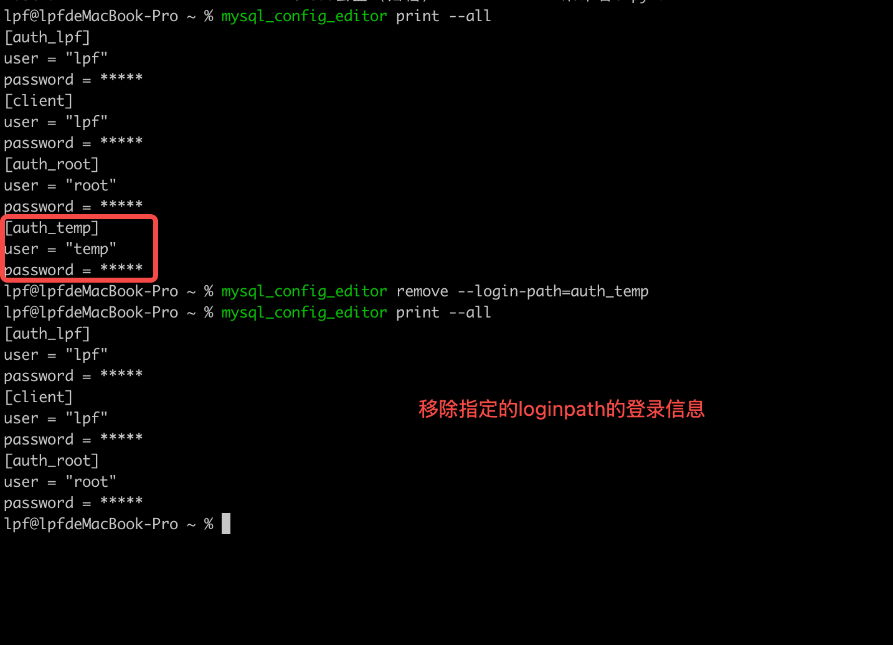

移除默认 loginpath 中国的 host 参数配置
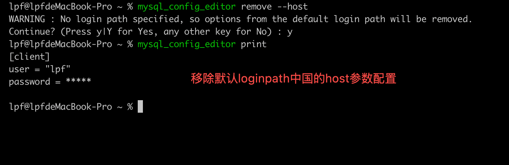

### 细节

Mysql*config_editor 只是保存登录信息不会验证是否能够联通*

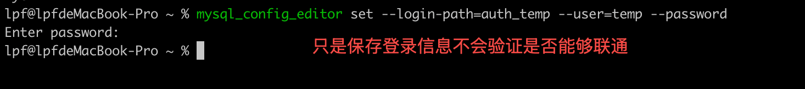

Mysql*config_editor 有一个默认的登录路径（client），默认配置和默认登陆时不指定都是通过这个来进行操作

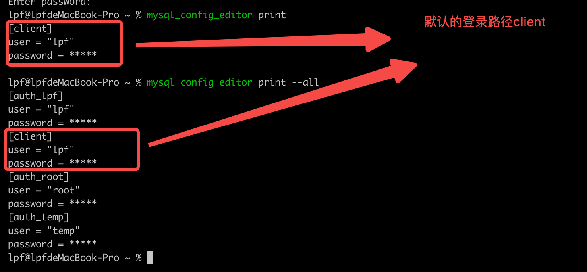

## 参考资料

https://blog.csdn.net/WF_crystal/article/details/135592740 

[官方文档](https://dev.mysql.com/doc/refman/8.0/en/mysql-config-editor.html)

## 变更记录

| 日期              | 操作类型 | 修改内容                                     | 备注 |
| ----------------- | -------- | -------------------------------------------- | ---- |
| 2024-12-24 星期二 | A        | 第一次联系 mysql 的 mysql_config_editor 命令 |      |
|                   |          |                                              |      |
|                   |          |                                              |      |
