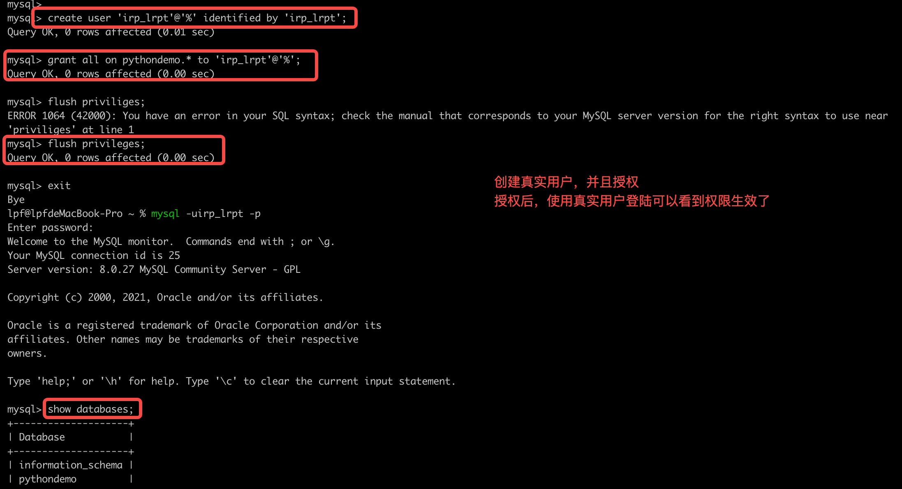
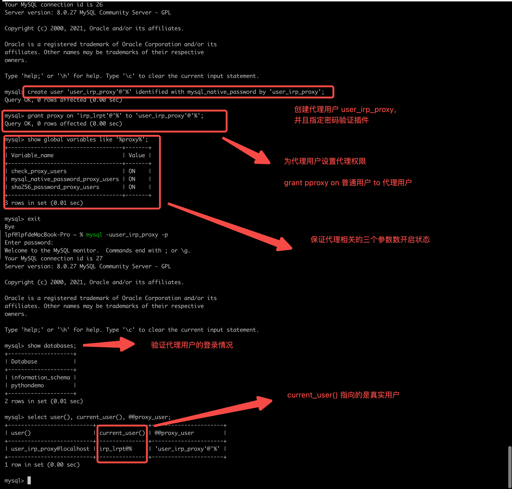
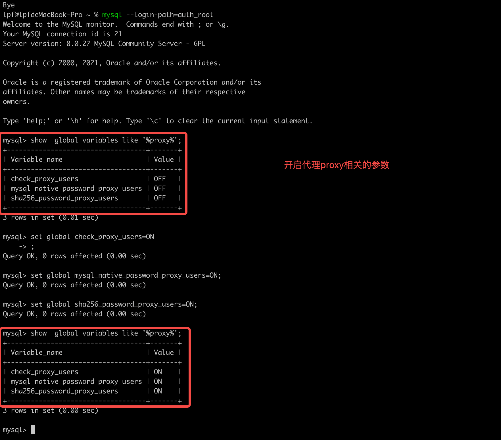
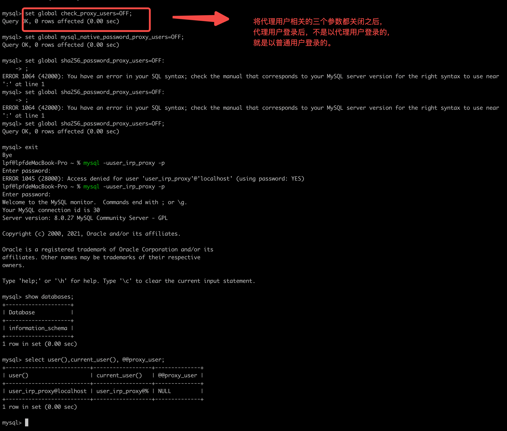

# MySQL代理用户Proxy User

代理用户就是作为真实用户的代理来登陆数据库。

建议不要用隐藏在代理用户后面的真实用户登陆，代理就是为了不暴露真实用户。 

## 客户需求

客户有这么一个需求：应用代码中连接数据库的用户信息（用户名/密码）写死在程序代码包中，部署了很多台机器应用服务器，发布后不想再进行对用户和密码的修改，而开发也想在上线前期使用该业务用户进行数据运维，后期上线后进行收回或者注销，这样同时使用代理用户和真实用户，就可以实现这个功能。

## 验证过程

创建普通用户

创建代理用户

开启代理用户相关的参数

关闭三个代理参数后，代理用户就是普通用户了。 

## 参考资料

[墨天轮](https://www.modb.pro/db/623961)

[mysql8.4官网proxyUser介绍](https://dev.mysql.com/doc/refman/8.4/en/proxy-users.html)

