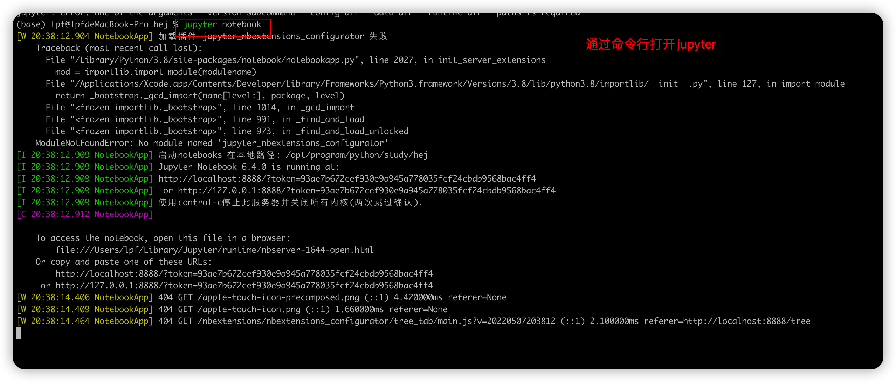
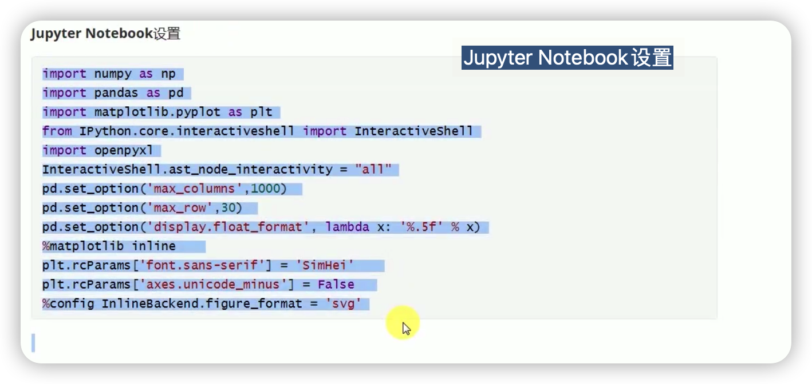

# Juypter的使用


打开jupyter 

在命令行下切换需要的工作空间中，之后执行如下命令

```shell
$> jupyter notebook
```

效果如下：




### Jupyter Notebook的设置



这里第四行和第六行设置jupyter 的Notebook 每次执行多个函数的时候，输出多个结果，默认情况下，Jupyter Notebook 只会返回一个结果。 

```python
# 设置jupyter打印每次的计算结果
from IPython.core.interactiveshell import InteractiveShell
InteractiveShell.ast_node_interactivity = "all"
```

注意：这里设置应该在jupyter的第一行进行设置


JupyterNotebook的快捷键

| 快捷键 |        操作        |
| :----: | :----------------: |
|   x    | 删除一个cell计算格 |
|        |                    |
|        |                    |

使用过程遇到的问题

* 无法利用jupyter将文件转换为pdf。 转换过程报错（依然没有解决）
* 