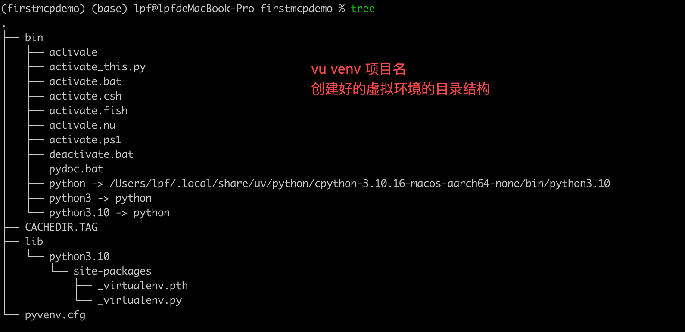

## # UV

## 安装

### mac系统安装uv 

```powershell
$> brew install uv
```

## uv可以完成的事情

* python的版本管理
* 依赖管理
* python程序打包
* python程序安装

## uv相关的命令

### python的版本管理

```shell
打印出uv支持的所有版本,不同操作系统下列表不一样
$> uv python list 
```


```shell
使用uv下载python的指定版本
$> uv python install cpython-3.12   

使用交互的方式运行python
$> uv run -p 3.12 python 

使用pypy来运行python程序，这里的pypy是python的一个版本
$> uv run -p pypy python 
 
```

### 依赖管理

```shell
使用python 3.13 创建一个python项目
$> uv init -p 3.13
```

```shell
使用uv 安装python的依赖， 在安装好依赖的同时还会创建相关的虚拟环境, 安装的python依赖会被记录到项目的pyproject.toml 文件中
$> uv add pandantic_ai

添加ruff依赖，这里添加--dev，说明这个依赖只在开发阶段有用，这样在打生产包的时候就不会将相关的依赖打包进去
$> uv add ruff --dev 

还可以通过如下命令安装依赖
$> uv pip install requests  # 不推荐，推荐创建好项目后 执行 uv add xxx 添加依赖

可以手动创建虚拟环境
```shell
$> uv venv firstmcpdemo   # 不推荐，建议直接使用 uv init，uv add xxx 来自动生成虚拟环境


通过 uv venv firstmcpdemoe 创建好虚拟机环境后，并没有创建好uv的项目，没有创建pyproject.toml 文件，还是需要 uv init 命令来初始化项目

创建虚拟环境后，手动激活虚拟环境
$> source bin/activate

```

创建好的虚拟环境目录结构如下：



OA
将ruff依赖删除
$> uv remove ruff --dev 

将相关的依赖添加到系统环境中，此时相关的命令就是脱离当前的工程独立运行的了， 通过which xx 查看，可以知道它的路径并不在当前的虚拟环境中
$> uv tool install ruff

```


```shell
查看已经安装的工具
$> vu tool list
```


```shell
查看工程所有依赖之间的关系
$> uv tree
```


   # 可以

### 运行

uv run xxx.py     # 这个命令会使用uv创建的虚拟环境来运行python文件

## 打包python程序为whl文件

编辑pyproject.toml 文件
新增
[project.scripts]
命令名称 = "想要运行的python的函数和脚本名"
ai = "main"

这里要注意，project.scripts 标签内容要明确文件的入口，一般是初始化的main.py 文件
执行 uv build 命令将整个工程 打包成whl文件，该文件会放到项目的dist目录下


## 安装whl文件

uv tool install xxx


## 疑惑
1. 在mac系统通过brew 安装uv之后，uv安装的tool默认安装路径为/Users/lpf/.local/bin 如果修改该路径？
2. 使用uv tool install 安装whl文件的时候一个版本的文件只能安装一次，有没有办法可以重复安装？ 
3. 

## 遇到的问题
1. 


2. 

error: Multiple top-level modules discovered in a flat-layout: ['a', 'weather'].


## 版本变更

author： lipf
date 2025-04-13 星期日
