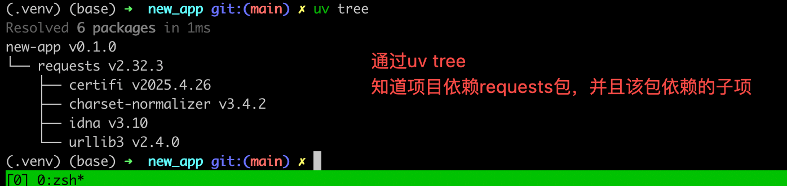

# UV使用

## 概述

### uv可以完成的事情

* 虚拟环境管理：替代 venv或虚拟env来创建或管理虚拟环境
* python包管理器
* python的版本管理
* 依赖管理
* python程序打包
* python程序安装, 取代PIP进行包的安装
* 其它
  * 取代pip来生成锁文件
  * 取代pipx来安装和运行Python工具

## 安装

### mac系统安装uv 

```powershell
$> brew install uv
```

### linux系统安装uv

​	linux系统下，直接通过pip install uv 可以快速完成uv的安装。 其它方式稍微繁琐一些

## 没用uv之前操作流程

```text
1、mkdir xxx  创建项目目录
2、cd xx.  切换到指定目录
3、python3 -m venv .venv  主动创建虚拟环境
4、source .venv/bin.activate 主动激活虚拟环境
5、pip3 install xxx 安装相关的依赖包
6、 pip freeze > requirements.txt  # 将虚拟环境中的依赖导出为requirements.txt, 便于环境迁移以及后续的部署

```

## 使用uv后操作流程

```text
1、 uv init new_app   通过uv init自动完成项目的初始化，会自动生成git，并且将虚拟环境.venv 添加到.gitignore 文件中，其它人下载项目后，通过uv sync 来下载和创建相关的虚拟环境还有依赖
2、uv add xxx 添加依赖
3. uv run main.py 运行项目
```

## uv相关的命令

### 命令总览

```text
An extremely fast Python package manager.

Usage: uv [OPTIONS] <COMMAND>

Commands:
  run      Run a command or script
  init     Create a new project
  add      Add dependencies to the project
  remove   Remove dependencies from the project
  sync     Update the project's environment
  lock     Update the project's lockfile
  export   Export the project's lockfile to an alternate format
  tree     Display the project's dependency tree
  tool     Run and install commands provided by Python packages
  python   Manage Python versions and installations
  pip      Manage Python packages with a pip-compatible interface
  venv     Create a virtual environment
  build    Build Python packages into source distributions and wheels
  publish  Upload distributions to an index
  cache    Manage uv's cache
  self     Manage the uv executable
  version  Read or update the project's version
  help     Display documentation for a command
```

## uv命令详解

### init

初始化一个python项目的开发环境，初始化的时候会自动初始化一个git仓库，以及其它必要的文件
方式一： uv init 项目名，创建新项目并指定使用uv进行管理
方式二：uv init  对现有项目进行uv管理，需要先切换到项目所在目录
使用uv init初始化后的项目目录结构如下：


* .python-version 用于控制项目中python的版本，确保不同的开发使用一致的Python版本
* pyproject.toml  项目的全局配置文件，负责管理项目的名称，依赖管理，安装等，是目前比较先进的一种项目管理方式
* uv.lock  在添加依赖并生成虚拟环境后，会生成uv.lock 文件，该文件用于锁定python包的版本
  * 这个锁文件记录了所有安装包的确切版本，包括子依赖项
  * 确保了环境完全是可复现的

虚拟环境管理：在首次需要需要虚拟环境的场景的时候，会快速创建虚拟环境。 

### venv
可以手动创建虚拟环境
```shell
$> uv venv firstmcpdemo   # 不推荐，建议直接使用 uv init，uv add xxx 来自动生成虚拟环境
通过 uv venv firstmcpdemoe 创建好虚拟机环境后，并没有创建好uv的项目，没有创建pyproject.toml 文件，还是需要 uv init 命令来初始化项目
创建虚拟环境后，手动激活虚拟环境
$> source bin/activate
```
### add

用于为python项目添加依赖, 在第一次添加依赖的时候，会创建虚拟环境 .venv

批量添加多个依赖项

### tree

用于显示依赖，以及依赖之间的关系.  将依赖可视化，便于查看依赖树


### run

使用run命令可以快速运行python项目，并且不需要特意的激活当前项目的虚拟环境。 

```main.py
import sys

def main():
    print("Hello from new-app!")
    # 这里sys.executable 打印的时候执行python使用的python 解释器的完整路径
    print(sys.executable)

if __name__ == "__main__":
    main()

```

​	

**run命令可以补全丢失的虚拟环境**


### sync

sync     Update the project's environment

其他人clone下来uv管理的python项目后，可以通过 uv sync 创建好虚拟环境和相关的依赖。 

**报错**


问题分析：

```text
这表明在编译 `kiwisolver` 包的 C++ 代码时，编译器找不到 `<algorithm>` 头文件。这个头文件是 C++ 标准库的一部分，通常由 Xcode 或 Clang 编译器提供。
```

解决方案：

```
mac系统：
xcode-select --install   # 安装xcode的一些内容，如果提示已经安装，执行下面的问题
sudo xcode-select -r 
```


**正确执行后效果**


### remove
remove   Remove dependencies from the project
将某个不再使用的依赖从项目中移除。该命令会更新pyproject.toml 和uv.lock 文件

### tool

tool     Run and install commands provided by Python packages

Tool 选项可以用于安装python包提供的工具，例如ruff。 


**uv tool 还可以下载安装的工具**

(new-app) (base) ➜  new_app git:(main) ✗ uv tool uninstall ruff                                                        
Uninstalled 1 executable: ruff                                                                                         
(new-app) (base) ➜  new_app git:(main) ✗ which ruff                                                                    
ruff not found                                                                                                         
(new-app) (base) ➜  new_app git:(main) ✗

**在不安装工具的前提下使用工具**

```shell
uv tool run ruff check
```

uv 为uv tool run 设计了一个快捷方式，就是uvx。 

```shell
uvx ruff check
```


**查看uv安装的tool有哪些**


升级工具版本

```shell
uv tool upgrade --all
```

### uv pip

pip      Manage Python packages with a pip-compatible interface
使用类似pip的接口来进行包管理，不过性能比pip快很多。 

uv pip使用不当会在运行时报错

uv_pip的正确使用方式： 使用之前先切换到当前项目的虚拟环境

通过 uv pip list 查看uv管理项目的依赖


run

### python

#### 打印支持的python版本

```shell
打印出uv支持的所有版本,不同操作系统下列表不一样
$> uv python list 
```


#### 使用uv下载python的指定版本

```shell
使用uv下载python的指定版本
$> uv python install cpython-3.12   

使用交互的方式运行python
$> uv run -p 3.12 python 

使用pypy来运行python程序，这里的pypy是python的一个版本
$> uv run -p pypy python 
 
```

## uv的智能全局缓存系统

uv会将同一个版本的依赖，只保留一份，长期来看，会节省大量的磁盘空间。 

而其它的虚拟环境管理工具（pip和venv），会将每个依赖都单独保持一份。 

虽然，不同项目，相同版本的依赖，只保留一份，但是uv依赖保证每个项目的独立性。

## uv的虚拟环境

uv创建虚拟环境的不足之处: 没用pip，因此创建的虚拟环境可能不对。 


**uv关于依赖管理的一个最佳实践**


TODO:  不知道通过 uv add pip ，能不能也达到这个效果。 

## 打包程序为whl文件

编辑pyproject.toml 文件
新增
[project.scripts]
命令名称 = "想要运行的python的函数和脚本名"
ai = "main"

这里要注意，project.scripts 标签内容要明确文件的入口，一般是初始化的main.py 文件
执行 uv build 命令将整个工程 打包成whl文件，该文件会放到项目的dist目录下


### 安装whl文件

uv tool install xxx

## 疑惑
1. 在mac系统通过brew 安装uv之后，uv安装的tool默认安装路径为/Users/lpf/.local/bin 如果修改该路径？
2. 使用uv tool install 安装whl文件的时候一个版本的文件只能安装一次，有没有办法可以重复安装？ 

## 其它知识点

ruff工具的使用

ruff check --fix 对当前项目下的python文件进行检查并修复。 如果不添加--fix，则只检查，不做修复

## TODO

1. 不知道为什么通过tool安装的工具，所在路径不一样？ 

## 遇到的问题

1. 

2. 
    error: Multiple top-level modules discovered in a flat-layout: ['a', 'weather'].

## 参考资料

[官方文档](https://docs.astral.sh/uv/)

[pyproject官方文档](https://packaging.python.org/en/latest/guides/writing-pyproject-toml/)

## 变更记录

| 日期              | 类型 | 操作内容                       | 备注                                                       | 接下来验证的内容 | 操作用户 |
| ----------------- | ---- | ------------------------------ | ---------------------------------------------------------- | ---------------- | -------- |
| 2025-04-13 星期日 | C    | uv命令的使用                   | 第一版本，记录了一些uv命令，但是这些命令还不能很熟练的使用 |                  | lipf     |
| 2025-05-18 星期日 | A    | 结合自己实践，补充一些uv的用法 | 对uv的命令按照不同的选项分类，便于理解和记忆               |                  | lipf     |
|                   |      |                                |                                                            |                  |          |
|                   |      |                                |                                                            |                  |          |

类型说明： C：创建    A： 最近内容    U：修改内容     R：解决疑惑点