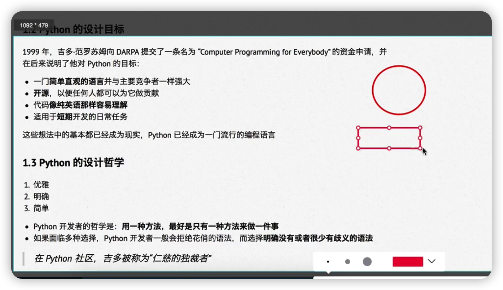
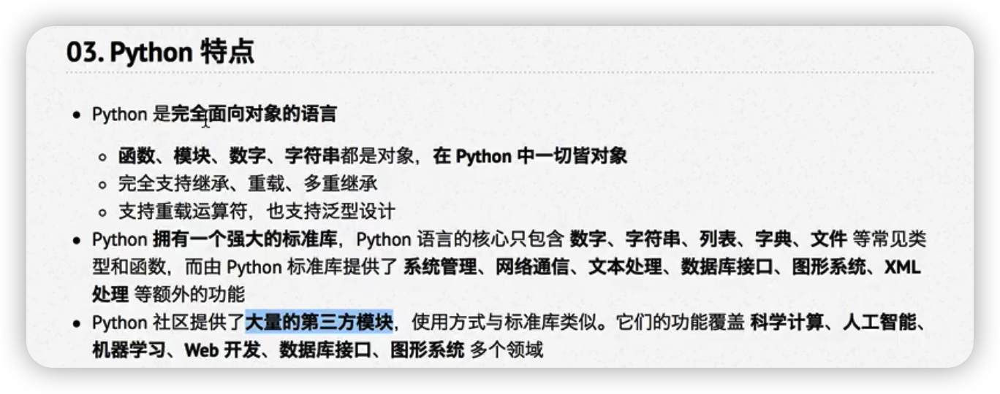

# Python入门必备的一些非编程知识

python是一个格式非常严格的程序设计语言
目前而言，大家记住，每行代码前面都不要增加空格
有了空格，可能会报 unexpected indent 错误。 

Python的设计哲学

选择Python的原因

python的特点

004_python的优缺点.png

* 运行python的三种方式
1. python解释器
2. 交互式运行python程序
   直接在终端中运行解释器，而不输入执行的文件名
   在python的shell中直接输入python代码，会立即看到程序执行结果
   通过输入 exit() 来退出python程序 或者通过Ctrl + D 来退出程序。 
3. IPython 
   IPython中的I 代表交互interactive 
   IPython是一个python的交互式shell，比默认的python shell 好用得多
   * 支持自动补全
   * 支持缩进
   * 支持bash shll 命令
   * 内置了很多有用的功能和函数
 * Ipython是一个基于BSD开源的
 * 

