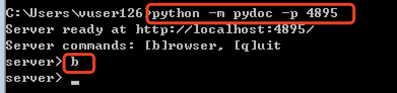

# Python 基础： Python 查看API 接口文档

搭建好了python 开发环境之后，在本地查看API 接口文档

## Mac 系统查看python 的API文档

在命令后执行如下命令 

​	python -m pydoc  -p 4895 

这里 python3  -m pydoc   是打开pydoc模块

-p 4895 是指定服务启动的端口号

如下图

在mac 系统，可能会存在python2的版本，因此一般通过python3 来启动相关命令。 

## Windows 系统查看python的API文档

在windows 系统的cmd中执行 python -m pydoc -p 4895 ，

之后输入b 表示浏览器打开指定端口，如下图

同时还可以输入q 来表示退出python api 的服务

