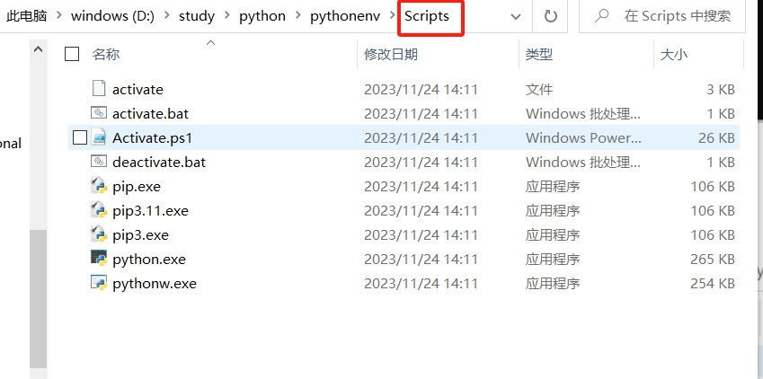

# Python虚拟环境的搭建


虚拟环境是Python开发中的一个重要工具，它可以帮助你隔离项目，保持环境整洁，同时也方便了项目共享与管理。 


venv模块支持创建轻量的“虚拟环境”，每个虚拟环境将拥有她吗自己独立的安装在其site目录的python软件包集合。 虚拟环境是现有的Python安装版基础之上创建的，这被称为虚拟环境的基础Python。


## Windows系统下创建python的虚拟环境

### 创建虚拟环境

执行如下命令创建Python的虚拟环境

```python
$> python -m venv pythonenv
```


创建之后，会在当前目录下创建一个同名的文件夹，这里文件夹的名称是【pythonenv】

对应的目录结构如下


其中，Scripts目录下的可执行命令如下：




### 激活虚拟环境

Windows下通过执行 activate.bat 命令来激活虚拟环境，


虚拟环境中的pip命令是在虚拟环境的Lib目录下的pip，而不是其他地方的pip。


之后，我们就可以在该虚拟环境中，安装某个项目依赖的项目。 eg


在虚拟环境中，安装的依赖存放路径是 Lib\site-packages\


在虚拟环境中启动Django项目


### 退出虚拟环境

切换到某个虚拟环境的Scripts目录下，执行 

```shell
$> deactivate.bat
```


## Mac 系统虚拟环境的创建

通过python3 命令创建python的虚拟环境

```shell
$> python3 -m venv pythonenv
```

"


这里通过python命令创建了虚拟环境，该虚拟环境叫做 pythonenv

这里的 -m 参数是将某个模块（mod）作为一个script脚本来运行，这里是将venv模块作为一个脚本来执行。 

类似的命令如下

```shellshe l
# pip3 升级命令
$> python -m pip install --upgrade pip
```

通过**python -m venv  虚拟环境名** 命令创建好虚拟环境之后，会在当前目录下创建一个同名的目录。 该目录下内容的结构如下


在mac系统中，激活虚拟环境，需要切换到指定虚拟环境的bin目录下，执行如下命令

```shell
$> source activate
```

效果如下图：


如果要取消激活，则直接关闭控制台，或者执行 如下命令


通过where命令，我们指定deactivate命令是anaconda软件提供的命令。 


## python 虚拟环境的使用

### 使用系统全局pip安装相关的库

在虚拟环境中，如果需要使用系统全局的pip安装库，可以使用 --system-site-packages 选项创建虚拟环境：

```shell
$> python -m venv --system-site-packages venvABC
```

这将允许虚拟环境中的Python解释器访问系统全局的库。 


### 生成虚拟环境中依赖的requirements.txt文件

在虚拟环境中，执行如下命令

```shell
$> pip freeze > requirements.txt 
```

会将Python项目中的第三方库的名称以及版本。

后续安装该项目的依赖时，即可直接使用：

```shell
pip install -r requirements.txt
```

## 相关参考资料

https://docs.pvython.org/zh-cn/3.13/library/venv.html    venv-创建虚拟环境

 

https://peps.python.org/pep-0405/           python虚拟环境的参考
