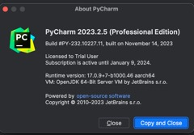
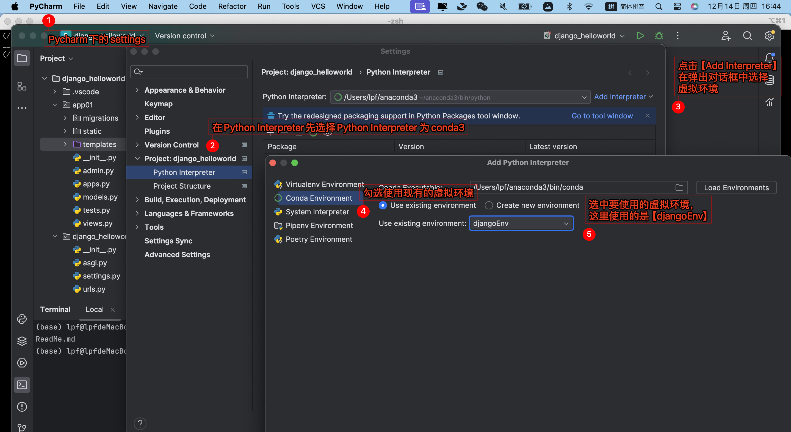
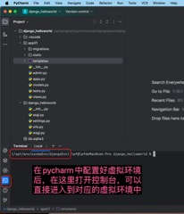

# 使用conda配置虚拟环境

## conda 配置源

有时候conda在下载一些依赖的时候，会提示找不到，这个时候，就需要配置一些新的源来解决这个问题。 

相关的命令如下：

```shell
$> conda config --append channels conda-forge
$> conda config --set channel_priority strict
$> conda update --all
```

## conda 虚拟环境中指定python版本

Anaconda虚拟环境下更换python版本

【不论升版本、降版本都使用conda install python命令】

**注意：修改版本后原来使用pip安装的包会被删掉，无法使用**


## 在Pycharm中配置虚拟环境

pycharm的版本信息：



```text
PyCharm 2023.2.5 (Professional Edition)
Build #PY-232.10227.11, built on November 14, 2023
Licensed to Trial User
Subscription is active until January 9, 2024.
Runtime version: 17.0.9+7-b1000.46 aarch64
VM: OpenJDK 64-Bit Server VM by JetBrains s.r.o.
macOS 14.1.2
GC: G1 Young Generation, G1 Old Generation
Memory: 2048M
Cores: 8
Registry:
    ide.experimental.ui=true
```

配置：




**验证**



