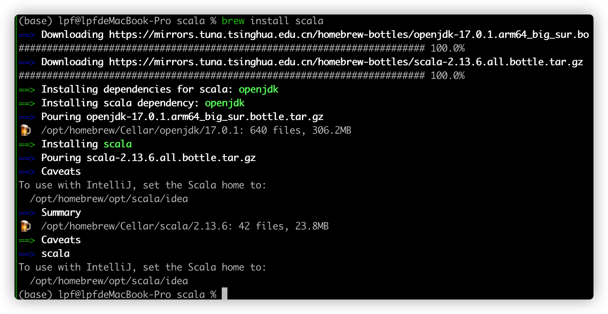
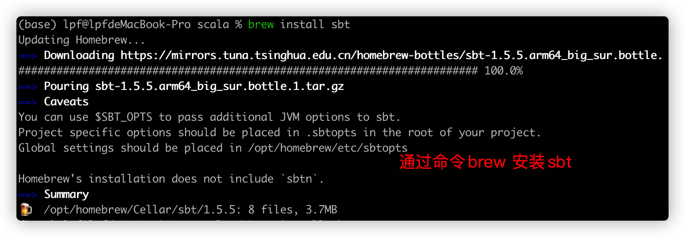
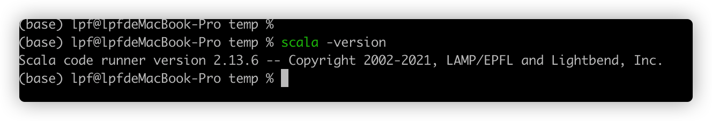

# scala 开发环境的搭建

从scala的官网 https://www.scala-lang.org/download/ 下载相关的命令行工具(sbt)或者集成开发工具


## Windows 系统安装Scala

* 首先确定你的系统已经安装了jdk8 或者（JDK11）. 如果没有安装，请先安装jdk8

* 在windows 系统安装sbt 命令行开发工具

* 在window下载sbt 软件 ，下载地址 

  https://www.scala-sbt.org/download.html

* 

参考资料：

https://docs.scala-lang.org/getting-started/sbt-track/getting-started-with-scala-and-sbt-on-the-command-line.html 


## Mac系统安装Scala 

### 通过brew安装scala开发环境

通过如下命令安装scala

```shell
$% brew install scala 
```



通过如下命令安装SBT

```shell
$% brew install sbt
```




校验scala安装是否成功

```shell
$%> scala -version
```

显示类似如下的结果：




如果在安装过程中不成功，可以先尝试更新brew。 执行如下命令

```shell
$%> brew upgrade
```

