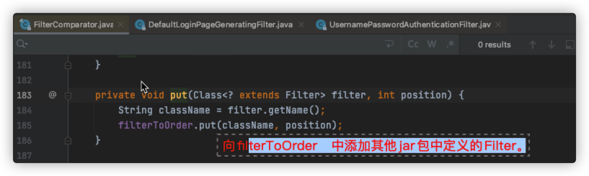
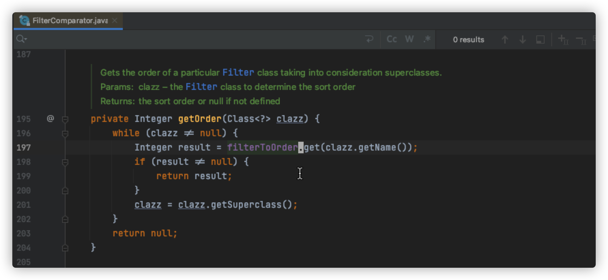

# SpringSecurity学习


## SpringSecurity源码阅读基础

SSM项目整合Spring Security 是通过整合 org.springframework.web.filter.DelegatingFilterProxy 过滤器来实现的。org.springframework.web.filter.DelegatingFilterProxy类也可以看作是SpringSecurity的启动入口。 


springboot 整合SpringSecurity之后的流程

1. org.apache.catalina.core.ApplicationFilterChain#doFilter
   1. org.apache.catalina.core.ApplicationFilterChain#internalDoFilter
2. TODO


### springseucrity 默认的15个过滤器

* [0] ***WebAsyncManagerIntegrationFilter***
  * org.springframework.security.web.context.request.async.WebAsyncManagerIntegrationFilter
  * OncePerRequestFilter 的子类
* [2] ***HeaderWriterFilter***
  * org.springframework.security.web.header.HeaderWriterFilter
  * OncePerRequestFilter 的子类
* [3] ***CsrfFilter***
  * org.springframework.security.web.csrf.CsrfFilter
  * OncePerRequestFilter 的子类
* [7] ***DefaultLogoutPageGeneratingFilter***
  * org.springframework.security.web.authentication.ui.DefaultLogoutPageGeneratingFilter
  * OncePerRequestFilter 的子类
* [8] ***BasicAuthenticationFilter***
  * org.springframework.security.web.authentication.www.BasicAuthenticationFilter
  * OncePerRequestFilter 的子类

* [1] SecurityContextPersistenceFilter

  * org.springframework.security.web.context.SecurityContextPersistenceFilter
  * 直接继承GenericFilterBean

* [4] LogoutFilter

  * org.springframework.security.web.authentication.logout.LogoutFilter
  * 直接继承GenericFilterBean

* [6] DefaultLoginPageGeneratingFilter

  * org.springframework.security.web.authentication.ui.DefaultLoginPageGeneratingFilter
  * 直接继承GenericFilterBean

* [9] RequestCacheAwareFilter

  * org.springframework.security.web.savedrequest.RequestCacheAwareFilter
  * 直接继承GenericFilterBean

* [10] SecurityContextHolderAwareRequestFilter

  * org.springframework.security.web.servletapi.SecurityContextHolderAwareRequestFilter
  * 直接继承GenericFilterBean

* [11] AnonymousAuthenticationFilter

  * org.springframework.security.web.authentication.AnonymousAuthenticationFilter
  * 直接继承GenericFilterBean

* [12] SessionManagementFilter

  * org.springframework.security.web.session.SessionManagementFilter
  * 直接继承GenericFilterBean

* [13] ExceptionTranslationFilter

  * org.springframework.security.web.access.ExceptionTranslationFilter

  * 直接继承GenericFilterBean

    

* [5] UsernamePasswordAuthenticationFilter 

  * org.springframework.security.web.authentication.UsernamePasswordAuthenticationFilter

  * 继承org.springframework.security.web.authentication.AbstractAuthenticationProcessingFilter

    

* [14]FilterSecurityInterceptor

  * org.springframework.security.web.access.intercept.FilterSecurityInterceptor
  * 继承 org.springframework.security.access.intercept.AbstractSecurityInterceptor
  * 实现javax.servlet.Filter

通过观察：发现springsecurity的默认的15个过滤器中，可以分为4类，

第一类：直接实现Filter接口例如 FilterSecurityInterceptor

第二类：继承org.springframework.security.web.authentication.AbstractAuthenticationProcessingFilter，

​				 比如：UsernamePasswordAuthenticationFilter

第三类：直接继承GenericFilterBean

第四类：继承OncePerRequestFilter，间接继承GenericFilterBean


### 重要的流程

* org.springframework.web.filter.DelegatingFilterProxy#doFilter 方法中的流程
* org.springframework.web.filter.OncePerRequestFilter#doFilter 方法中的流程
* org.springframework.security.web.authentication.AbstractAuthenticationProcessingFilter#doFilter 中的流程


重要的类：

org.springframework.web.filter.OncePerRequestFilter


### 疑惑

org.springframework.security.web.context.request.async.WebAsyncManagerIntegrationFilter 这个过滤器是springsecurity 执行的第一个过滤器，它的具体作用不知道是干什么的？


## SpringSecurity中的过滤器链


### filterToOrder 中存放拦截器

SpringSecurity中的过滤器维护在FilterComparator类的filterToOrder map中（Map<String,Integer>）, 在初始化的时候，向filterToMap中添加过滤器的时候，存在两种方式，

其中一种是直接向filterToOrder中通过Map数据类型的put方法添加，这种方式添加的过滤器都不是SpringSecurity的jar包自定义的Filter， 是需要引入其他包定义的过滤器的。 

另一种方式是通过在FilterToOrder中定义的put（Class<? extends FIlter> filter, int position）方法来定义的。这种方法添加的FIlter都SpringSecurity中定义的Filter。 



这里Map<String, Integer> filterToOrder = new HashMap<>();  

中Integer的递增规律是：初始化一个值INITIAL_ORDER （100）， 每次想Map中加入一个Filter，取值就递增ORDER_STEP（100）。 


### 获取filterToOrder 中某个拦截器的位置




通过全限定类名从Map中获取，如果获取不到通过该类的父类来获取，直到找不到其父类，则返回null。 


### 一些重要的Filter 

* ConcurrentSessionFIlter 
  * 这个拦截器会被多次调用
* LogoutFilter
  * 用户用户的登出
* UserNamePasswordAuthenticationFilter
* SessionManagementFilter
* ExceptionTransactionFIlter 
* RequestCacheAwareFilter

### 总结

SpringSecurity初始化了30多个拦截器，这些拦截器都维护在Filteromparator类中的filterToOrder 中。 这些拦截器有些事已经启用。 有一些需要引入特定的包并且对HttpSecurity 进行配置才会生效。而且他们的顺序是特定的。如果想要对某些功能进行定制，详细了解这些拦截器的实现逻辑是很有帮助的。 


### 疑惑：

SpringSecurity中的过滤器链维护在FilterComparator 类的FilterToOrder（一个HashMap）中，初始化的时候，ConcurrentSessionFilter 会被返回添加到filterToOrder中，导致filterToOrder的value值不断被替换（不断被大值替换），

既然这样，为什么不在最后一次出现的位置出现一次？？


## SpringBoot 整合springSecurity之HttpSecurity 深入

HttpSecurity 实际傻姑娘就是在配置SpringSecurity的过滤器链，诸如，CSRF，CORS，表单登录等，每个配置器对应一个过滤器。我们可以通过HttpSecurity配置过滤器的行为。 


## UsernamePasswordAuthenticationFilter


### 疑惑

UsernamePasswordAuthenticationFilter 类中

```
public static final String SPRING_SECURITY_FORM_USERNAME_KEY = "username";
public static final String SPRING_SECURITY_FORM_PASSWORD_KEY = "password";

private String usernameParameter = SPRING_SECURITY_FORM_USERNAME_KEY;
private String passwordParameter = SPRING_SECURITY_FORM_PASSWORD_KEY;
```

这种写法，为什么不直接将“username”赋值给变量 usernameParameter  


2. 通过 继承WebMvcConfigurationSupport 类来控制登录页面的原理是什么？ 

   见有人这样写过

   @Configuration public class SecurityMvcConfig extends WebMvcConfigurationSupport { 	   

   ​        @Override

   ​		protected void addViewControllers(ViewControllerRegistry registry) {              			 			registry.addViewController("/login").setViewName("login");    

     } 

   }


常规的用户登录使用的AuthenticatonProvider 使用的是 DaoAuthenticationProvider 。 


## 单点登录之CAS 

SpringSecurity 整合单点登录需要引入如下依赖

```
<dependency>
		<groupId>org.jasig.cas.client</groupId>
		<artifactId>cas-client-core</artifactId>
		<version>3.4.1</version>
</dependency>
<dependency>
	 <groupId>org.springframework.security</groupId>
	 <artifactId>spring-security-cas</artifactId>
   <version>5.5.3</version>
</dependency>
```

其中CasAuthenticationFilter  单点登录认证相关的过滤器 是单点登录需要依赖的过滤器。 


单点登录涉及到的Filter 是：

***org.springframework.security.cas.web.CasAuthenticationFilter***， 它和***UsernamePasswordAuthenticationFilter***继承自相同的抽象类***org.springframework.security.web.authentication.AbstractAuthenticationProcessingFilter***


单点登录默认处理的url 地址是： “/login/cas”


单点登录中， AuthenticationEntryPoint 接口的作用是什么？？


单点登录中： SingleSignOutHttpSessionListener 监听器是干什么的？

\namespace configuration


CasAuthenticationEntryPoint 是干什么用的？？


### 相关资料下载

https://www.apereo.org/projects/cas  

https://github.com/apereo/cas/releases


## SpringSecurity中重要的接口

* org.springframework.web.filter.**OncePerRequestFilter**
* org.springframework.security.core.**Authentication** 继承Principal 接口。是SpringSecurity 对Java 中Principal 进行了进一步封装
* org.springframework.security.authentication.**AuthenticationProvider** 
  * Indicates a class can process a specific Authentication implementation. 定义了一个认证实现的类，可以编写验证过程
* org.springframework.security.authentication.**AuthenticationManager**  
  * Processes an Authentication request.
  * 处理一个认证请求

* org.springframework.security.authentication.AuthenticationEventPublisher
* 


## 疑惑

* SpringSecurity 中的过滤器 OncePerRequestFIlter 是如何确保一次请求只会通过一次该过滤器。 ？
* UsernamePasswordAuthenticationFilter 和CasAuthenticatonFilter 没有继承OncePerRequestFilter 类，每个请求都包走这个过滤器，这些过滤器是如何保证性能的？

* springSecurity是如何灵活集成多种认证技术的？


