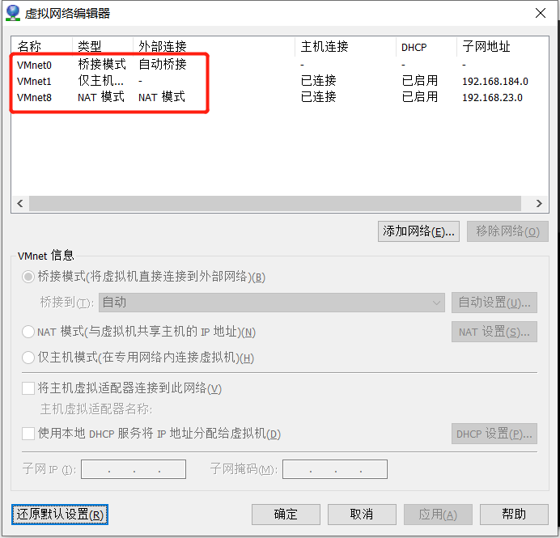
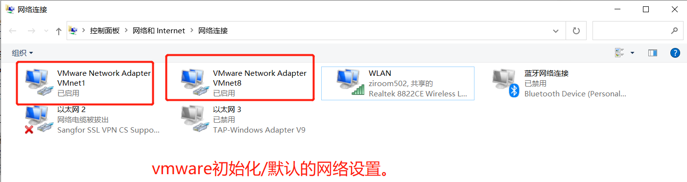
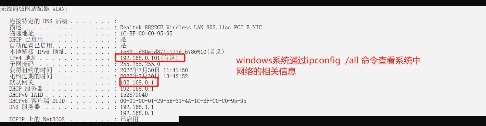
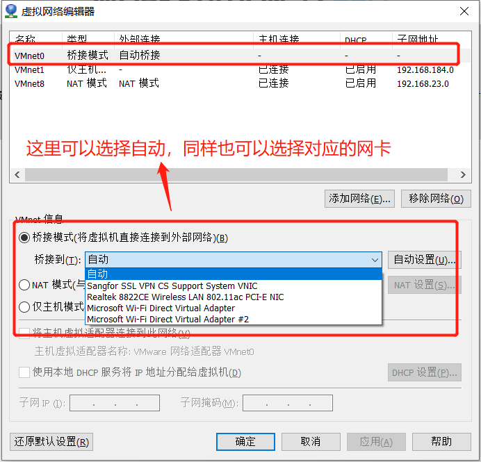
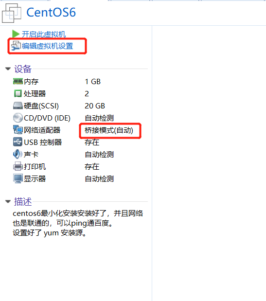
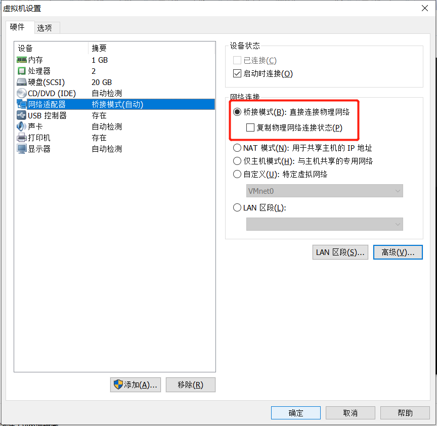

# vmware中的三种网络类型详解

本文主要是参考 https://www.cnblogs.com/linjiaxin/p/6476480.html

结合自己的实际操作进行编写。 


## Vmware网络简介

vmware为我们提供了三种网络工作模式，它们分别是：**Bridged（桥接模式）**、**NAT（网络地址转换模式）**、**Host-Only（仅主机模式）**。


打开vmware虚拟机，我们可以在选项栏的“编辑”下的“虚拟网络编辑器”中看到VMnet0（桥接模式）、VMnet1（仅主机模式）、VMnet8（NAT模式）。其中VMnet0表示的是用于桥接模式下的虚拟交换机；VMnet1表示的是用于仅主机模式下的虚拟交换机；VMnet8表示的是用于NAT模式下的虚拟交换机。





在“网络连接”中我们可以看到这两块虚拟网卡，如果将这两块卸载了，可以在vmware的“编辑”下的“虚拟网络编辑器”中点击“还原默认设置”，可重新将虚拟网卡还原。




这里我们可以看到，在vmware的网络编辑器中有三块网卡，但是在宿主机的网络连接中，只要2块网卡，这是因为桥接模式，不需要单独创建一个虚拟网卡。 


## 三种网络模式

### 桥接模式

桥接模式就是将主机网卡与虚拟机虚拟的网卡利用虚拟网桥进行通信。在桥接的作用下，类似于把物理主机虚拟为一个交换机，所有桥接设置的虚拟机连接到这个交换机的一个接口上，物理主机也同样插在这个交换机当中，所以所有桥接下的网卡与网卡都是交换模式的，相互可以访问而不干扰。在桥接模式下，虚拟机ip地址需要与主机在同一个网段，如果需要联网，则网关需要与主机网卡一致。而DNS可以不一样。 


相关的网络拓扑图如下：

(todo,暂时没有，后期使用EA绘制一个)


#### 步骤

为虚拟机设置桥接模式操作步骤

以centos系统为例：

1. 获取宿主机的网络信息

   windows系统通过如下命令查看系统中网络信息

   ```powershell
   $> ipconfig /all
   ```

   

   

2. 为vmware的虚拟机设置网络适配为桥接模式


查看vmware软件的虚拟网络编辑器



这里要保证，存在桥接模式。同时可以自定义桥接到哪块网卡或者让系统自动选择桥接到哪块网卡。 

之后为某一个具体的虚拟机的网卡设置具体的网络模式为桥接模式







编辑Linux虚拟机的网络配置文件 /etc/sysconfig/network-scripts/ifcfg-eth0  

注意：ifcfg-eth0 是centos6中的命名规范，在centos7，8中，命名不一样。以系统默认名称为主。 

其中，网络配置文件的最小配置内容如下：

```ifcfg-eth0
# 这里设备，必须填写
DEVICE=eth0
# 这里的ip地址必须和宿主机在同一个网段
IPADDR=192.168.0.105
# 网关应该和宿主机的网关保持一致
GATEWAY=192.168.0.1
# 子网掩码和宿主机一致
NETMASK=255.255.255.0
# 这里的DNS可以和宿主机不一致
DNS1=8.8.8.8
```

3. 重启linux系统的网络服务

   centos系统的不同版本，重启网络服务的方式可能不同。 

   centos6：

   ```shell
   # centos6
   # service network restart
   # 或 下面的命令
   # /etc/init.d/network restart
   
   # centOs7
   # systemctl restart network
   ```

   

4. 验证

   1. 验证虚拟机能否访问外网

   ​    ping www.baidu.com 

   ​    查看网络是否通。 

    2. 验证属主机能否访问虚拟机

       通过xshell 连接虚拟机，看看能不能联通


#### 总结

桥接模式配置简单，但如果你的网络环境是ip资源很缺少或对ip管理比较严格的话，那桥接模式就不太适用了。如果真是这种情况的话，我们使用网络模式：NAT模式。 

### NAT网络地址转换


### 仅主机模式