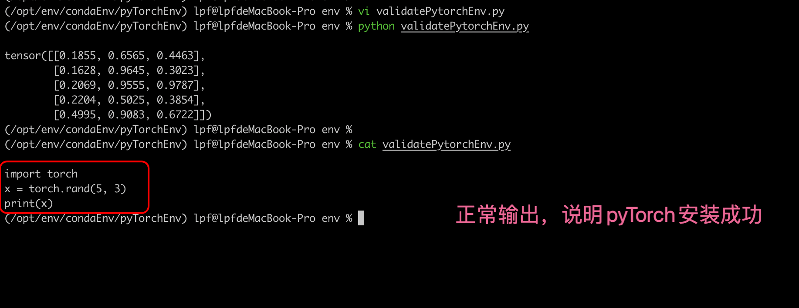

# Mac系统中pyTorch环境搭建

## 环境搭建

* 先安装MiniConda/[Anaconda](https://pytorch.org/get-started/locally/#anaconda)
* 创建虚拟环境
* 安装pyTorch

```shell
-- 使用conda创建虚拟环境
$> conda create pytorch

-- 安装 pyTorch
$> conda install pytorch::pytorch torchvision torchaudio -c pytorch
或
$> conda install pytorch torchvision -c pytorch    这里-c 指定通道channels

```

下载得到的相关python包

```text
(/opt/env/condaEnv/pyTorchEnv) lpf@lpfdeMacBook-Pro ~ % conda install pytorch::pytorch torchvision torchaudio -c pytorch
Channels:
 - pytorch
 - defaults
 - conda-forge
Platform: osx-arm64
Collecting package metadata (repodata.json): done
Solving environment: done

## Package Plan ##

  environment location: /opt/env/condaEnv/pyTorchEnv

  added / updated specs:
    - pytorch::pytorch
    - torchaudio
    - torchvision


The following packages will be downloaded:

    package                    |            build
    ---------------------------|-----------------
    brotli-python-1.0.9        |  py312h313beb8_8         367 KB
    bzip2-1.0.8                |       h80987f9_6         129 KB
    charset-normalizer-3.3.2   |     pyhd3eb1b0_0          44 KB
    expat-2.6.2                |       h313beb8_0         150 KB
    filelock-3.13.1            |  py312hca03da5_0          24 KB
    idna-3.7                   |  py312hca03da5_0         133 KB
    jinja2-3.1.4               |  py312hca03da5_0         349 KB
    jpeg-9e                    |       h80987f9_3         245 KB
    libffi-3.4.4               |       hca03da5_1         120 KB
    libjpeg-turbo-2.0.0        |       h1a28f6b_0         386 KB
    lz4-c-1.9.4                |       h313beb8_1         157 KB
    markupsafe-2.1.3           |  py312h80987f9_0          24 KB
    mpmath-1.3.0               |  py312hca03da5_0         988 KB
    networkx-3.3               |  py312hca03da5_0         3.0 MB
    numpy-1.26.4               |  py312h7f4fdc5_0          12 KB
    numpy-base-1.26.4          |  py312he047099_0         6.3 MB
    openjpeg-2.5.2             |       h54b8e55_0         324 KB
    pillow-10.4.0              |  py312h80987f9_0         883 KB
    pip-24.2                   |  py312hca03da5_0         2.8 MB
    python-3.12.4              |       h99e199e_1        14.0 MB
    pytorch-2.4.0              |         py3.12_0        57.6 MB  pytorch
    pyyaml-6.0.1               |  py312h80987f9_0         172 KB
    requests-2.32.3            |  py312hca03da5_0         128 KB
    setuptools-72.1.0          |  py312hca03da5_0         2.9 MB
    sqlite-3.45.3              |       h80987f9_0         1.2 MB
    sympy-1.12                 |  py312hca03da5_0        14.0 MB
    tk-8.6.14                  |       h6ba3021_0         3.3 MB
    torchaudio-2.4.0           |        py312_cpu         4.9 MB  pytorch
    torchvision-0.19.0         |        py312_cpu         6.8 MB  pytorch
    typing_extensions-4.11.0   |  py312hca03da5_0          73 KB
    urllib3-2.2.2              |  py312hca03da5_0         221 KB
    wheel-0.43.0               |  py312hca03da5_0         140 KB
    xz-5.4.6                   |       h80987f9_1         371 KB
    zlib-1.2.13                |       h18a0788_1          91 KB
    zstd-1.5.5                 |       hd90d995_2         504 KB
    ------------------------------------------------------------
                                           Total:       122.6 MB

The following NEW packages will be INSTALLED:

  blas               pkgs/main/osx-arm64::blas-1.0-openblas
  brotli-python      pkgs/main/osx-arm64::brotli-python-1.0.9-py312h313beb8_8
  bzip2              pkgs/main/osx-arm64::bzip2-1.0.8-h80987f9_6
  ca-certificates    pkgs/main/osx-arm64::ca-certificates-2024.7.2-hca03da5_0
  certifi            pkgs/main/osx-arm64::certifi-2024.7.4-py312hca03da5_0
  charset-normalizer pkgs/main/noarch::charset-normalizer-3.3.2-pyhd3eb1b0_0
  expat              pkgs/main/osx-arm64::expat-2.6.2-h313beb8_0
  filelock           pkgs/main/osx-arm64::filelock-3.13.1-py312hca03da5_0
  freetype           pkgs/main/osx-arm64::freetype-2.12.1-h1192e45_0
  idna               pkgs/main/osx-arm64::idna-3.7-py312hca03da5_0
  jinja2             pkgs/main/osx-arm64::jinja2-3.1.4-py312hca03da5_0
  jpeg               pkgs/main/osx-arm64::jpeg-9e-h80987f9_3
  lcms2              pkgs/main/osx-arm64::lcms2-2.12-hba8e193_0
  lerc               pkgs/main/osx-arm64::lerc-3.0-hc377ac9_0
  libcxx             pkgs/main/osx-arm64::libcxx-14.0.6-h848a8c0_0
  libdeflate         pkgs/main/osx-arm64::libdeflate-1.17-h80987f9_1
  libffi             pkgs/main/osx-arm64::libffi-3.4.4-hca03da5_1
  libgfortran        pkgs/main/osx-arm64::libgfortran-5.0.0-11_3_0_hca03da5_28
  libgfortran5       pkgs/main/osx-arm64::libgfortran5-11.3.0-h009349e_28
  libjpeg-turbo      pkgs/main/osx-arm64::libjpeg-turbo-2.0.0-h1a28f6b_0
  libopenblas        pkgs/main/osx-arm64::libopenblas-0.3.21-h269037a_0
  libpng             pkgs/main/osx-arm64::libpng-1.6.39-h80987f9_0
  libtiff            pkgs/main/osx-arm64::libtiff-4.5.1-h313beb8_0
  libwebp-base       pkgs/main/osx-arm64::libwebp-base-1.3.2-h80987f9_0
  llvm-openmp        pkgs/main/osx-arm64::llvm-openmp-14.0.6-hc6e5704_0
  lz4-c              pkgs/main/osx-arm64::lz4-c-1.9.4-h313beb8_1
  markupsafe         pkgs/main/osx-arm64::markupsafe-2.1.3-py312h80987f9_0
  mpmath             pkgs/main/osx-arm64::mpmath-1.3.0-py312hca03da5_0
  ncurses            pkgs/main/osx-arm64::ncurses-6.4-h313beb8_0
  networkx           pkgs/main/osx-arm64::networkx-3.3-py312hca03da5_0
  numpy              pkgs/main/osx-arm64::numpy-1.26.4-py312h7f4fdc5_0
  numpy-base         pkgs/main/osx-arm64::numpy-base-1.26.4-py312he047099_0
  openjpeg           pkgs/main/osx-arm64::openjpeg-2.5.2-h54b8e55_0
  openssl            pkgs/main/osx-arm64::openssl-3.0.14-h80987f9_0
  pillow             pkgs/main/osx-arm64::pillow-10.4.0-py312h80987f9_0
  pip                pkgs/main/osx-arm64::pip-24.2-py312hca03da5_0
  pysocks            pkgs/main/osx-arm64::pysocks-1.7.1-py312hca03da5_0
  python             pkgs/main/osx-arm64::python-3.12.4-h99e199e_1
  pytorch            pytorch/osx-arm64::pytorch-2.4.0-py3.12_0
  pyyaml             pkgs/main/osx-arm64::pyyaml-6.0.1-py312h80987f9_0
  readline           pkgs/main/osx-arm64::readline-8.2-h1a28f6b_0
  requests           pkgs/main/osx-arm64::requests-2.32.3-py312hca03da5_0
  setuptools         pkgs/main/osx-arm64::setuptools-72.1.0-py312hca03da5_0
  sqlite             pkgs/main/osx-arm64::sqlite-3.45.3-h80987f9_0
  sympy              pkgs/main/osx-arm64::sympy-1.12-py312hca03da5_0
  tk                 pkgs/main/osx-arm64::tk-8.6.14-h6ba3021_0
  torchaudio         pytorch/osx-arm64::torchaudio-2.4.0-py312_cpu
  torchvision        pytorch/osx-arm64::torchvision-0.19.0-py312_cpu
  typing_extensions  pkgs/main/osx-arm64::typing_extensions-4.11.0-py312hca03da5_0
  tzdata             pkgs/main/noarch::tzdata-2024a-h04d1e81_0
  urllib3            pkgs/main/osx-arm64::urllib3-2.2.2-py312hca03da5_0
  wheel              pkgs/main/osx-arm64::wheel-0.43.0-py312hca03da5_0
  xz                 pkgs/main/osx-arm64::xz-5.4.6-h80987f9_1
  yaml               pkgs/main/osx-arm64::yaml-0.2.5-h1a28f6b_0
  zlib               pkgs/main/osx-arm64::zlib-1.2.13-h18a0788_1
  zstd               pkgs/main/osx-arm64::zstd-1.5.5-hd90d995_2


Proceed ([y]/n)? y


Downloading and Extracting Packages:

Preparing transaction: done
Verifying transaction: done
Executing transaction: done
(/opt/env/condaEnv/pyTorchEnv) lpf@lpfdeMacBook-Pro ~ %
```


## 验证

```python
import torch
x = torch.rand(5, 3)
print(x)
```




## 变更记录

| 变更日期          | 变更内容                                                 | 备注 |      |
| ----------------- | -------------------------------------------------------- | ---- | ---- |
| 2024-08-15 星期四 | 在Anaconda的基础上使用conda创建好虚拟环境然后安装pyTorch |      |      |
|                   |                                                          |      |      |
|                   |                                                          |      |      |