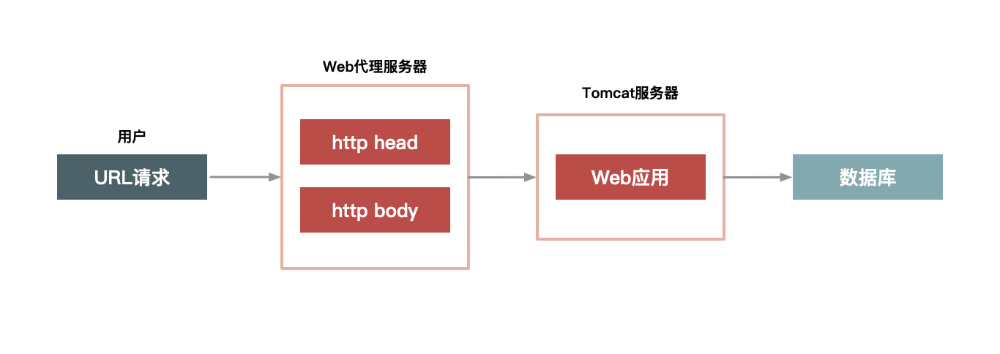
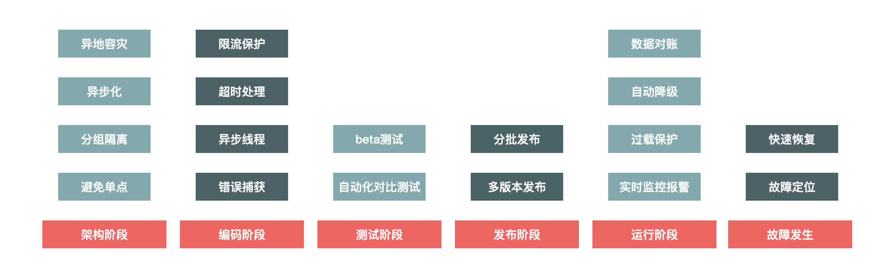

# 极客时间-如何设计一个秒杀系统

## 秒杀系统架构设计有哪些关键点
秒杀场景中，对于系统的要求其实就是三个字： 快，准，稳 

## 设计秒杀系统--四要1不要

避免单点，关键点是避免将服务的状态和机器绑定。即将服务无状态化，这样服务就可以在机器中随意移动。 

架构是一种平衡的艺术，而最好的架构一旦脱离了它所适应的场景，一切都将是空谈。 

数据要尽量少，请求数要尽量少，路径要尽量短，依赖要尽量少，以及不要有单点。 

越追求极致性能，系统定制开发就会越多，同时系统的通用性也就会越差。 

两个阶段的系统架构图

## 02 如何才能做好动静分离？ 有哪些方案可选

秒杀场景中，对系统的要求其实就三个字： 快，准，稳。

* 数据的动静分离
  * 让系统快起来的思路，第一点，提高单次请求的效率， 第二点是减少没必要的请求。 
  * 所谓的动静分离，其实就是把用户请求的数据（如HTML页面）划分为“动态数据”和“静态数据”。 简单来说，动态数据和静态数据的主要区别就是看页面中输出的数据是否和URL，浏览者，时间，地域相关，以及是否含有Cookie等私密数据。 
  * 所谓的动态还是静态，并不是说数据本身是否动静，而是数据中是否含有和访问者相关的个性化数据
  * 注意：这里说的页面中不含有，指的是页面的HTML源码中不含有。
* 动静分离之后，我们就可以对静态数据做缓存，有了缓存之后，静态数据的访问效率自然就提高了。 
* 静态数据如何做缓存？
  * 第一： 应该把静态数据缓存到离用户最近的地方。
    * 常见的缓存地址可能是用户浏览器里，CDN上，或者服务端的Cache中
  * 第二：静态化改造就是要直接缓存HTTP连接。
    * Web代理服务器根据请求URL，直接取出对应的HTTP响应头和响应体，然后直接返回，这个响应过程简单得连HTTP协议都不用重新组装，甚至连HTTP请求头也不需要解析。 
    * TODO 使用nginx，实现一下
    * WEB代理服务器直接将HTTP请求进行缓存
    
  * 第三：选择合适的WEB服务器（例如Nginx，Apache， Varnish） 来处理大并发的静态文件请求
* 如何做动静分离的改造
  * 以商品详情系统为例进行说明
  * URL唯一化
    * 每个商品都由ID来标识，我们在缓存整个HTTP连接的时候，就以URL作为缓存的key。
  * 分离浏览者相关的因素
    * 浏览者相关的因素包括是否已登陆，以及登陆身份等，这些相关因素我们可以单独拆分出来，通过动态请求来获取
  * 分离时间因素
    * 服务端输出的时间也通过动态请求获取
  * 异步化地域因素
    * 详情页上面与地地域相关的因素做成异步方式获取，当然，你也可以通过动态方式获取，知识这里通过异步获取更合适
    * 疑惑： 异步方式和动态请求方式有什么区别？？
  * 去掉Cookie。 
    * 通过web服务器的功能去掉Cookie
    * 这里说的去掉Cookie并不是用户端收到的页面就不含Cookie，而是说，在缓存的静态数据中不含有Cookie。 
    * 
* 动态内容的处理
  * 动态数据JSON化，方便页面中多个模块对数据的获取。 
  * 方案一： ESI （Edge Side Include）
    * 在WEB代理服务器上做动态内容的请求，并将请求插入到静态页面中，当用户拿到页面时已经是一个完整的页面了。 
  * 方案二： CSI （Client Side Include）
    * 单独发起一个异步的JS请求，以向服务器端获取动态内容。
  * 

### 动静分离的几种架构方案
如何在系统架构桑拿进一步对这些动态和静态数据重新组合，再完整的输出给用户。 这就涉及对用户请求路径进行合理的架构了。 

* 实体机单机部署
* 统一Cache层
* 上CDN

**不同的架构方案会引入不同的问题。**
在做架构方案设计的时候，有一些关键性的细节，是需要确定的。 

前后端分离和动静分离是两个不一样的切面，前后端分离不代表就是动静分离。
TODO： 动静分离/前后端分离的区别？ 

### 关键词
* varnish
* 深度参与

## 03 二八原则：有针对性地处理好系统的“热点数据”
热点分为热点操作和热点数据。 
热点数据分为静态热点数据和动态热点数据。 

* 发现热点数据
  * 发现静态热点数据
    * 对买家每天访问的商品进行大数据访问，统计处TOP N的商品，这些商品就是热点商品。
  * 发现动态热点数据
    * 秒级内自动发现热卖商品
    * 设计一个动态热点发现系统
* 处理热点数据
  * 处理热点数据通常有几种思路： 一是优化，二是限制，三是隔离
  * 优化热点数据最有效的方法就是缓存热点数据
  * 限制更多的是一种保护机制
  * 隔离：秒杀系统设计的第一个原则就是将这种热点数据隔离出来，不要让1%的请求影响到另外的99%，隔离出来之后也更方便的对这1%的请求做针对性的优化。 
    * 业务隔离
      * 把秒杀做成一种营销活动
    * 系统隔离
      * 通过分组部署的方式和另外99%分开。
      * 秒杀可以申请独立的域名，目的是让请求落到不同的集群中
    * 数据隔离
      * 启用单独的Cache集群或者Mysql数据库来存放热点数据。 目的是不让0.01%的数据影响99.999%的数据
    * 

## 04 流量削峰应该怎么做？
### 流量削峰的一些操作思路
* 排队
  * 实现一：消息队列
  * 实现二：利用**线程池加锁等待** 。不懂TODO去了解一下
  * 实现三： 把请求序列化到文件中，然后再顺序地读文件来恢复请求等方式
* 答题
  * 对发出的请求进行缓冲
* 分层过滤
  * 对请求进行分层过滤，从而过滤掉一些无效的请求。 
  * 分层过滤的核心思想是：在不同的层次尽可能的过滤掉无效的请求，让“漏洞”最末端的才是有效的请求。而要达到这种效果， 我们就必须对数据做分层的校验
  * 

## 05 影响性能的因素有哪些？ 又该如何提高系统的性能

服务端的优化技巧

性能： 服务设备不同，对性能定义也不同。 
  CPU： CPU主要看主频
  磁盘： 磁盘主要看IOPS （Input/Output Operations Per Second），即每秒进行读写操作的次数
  系统服务端的性能： 一般用QPS （Query Per Second， 每秒请求数）。 一级响应时间（Response Time，RT），它可以理解为服务器处理响应的耗时

#### 如何优化系统
* 减少编码
  * 减少字节和字符之间的转换
* 减少序列化
* Java极致优化
* 并发读优化

## 06 秒杀系统“减库存”设计的核心逻辑

### 减库存的几种方式
* 下单减库存
  * 存在的问题：恶意下单，导致商品卖不了
* 付款减库存
  * 导致的问题：库存超卖。 
  * 导致的问题：很多买家下单成功，但是付不了款
* 预扣库存
  * 下单后，库存为其保留一段时间。 
  * 防止措施： 给经常下单不付款的买家进行识别达标。 给某些类目设置最大购买件数， 对重复下单不付款的操作进行次数限制等。 

解决大并发读问题，可以采用LocalCache（即在秒杀系统的单机上缓存商品相关的数据）和对数据进行分层过滤的方式。

### 秒杀场景下减库存的极致优化思路
* 如何在缓存中减库存
* 如何在数据库中减库存

飞：有的医院，挂号，也可以认为是另类的秒杀。 

### 并发锁问题的解决思路
* 应用层做排队
  * 这样可以减少同一台机器对数据库同一行记录进行操作的并发度。 同时也能控制单个商品占用数据库连接的数量，防止热点商品占用太多的数据库连接
* 数据库层做排队
  * 需要对数据库程序本身进行代码优化，功能增强
  * 在部署到多台机器上面有效

## 07 准备Plan B： 如何设计兜底方案
我们可以在系统达到不可用状态之前就做好流量限制，防止最坏奇怪你去看的发生。 

为什么系统的高可用建设要放到整个生命周期中全面考虑？因为我们在每个环节中都可能犯错，而有些环节犯的错，你在后面是无法弥补的。

## 08 答疑解惑： 缓存失效的策略应该怎么定？

## 结果测试： 这小秒杀系统的设计知识你都掌握了么？？

