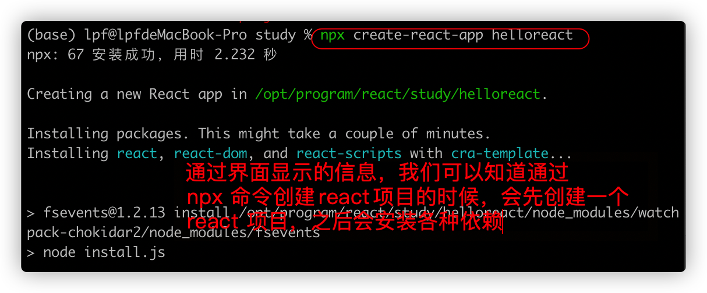
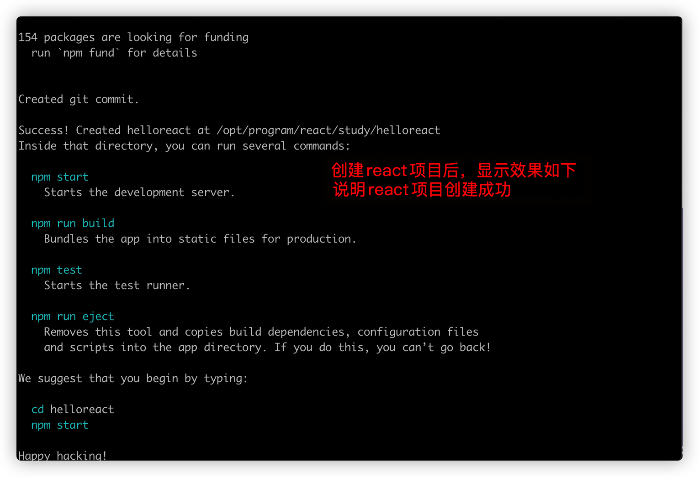
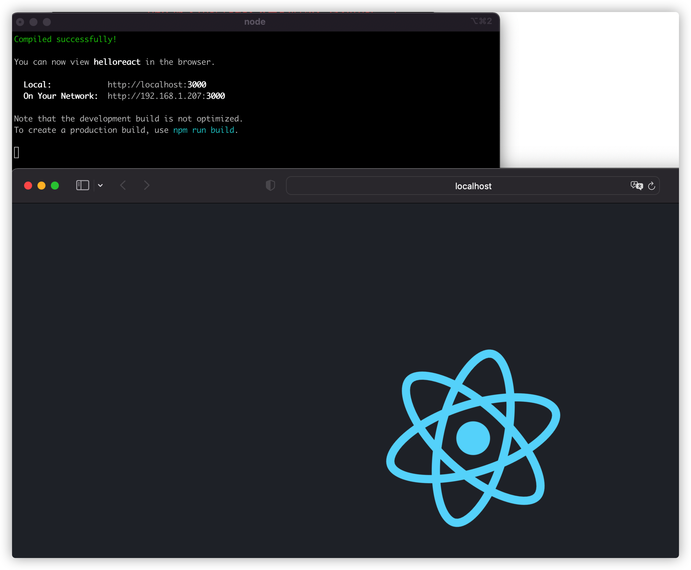
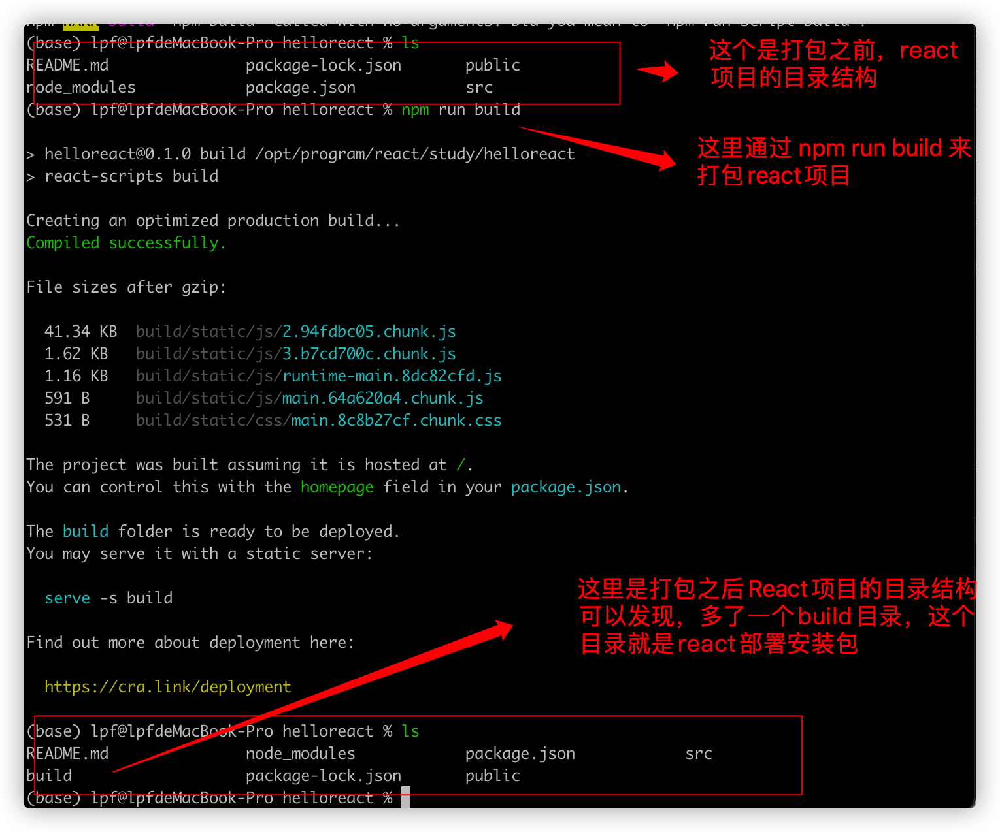
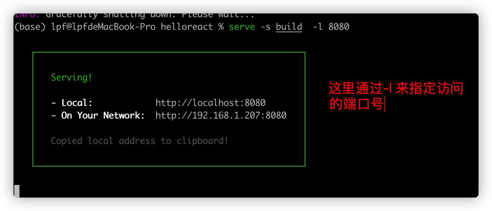
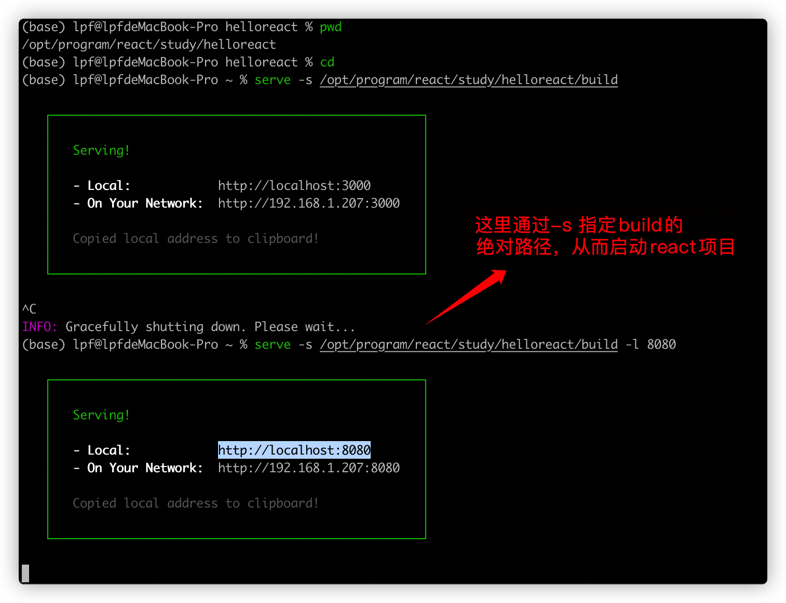

# React 项目部署

React 项目部署的方式有多种，下面将逐步介绍自己熟知的几种部署方式

第一篇React系列就介绍React的部署，主要是因为简单，容易操作。 


为了让代码可操作性。 这里部署的React项目使用最简单的一个React项目来部署。 

## 创建React项目

安装之前，相关环境的搭建就不详细介绍了，网上资料很多

通过如下命令创建一个React 项目。 

```shell
$ npm create-react-app helloreact
```

效果如下：







之后，按照提示信息，切换到 helloreact目录下，并且执行 npm start 

为了保证我们部署如果出错不是react项目本身的问题，我们先按照图中显示先启动一下React项目，效果如下，则说明react项目可以正常访问。我们也就可以将该项目用户部署。 



项目已经创建好了，接下来我们可以将创建好，且可以正常运行的React项目进行部署了。 

部署方式有多种，这里将一一介绍。

## 通过node的静态服务来部署

通过如下命令来安装静态服务器

```shell
$ > npm install -g serve
```

这里的-g 说明是全局安装，这样之后部署其他React项目的时候，就不在需要重新下载安装了。 


005_通过npm安装serve服务器.png

通过如下命令来打包react 项目部署包

```shell
$> npm run build
```




打包之后，通过如下命令运行server 服务

```shell
$ serve -s build  -l 8080  007_通过serve命令来运行react项目.png
```

这里要注意，需要通过-l 来指定端口号，如果不指定，访问的端口号默认是3000

效果如下



我们也可以通过 serve -s 来指定build 目录的绝对路径的方式来启动react项目。

相关命令如下

```shell
$> serve -s /opt/program/react/study/helloreact/build -l 8080
```



#### 在Ubuntu系统中通过serve部署React项目

遇到困难了：自己没办法将React的build打包文件build.zip 传送到ubuntu 系统。

先通过zip 命令将react项目中的build文件夹打包，相关命令如下

```shell
$> zip build.zip build
```

这里之所以要通过zip命令打包成zip 包，主要是因为在centos或者ubuntu系统中zip 软件默认是安装好的。

接下来将build.zip 包上传到linux系统。这里选择的是ubuntu系统。我这里通过scp 命令来在两个系统之间传输文件。 相关命令如下


## 通过docker部署react项目

docker的安装和使用这里先不讲解。 有问题可以参考：https://juejin.cn/post/7034535090445090830


这里自己采用在外部打包好build生产包后，将该生产部署包复制到docker镜像中，而不是将源码复制到docker镜像中，在生成镜像的过程中，去打包。 

相关的Dockerfile文件内容如下：

```dockerfile
# 第一阶段：拉取node镜像来打包React项目
FROM node:14 as buildstep
WORKDIR /app
COPY build /app/build
# 第二阶段：创建并运行Nginx服务器，并把打包好的文件复制粘贴到服务器文件夹中
FROM nginx:alpine
COPY --from=buildstep /app/build/ /usr/share/nginx/html
EXPOSE 80
CMD ["nginx","-g","daemon off;"]
```

利用Dockerfile 文件生成镜像文件的命令如下.这里的参数-t 可以每次生成镜像之前，将之前的镜像删除。 

```shell
$> docker build -t reat-web .
```

通过如下的命令来启动镜像

```shell
$> docker run -d -p 54321:80 react-web
```


### 可以改进完善的地方

在生成镜像的时候，指定镜像的版本号，而不是每次都是latest

同时旧的镜像应该保存。


## 变更记录

| 类型 | 时间                   | 内容                                    |
| ---- | ---------------------- | --------------------------------------- |
| 创建 | 2021年11月25日20:09:31 | 使用node的静态服务器来静态部署React项目 |
|      |                        |                                         |
|      |                        |                                         |