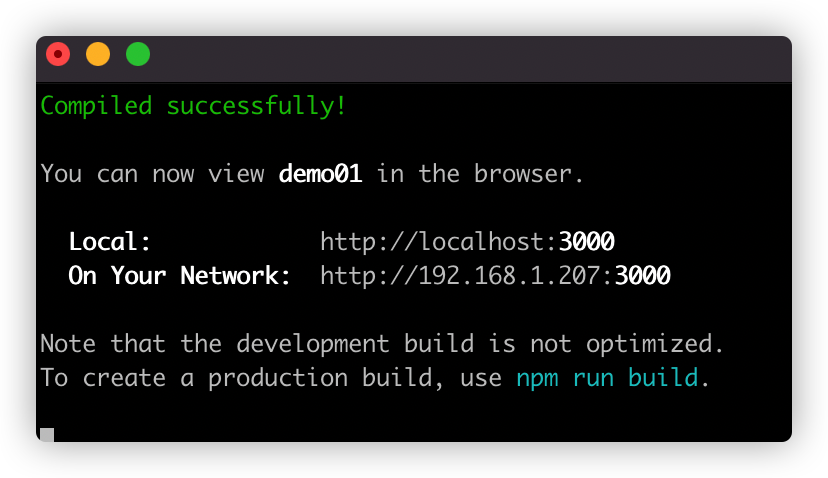

# React创建项目

## 创建一个普通的React项目（只支持原生Javascipt语言）

执行如下命令来创建一个React项目

```shell
$> npx react-create-app myapp
```

这里的npx 是npm工具的加强版，它可以在不全局安装脚手架的情况下，使用这些脚手架来创建相关的项目。

这里要注意使用npx创建的react项目名不能包含大写字母。


相关命令如下图


项目创建好之后，我们可以按照提示的命令 

```shell
$> cd demo01
$> npm start 
```

命令来本地启动react项目。 会自动打开默认浏览器来显示效果

效果如下图




通过vscode 查看react项目的架构图如下：


## 创建一个支持TypeScript的React项目

使用如下命令来创建一个支持TypeScript的React项目。 

TypeScript 目前在前端开发中，占用很大的作用，对应开发前端项目的帮助是很大的。 

```shell
$> npx create-react-app myappts --template=typescript
```

通过上面的命令创建支持TypeScript语言的react项目中包含一个tsconfig.json文件，该文件是react中关于typescript语言的一些定义相关的内容以及各自的作用如下：

```json
{
  "compilerOptions": {
    //noImplicitAny 不需要显示的声明Any类型，这样ts代码可以很方便的和javascript代码混合编程 
    "noImplicitAny": false,
    "target": "es5", //定义了编译后目标Javascript的版本
    "lib": [ // lib 展示了编译期间所有需要的库文件
      "dom",
      "dom.iterable",
      "esnext"
    ],
    "allowJs": true, // 运行混合编译JavaScript文件
    "skipLibCheck": true,
    "esModuleInterop": true, // 允许我们使用CommonJs的方式import默认文件。
    "allowSyntheticDefaultImports": true,
    "strict": true,
    "forceConsistentCasingInFileNames": true,
    "noFallthroughCasesInSwitch": true,
    "module": "esnext",  //配置的是我们代码的模块系统，Node.js 的CommonJS
    "moduleResolution": "node", // 决定了我们的编译器工作方式，“node” ，“classic”
    "resolveJsonModule": true, 
    "isolatedModules": true, // 编译器会讲每个文件作为单独的模块来使用
    "noEmit": true, // 表示当发生错的时候，编译器不要生成JavaScript代码
    "jsx": "react-jsx" // 允许编译器支持编译React代码
  },
  "include": [
    "src"
  ]
}
```


## React项目解析

### package.json 文件解析

在创建好的React项目中，dependiencies 中定义了我们项目中需要的各种依赖。 

其中，react-scripts 是React脚手架工具的核心。它定义了我们执行npm命令时支持的各种参数。

react 项目中，npm 支持的各种参数，在package.json 中的 scripts 中找到相关的定义。 如下图


### 深入了解React项目中编译流程

通过 npm run reject 可以了解React项目的所有配置信息。 


## 其他

@types/react：react ts 接口定义，也称typing。

这里的@types 是对某个库的typeScript的解释文件。可以让原先不支持的库支持typeScript

