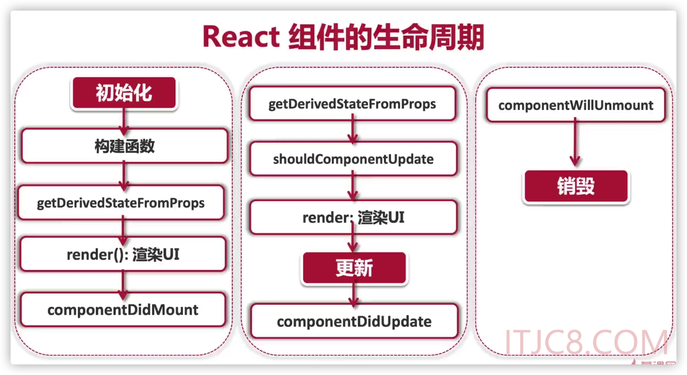

# React基础知识了解


## 疑惑

* 为什么只有函数式组件中才有钩子函数（hooks）

* ES6 中的花括号是干什么的？


## React的设计理念

* 单向数据流
* 虚拟DOM
* 组件化

## React中的组件

React中的组件分为函数式组合和类组件。 


### 函数式组件

const 组件名:React.FC<AAAA> = (props) =>{

​     return (<div></div>)

}

这里React.FC是什么这个函数式组件的类型。  

AAA 是传入的参数的类型。 通过 interface AAA {} 的方式进行定义的。 


函数式组件，颠覆了类组件的生命周期的概念。 


### 类组件

构建函数式组件的方法

```tsx
import React from 'react'

interf  ace Props {}

interface State {
  isOpening: boolean
}

// 通过继承React.component() 组件来构造一个类组件
class ShoppingCar extends React.Component<Props, State> {
  // 通过构造函数来初始化函数式组件
  constructor(props: Props) {
    super(props)
    this.state = {
      isOpening: false,
    }
  }
  render() {
    return <div>购物车</div>
  }
}

export default ShoppingCar

```


### JSX的命名约定

* 使用camelCase(小驼峰)方式定义属性
  * const element = <div className="element-style" tabIndex="0"></div>
* jsx的自定义属性，以data-开头
  * const element = <dev data-customized={'自定义属性'}></dev>

JSX表示对象，它会被编译为React.createElement() 对象


## 如何在TSX/JSX中添加CSS样式

### CSS module （模组化）

* 每个jsx或者tsx文件就被视为一个独立存在的原件
* 原件所包含的所有内容也同样都应该是独立存在的
* import  './index.css' ---> 修改为 将css对象作为一个变量来引入 import style from ‘./index.css’


### 让typescript可以识别css文件

Typescript的定义声明

* *.d.ts
* 只包含类型声明，不包括逻辑
* 不会被编译，也不会被webpack打包

在src下创建一个custom.d.ts 文件，文件内容如下

```
# 这里使用typescript的declare 关键字来做声明。
declare module "*.css" {
  const css: { [key: string]: string };
  export default css;
}
```

通过上面的设置之后，将鼠标放在import styles from ‘**.module.css’ 中的styles 的时候，就可以看到styles的定义。 


## CSS in JS （JSS）


在React项目中，通过create-react-app创建的项目已经帮我们处理好的全局样式的设置，就是index.css. 


利用插件

npm install typescript-plugin-css-modules --save-dev

解析css文件，让我们在编写react项目的时候，可以自动将css的引用通过styles.css样式名称的方式引入进来。 

安装好插件之后，还需要在tsconfig.js 文件中进行配置。 配置内容如下

在compilerOptions 中，配置如下内容

"plugins": [{ "name": "typescript-plugin-css-modules" }]


custom.d.ts中内容

```*.d.ts
declare module "*.css" {
  const css: { [key: string]: string };
  export default css;
}
```


设置vscode属性

在项目根目录下，新建.vscode目录，在目录中新建 settings.json,内容如下：

```json
{
    "typescript.tsdk": "node_modules/typescript/lib",
    "typescript.enablePromptUseWorkspaceTsdk": true
}
```


### React 项目引入多媒体资源和字体

通过create-react-app 脚手架构建的react项目已经帮我们定义了对多媒体和字体加载的支持。 是在react-scripts 脚本中进行配置的。 配置的位置是 react-scripts/lib/react-app.d.ts文件中。 

 

在React项目中，从工程化的角度来看，需要将各种资源放在一起统一管理。建议的管理路径如下：

* assets
  * font（字体）
  * images（图片）
  * icons (图标)


#### 引入字体

下载需要的字体到assets/font 目录下，并且在 index.css 中进行定义，如下

```css
/** 在index.css 中引入对字体的全局定义 **/
@font-face {
   font-family: '简隶变字体';
   src: local('简隶变字体'), url(./assets/font/简隶变字体.ttf) format('truetype');
}
```

之后，通过如下属性为相关文字设置字体

```css
font-family: '简隶变字体';
font-size: 72px;
```

注意事项：

通过className来引用css变量的时候，直接使用{} 来获取变量的取值就可以，不需要在{} 外面添加双引号


## 类组件中的State和Props

State和Props 控制页面变化的数据。 


### State和Props的区别

* props是组件对外的接口，而state是组件对内的接口
* props用于组件间数据传递，而state用于组件内部的数据传递


### state的正确打开方式

* state是私有的，可以认为state是组件的私有属性

* 用setState() 修改State

* 直接修改state，组件不会触发render函数，页面不会渲染

  ```
  // 错误
  this.state.isOpen = true
  ```

* 正确的修改方式是使用setState() 

  ```tsx
  onClick={()=>{
     this.setState({isOpen : !this.state.isOpen})
  }}
  ```

* 构造函数constructor是唯一可以初始化state的地方

  ```tsx
  // 初始化组件 state 
  constructor (props){
  	super(props);
  	this.state = {
  			robotGallery:[],
  			count:0,
  	}
  }
  ```

* State的更新是异步的

  * 调用setState后，state不会立刻改变，是异步操作
  * 不要依赖当前的State，计算下一个State

  

### Props

* 本质上，props就是传入函数的参数，是从传入组件内部的数据。更准确地说，是从父组件传递向子组件的数据。 
* props是只读属性


## React的事件驱动 (React Event)

事件中的target： 描述的是事件发生的元素

事件中的currentTarget：描述的是事件处理绑定的元素


## 异步处理：获取网络API数据

ES6中的promise 

Promise 对象代表了未来将要发生的事件，用来传递异步操作的消息。

#### Promise 对象有以下两个特点:

1、对象的状态不受外界影响。Promise 对象代表一个异步操作，有三种状态：

- pending: 初始状态，不是成功或失败状态。
- fulfilled: 意味着操作成功完成。
- rejected: 意味着操作失败。


### 异步请求

```tsx
// 这里利用fetch来访问请求，并对返回中的数据进行处理，将数据赋值给state中的robootGallery
// 这里要注意，response.json() 这里需要有括号
fetch('https://jsonplaceholder.typicode.com/users')
      .then((response) => response.json())
      .then((data) => this.setState({ robotGallery: data }))
```


### setState是异步的还是同步的

setState是异步更新，同步执行，他的回调函数就是setState的第二个参数。 

setState() 本身并非异步，但是对state的处理机制给人一种异步的假象，state处理一般发生在生命周期变化的时候。 


```tsx
<button
            onClick={() => {
              this.setState({ count: this.state.count + 1 }, () => {
                // 这里是setState的回调函数，打印的取值是正确的
                console.info('state.count2 = ', this.state.count)
              })
              this.setState({ count: this.state.count + 1 }, () => {
                // 这里是setState的回调函数，打印的取值是正确的
                console.info('state.count2 = ', this.state.count)
              })
              // 这里得到的state.count 的取值是不对的
              //console.info('state.count1 = ', this.state.count)
            }}
          >
            点击
          </button>
```

这里虽然在onclick中，执行了两次setState（） ，但是每次执行setState的时候，state里面的取值，都是之前的数据，并不是加一之后的数据。 


解决办法：通过设置setState的第一个参数为箭头函数来解决

```tsx
his.setState((preState, preProps) => {
                  return { count: preState.count + 1 }
                },() => {
                  console.info('count= ', this.state.count)
                })
```


### React组件的生命周期

* Mounting：创建虚拟DOM，渲染UI

  * 对应组件的componentDicMount方法

* Updating：更新虚拟DOM，重新渲染UI

  * 对应组件的componentDidUpdate方法

* Unmounting：删除虚拟DOM，移除UI

  * 对应组件的componentWillUnmount方法

  

### React生命周期




## React中的钩子（hooks）

React中的钩子，可以让我们在非类组件中使用state。

钩子是消息处理的一种方法，用来监视指定程序。 

函数组件中需要处理副作用，可以用钩子把外部代码钩进来。 

常用的钩子：useState，useEffect，useContext，userReducer

钩子(hooks)一律使用use作为前缀。 

 

Hooks的本质：一类特殊的函数，为你的函数形式的组件（functional component）注入特殊的功能。 

Hooks的目的就是给函数式组件加上状态。

Hooks代表了React架构的一次重大变革。


### useState()  状态钩子

const [count, setCount] = useState(0);

* React 自带的一个hook函数，声明组件状态
* 参数可以设置state的初始值（initial state）
* 返回值是一个只有两个元素的数组：【状态，状态更新函数】


### useEffect()：副作用钩子

```react
useEffect(()=>{
	document.title ='点击${count}次'；
},[count])
```

可以取代生命周期函数 componentDidMount，componentDidUpdata 和componentWillUnmount

给函数式组件添加副作用（side effect）


### 纯函数(pure function)

* 给一个函数同样的参数，那么这个函数永远返回同样的值
* 函数式编程理念
* React组件输入相同的参数(props),渲染UI应该永远一样

副作用与纯函数相反，指一个函数处理了与返回值无关的事情


useEffect() 副作用函数，如果第二个参数是一个空数组，则模拟类组件中组件挂载的生命周期函数。 componentDidMount

useEffect() 副作用函数，如果第二个参数是空，则模拟类组件中的componentDimUpdate，只要页面渲染发生变动，就会出发useEffect函数调用。 


### 如何在useEffect中使用aysnc/await 

代码知道怎么写了，但是，具体的关于async 和await 的知识还需要补充。 

```typeScript
useEffect(() => {
    const fetchData = async () => {
      setLoading(true)
      try {
        const response = await fetch(
          'https://jsonplaceholder.typicode.com/users'
        )
        const data = await response.json()
        setRobotGallery(data)
      } catch (e) {
        setErrMsg('网站出错，请手工处理')
      }
      setLoading(false)
    }
    fetchData()
  }, [])
```


### React 中的全局状态Context 以及对应的钩子函数useContext

#### 方式一：使用全局context 组件的

* 定义一个全局的默认的context

  ```react
  const defaultContext = {
  	username:'lpf',
  }
  ```

* 使用React.createContext 函数创建一个全局context对象，并将其导出

  ```react
  // 将前面定义的默认的context的值作为参数传递给React的createContext参数
  export const appContext = React.createContext(defaultContext)
  ```

* 使用<appContext.Provider></appContext.Provider> 在传入参数的地方将组件包裹一下

  ```react
  ReactDOM.render(
    <React.StrictMode>
      <appContext.Provider value={defaultContext}>
        <App author={author} />
      </appContext.Provider>
    </React.StrictMode>,
    document.getElementById('root')
  )
  
  ```

* 在需要使用全局context参数的地方，引入appContext 

  ```react
  import {appContext} from '../index';
  ```

* 使用<appContext.Consumer></appContext.Consumer>将对应的子组件包裹，并调整代码

  ```react
  return (
      <appContext.Consumer>
        {(value) => {
          return (
            <div className="styles.cardContainer">
              <li className="styles.cardContainer:hover ">
                
                <h2>{name}</h2>
                <p>{email}</p>
  
                <h2>author: {value.username}</h2>
              </li>
            </div>
          )
        }}
      </appContext.Consumer>
    )
  ```

### 方式二：使用useContext方法来替代<appContext.Consumer>来获取context中的取值

```react
const Robot: React.FC<RobotProps> = ({ id, name, email }) => {
  let value = useContext(appContext)
  return (
    <div className="styles.cardContainer">
      <li className="styles.cardContainer:hover ">
        
        <h2>{name}</h2>
        <p>{email}</p>

        <h2>author: {value.username}</h2>
      </li>
    </div>
  )
}
```

方式二相比方式一，大大减少了模板代码。避免了模板的嵌套，简化的代码。 


#### 全局Context状态的组件化

```react
import React, { useState } from 'react'

// 利用TypeScript的特点来指定context的类型
interface AppStateValue {
  username: string
  shoppingCart: { items: { id: number; name: string }[] }
}

// 1. 使用React 的Context 来替代Props实现组件之间传递值
const defaultContext: AppStateValue = {
  username: 'lipengfei',
  shoppingCart: { items: [] },
}
//在使用React的createContext创建一个Context的时候，需要传入一个默认值。就是前面定义的defaultContext。
export const appContext = React.createContext(defaultContext)

// 这里创建一个Context，是要将之前创建的setState函数放入到全局变量中。
//TODO 飞：为什么，这里还要重新创建一个context，而不是使用之前创建的 appContext？？？ 2021-12-05 星期日 16:52
export const appSetStateContext = React.createContext<
  React.Dispatch<React.SetStateAction<AppStateValue>> | undefined
>(undefined)

// 将<appContext.Provider value = ...> 定义为一个函数式组件
export const AppStateProvider: React.FC = (props) => {
  const [state, setState] = useState(defaultContext)

  return (
    <appContext.Provider value={state}>
      <appSetStateContext.Provider value={setState}>
        {props.children}
      </appSetStateContext.Provider>
    </appContext.Provider>
  )
}

```


#### React中的高阶组件HOC

高阶组件是react中非常重要的概念，被广泛的使用在其他React框架中，例如react-redux， react-router

HOC = higherOrde（wrappedComponent）


React官方文档

https://zh-hans.reactjs.org/docs/higher-order-components.html


高阶组件(HOC)是React中用于复用组件逻辑的一种高级技巧。 HOC 自身不是React API 的一部分，他是一种基于React的组合特性而形成的设计模式。 


