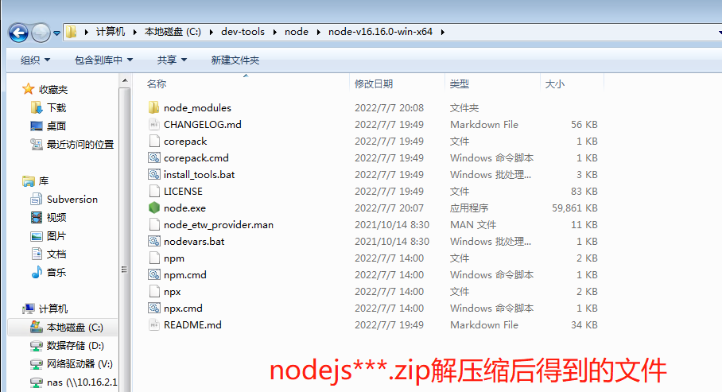
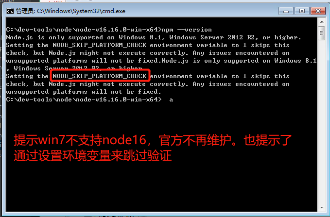
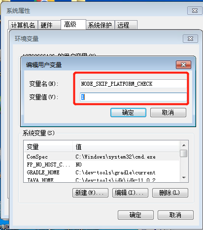
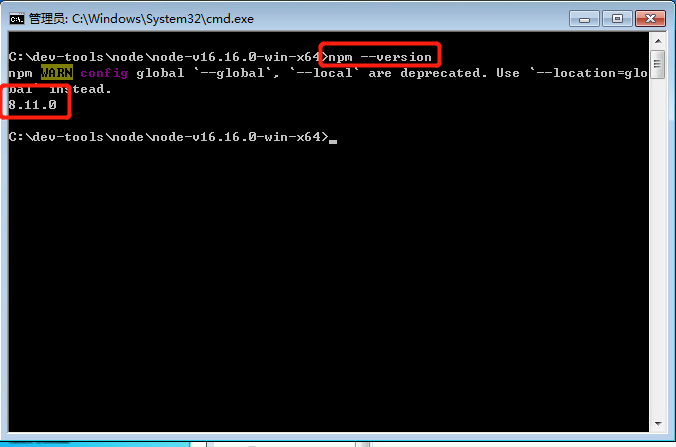
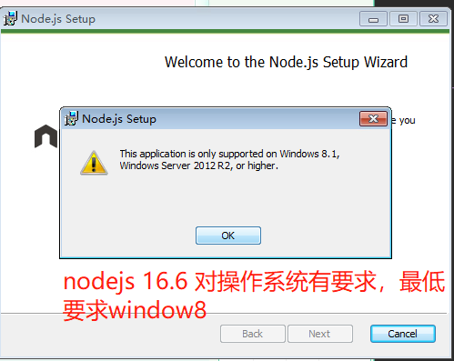
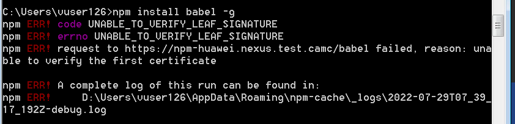
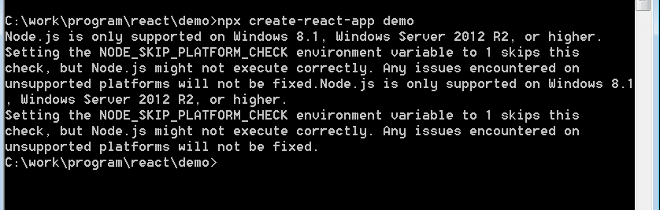

# NPM私服使用

## 环境

操作系统： window 7 

node:  16


## 前提

* crate-react-app 脚手架需要依赖的nodejs的最低版本是node14. 
* win7系统支持的node的最高版本是node13

* node16.6 对系统的对低要求是win8


所以需要采取办法在win7 系统安装版本号大于等于14的node.js。 这里采用目前(2022-08-10)node官网的最新版本node16.6.0 

这里采取的方案是安装 zip免安装版，直接解压后配置相关命令就可以。 

node文件名是 【node-v16.16.0-win-x64.zip】，在公司的svn目录下有相关的安装包：路径如下：

 https://svn.amctest.com/svn/subversion/NVP/02程序/01Deployment/04nodejs/node-v16.16.0-win-x64.zip


## 安装nodejs

先将原先安装的低版本的nodejs卸载

将 node-v16.16.0-win-x64.zip 解压缩到一个指定的目录

[在公司虚拟机中建议安装在C盘，性能会比较高，其他盘是网络盘]

解压后得到的内容如下：




打开命令行：执行npm --version ，



当我们执行npm命令的时候，我们可以看到官方给出了让我们兼容的方案。

设置环境变量：NODE_SKIP_PLATFORM_CHECK 为1 。 

接下来，我们在系统环境变量中添加。




接下来，我们重新打开一个cmd窗口，重新执行npm命令。 




这里有一个警告，可以通过修改 npm.cmd 命令中配置进行调整。 


## node 配置私服

```shell
$> npm config set registry 私服地址
```


 


## 遇到的问题：

###  问题一 

   win7 不支持node16的msi软件包的安装



​		

​     解决方案： 使用node16.6 的zip 安装包，并且配置相关的环境变量


1. ###  UNABLE_TO_VERIFY_LEAF_SIGNATURE 

   

解决方案：

关掉strict-[ssl](https://so.csdn.net/so/search?q=ssl&spm=1001.2101.3001.7020)即可，
如下：npm config set strict-ssl false




解决方案:

在环境变量中，设置 NODE_SKIP_PLATFORM_CHECK  取值为1 。 


### 问题三：

npm warn config global `--global`, `--local` are deprecated. use `--location=global` instead.

找到那2个文件里面的prefix -g替换为prefix --location=global


参考资料：

https://www.cnblogs.com/fengziyi/p/16445639.html