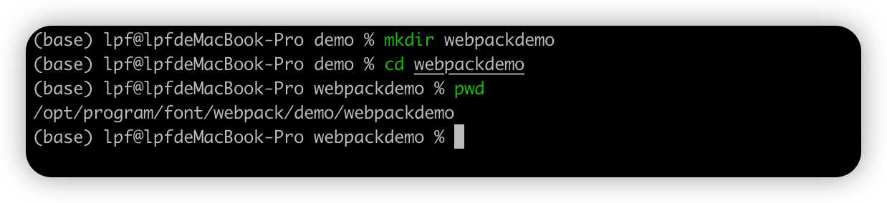
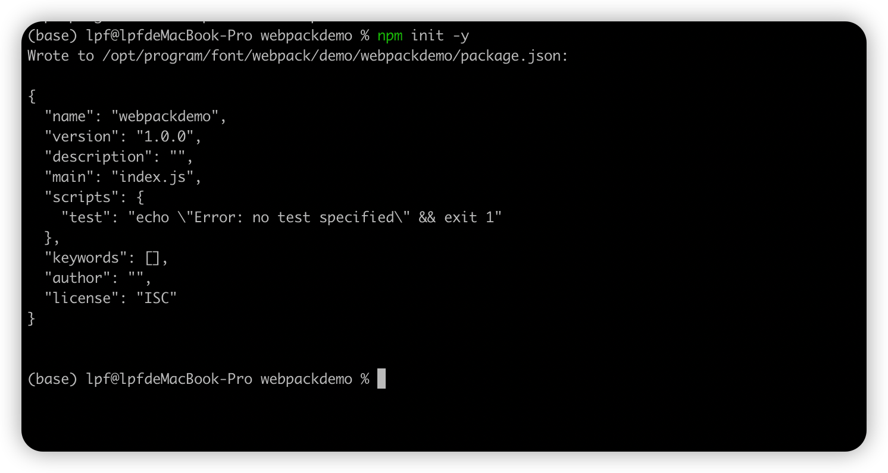
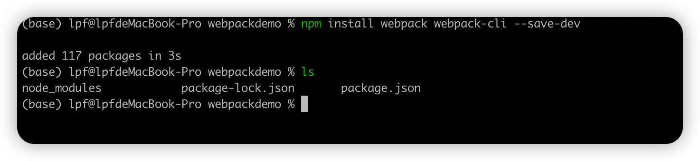
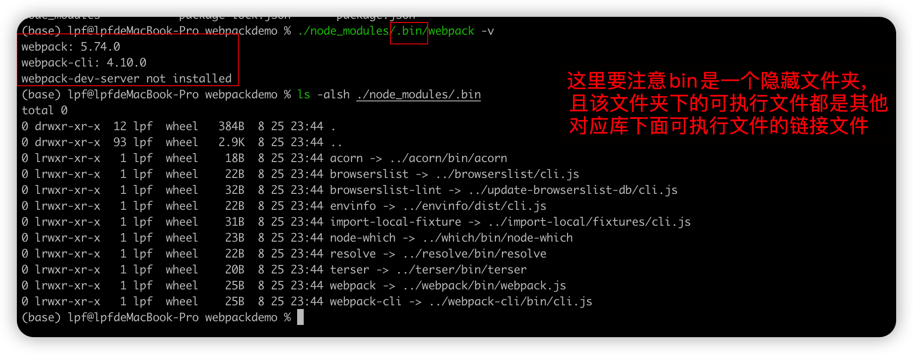

# webpack的安装

webpack的安装指的是在某个前端项目中安装webpack，而不是说讲webpack安装到操作系统中。 

## 前提

在操作系统中安装好node和npm

## 步骤

1. 创建一个空的文件夹

   

2. 执行如下命令来初始化一个node项目

   ```shell
   ## 这里的 -y 表示所有的选项都选择默认值，你也可以依次设置相关的值
   $> npm init -y 
   ```

   效果如下: 可以看到生成了一个package.json 文件

   

3. 通过npm 安装webpack

   ```shell
   $> npm install webpack webpack-cli --save-dev
   ```

   

  4. 验证webpack安装成功

     执行如下命令

     ```
     $> ./node_modules/.bin/webpack -v
     ```

      


| 日期                 | 类型 | 说明                        |
| -------------------- | ---- | --------------------------- |
| 2022-08-25（星期四） | 新增 | node项目安装构建工具webpack |
|                      |      |                             |
|                      |      |                             |


