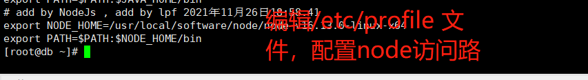
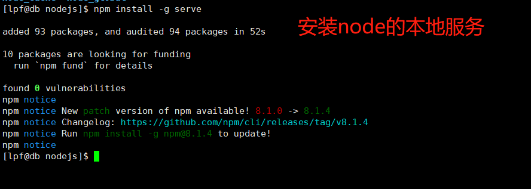

# NodeJs相关的内容

## 安装

### 在CentOS 系统安装NodeJs

去官网 https://nodejs.org/zh-cn/download/ 根据自己的版本下载最新的稳定版本(TLS)

截止到20211126，NodeJs的最新版本是 16.13.0.对应的npm的版本是 npm 8.1.0. 

下载得到的是 node-v16.13.0-linux-x64.tar.xz 文件。

利用xshell等工具将下载好的nodejs的安装包上传到centOs7 系统中。 


通过如下的命令解压*.tar.xz 文件。

```shell
先通过xz 命令将*.tar.xz 文件解压成为一个tar 包，
$> xz -d **.tar.xz 
之后会在当前目录下生成一个tar的包，原来的tar.XZ 的包将不存在
之后通过tar 命令将tar包解压
$> tar -xvf **.tar  -C  目标路径
注意，这里的—C 后面跟一个目标路径，该路径必须存在
```

 

解压之后，在/etc/profile 文件中，新增Node的相关配置信息，信息如下



之后执行 如下命令来刷新/etc/profile 

```shell
$> source /etc/profile
```

执行之后，通过如下命令验证node的环境变量是否生效

```shell
$> node --version
$> npm -v
```


## 配置NodeJs全局仓库的位置

执行如下的命令来配置Node全局仓库位置

```shell
$> npm config set prefix "/opt/data/nodejs/node_global"
$> npm config set cache "/opt/data/nodejs/node_cache"
```


以root用户登录，执行如下命令，来为/opt 

chmod 777 -R /opt

修改/opt 目录的访问权限，

之后，执行 chmod 744 /etc/sudoers 命令，设置sudoers的访问权限。让其可编辑。 

之后通过/etc/sudoers 的100行左右，新增一行，内容如下：


修改完之后，重新设置/etc/sudoers文件的访问权限

chmod 440 /etc/sudoers


之后，切换到普通用户，执行如下命令：

```shell
这里将快速的在同一个文件下面创建两个文件夹，且如果父目录不存在也会创建
$> mkdir -p /opt/data/nodejs/{node_global,node_cache}
```


创建好之后，执行如下命令来下载 node 的本地服务器。 

```shell
$> npm install -g serve
```

执行后，显示效果如下



执行完上面的命令之后，可以发现，在刚刚创建的node_cache目录和node_global 目录下有了一些数据。

在/opt/data/nodejs/node_global/bin 目录下有了一个serve 文件。

为了我们可以在任何地方都可以启动serve，我们需要将 /opt/data/nodejs/node_global/bin 路径通过/etc/profile 中配置给PATH变量

（编辑/etc/profile 需要root权限）


设置npm的远程仓库为淘宝的镜像库

```text
npm config set registry http://registry.npm.taobao.org/ 
```


