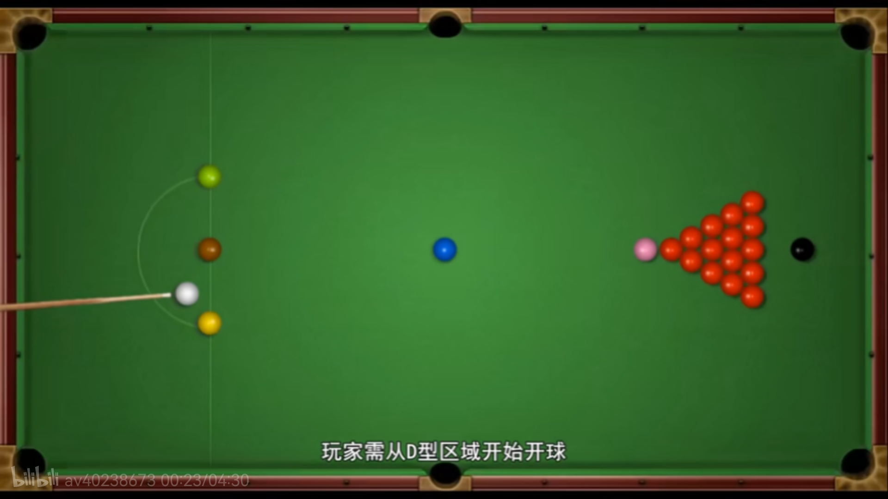
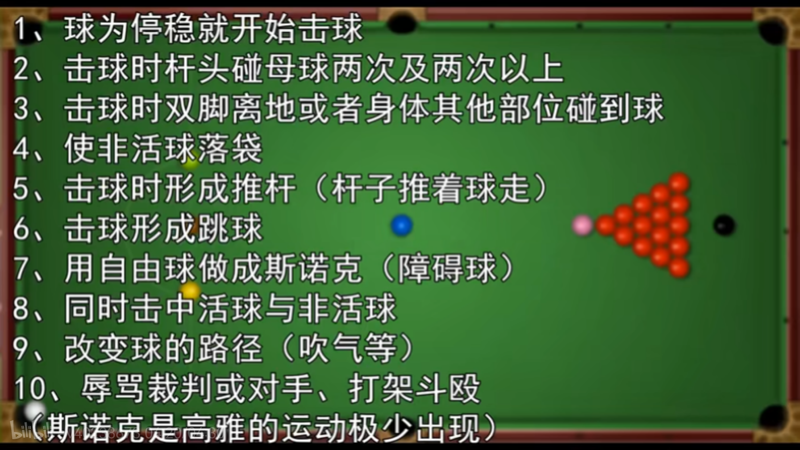

# 斯诺克基础知识入门

斯诺克起源于英国的台球运动。 

## 球的组成

斯诺克的球由15个红球+6个彩球+1个母球（白球）组成。摆放位置如下图

### 击打规则:

玩家需从D型区域开始开始，如下图

开球之后，依次按照 红球---》 彩球， 红球---〉 彩球 的顺序所击打。 

其中彩球的击打顺序分别是：

彩球按照： 黄，绿，棕（咖啡）， 蓝，粉，黑的顺序依次是2-7分。 而红球的分值为1分。  

（疑惑：这里说的应该是击打顺序，和是否进球没有关系？ 好像是这样？）

如下图

重新上场后，必须击打台面上分值最低的球，也就是活球（红球的分值1分）。 

注意： 红球入袋的下一杆活球为分值最低的一颗彩球，除那颗彩球外，其余均为非活球。 

这里，击球的顺序，是红球-->彩球-->红球。 但是彩球的个数是有限的，因此在红球打完附带的彩球落袋后会取出来摆在原本点位上。 如果点位被占，就摆在低一分的彩球处。 

(疑惑，如果彩球，打进去之后，会被取出来，那么每次打的彩球都是分值最低的彩球 黄球吧？)

如果彩球原本的位置被占，以及低一分彩球的位置也被占，则将球摆放在原本点位的附近。 （这里原本点位是低一分的彩球所在位置）。但是不能和原本点位贴住，需要留一点距离。 

，

按照红球--彩球--取出彩球---红球的顺序击打，直到最后一颗红球打完，再打掉任意一颗彩球。 

当全部的红球都打完后，需要按照彩球的分数由低到高依次击打，直到清台。（红球全部打完后，击打彩球时，彩球不需要再取出来放到原位置了）

打完最后一个黑球后，若分数相同则需要取出母球和黑球从D型区域开球证黑球（投掷硬币决定开球）。

## 罚分规则

在斯诺克中，只要出现犯规行为会被罚分，也就是给对手加分，并且交换选手，分值多少由球的分值决定。

彩球罚分规则如下图：

如果先碰到粉球（6分），则会罚六分，如果先碰到黑球（7分）则罚7分。如果碰到的是黄球（2分），不足4分，按照4分罚分。 

## 常见的犯规行为

* 母球（白球）落袋
  * 就算进球也不算，若进球为红球则不取出，彩球则需取出，按照落袋前最后碰到的彩球分数处罚。）同样，不足4分按4分处罚）
* 打错目标球
  * 该打彩球时先碰到红球，该打红球时先碰到彩球，以及打错彩球。 

## 获胜方式

在一局比赛中，当一方球员的分数达到或超过对手分数的一定倍数时（通常是2或3倍），该球员将赢得这一局。

赢得的局数越多，最终获胜的可能性就越大。

下图中， 66分达到对手31 分的2倍，所以提前赢得比赛。 

## 具体的规则和名称

### 斯诺克/做一杆斯诺克

一杆斯诺克也就是让母球与目标球之间存在障碍球，从而不能直线达到目标球。 

​		这里要注意： 斯诺克，不允许跳球。 

### 超分

 一分的分数加上剩余台面上的所有球的分数也比对方低时则为超分。 

​		但是，超分并不算赢，因为可以通过做斯诺克（障碍球）让对方罚分，使得自己的分数超过对方，这也是斯诺克的一大魅力所在。 

### 让杆 

当母球与目标球之间存在障碍球（形成斯诺克）导致白球犯规时，对方可以选择让裁判恢复之前的局面，让你再打一次，从而获得罚分。 如果一直犯规可以让对方一直打，也就是常见的解斯诺克。 

​		注意：

                1.  超分状态下不能让杆
                1.  超难解或者根本无解的斯诺克也不能一直让杆

### 贴球

贴球就是两个球相切。若白球与目标球形成贴球，随意打都被认定为先碰到的目标球的。

### 自由球（free ball）

当对方犯规时，造成没有一颗活球能被完整 看到时，则为自由球。 

当遇到自由球时，可以指定任何球当作活球来打，分值为活球分值。 

### 手中球or任意球

母球只要出球台都是对方的手中球，可以摆放在任意位置（PS：朋友间常见，斯诺克比赛很少见）

### 库边

### 其它

### 斯诺克147

说明选手打出来满分147分。 需要选手打进15个红球，并且按照规定的顺序清台，才能获得满分杆。 

如果选手出现失误，或者没有按照规定的顺序清台，是没法获得147满分的。 

21岁的火箭参加1997年的斯诺克世界锦标赛，奥沙利文对阵普莱斯，仅用5分零8秒完成清台，并且拿下人生第一个147分。

## 杆法

### 高杆

母球打完后向前走

### 低杆

母球打完向后退

### 中杆

母球打完，大致留在原地。 

### 扎杆

扎杆就是把杆竖起来击打母球形成强烈旋转从而使母球呈弧线前进。 

## 非常见犯规

## 其它

## 斯诺克三大赛事

* 世界锦标赛
* 英国锦标赛
* 大师赛

## 优秀的斯诺克选手

* O‘SULLIVAN       奥沙利文（火箭）

  
* SELBY                   塞尔比 （防守大师，磨王（想的时间长））
* 

## 疑惑

* 斯诺克比赛可以不把球都打完就结束吗？

