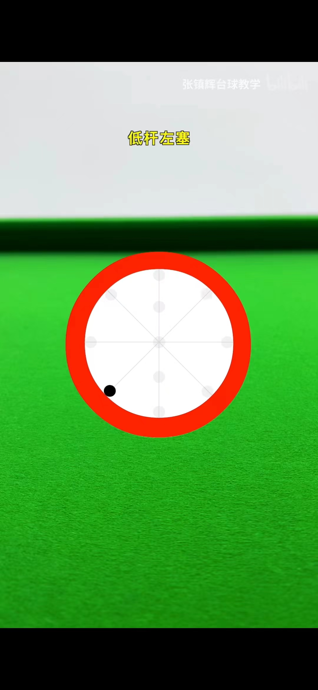
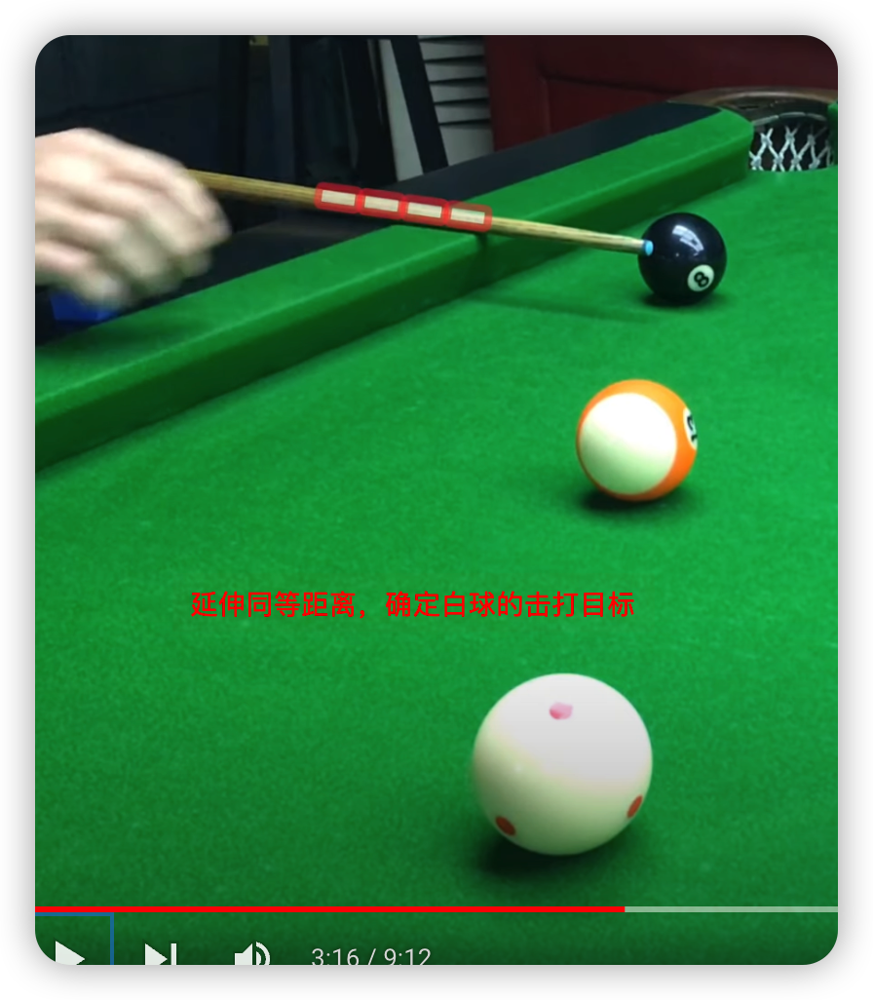
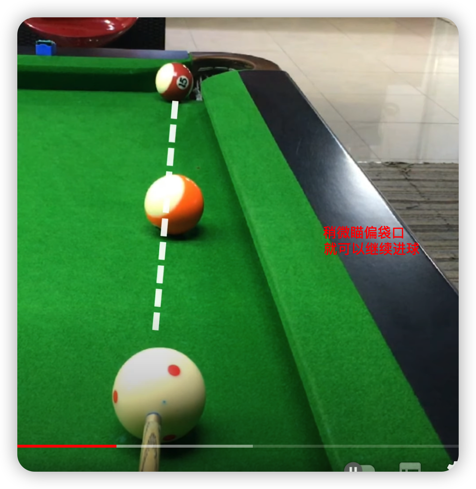

# 台球相关知识

* 冲杆的类型
  * 长冲
  * 短冲
  * 冲跳一体

大中小力吃库后的变化

高中低杆母球吃库后的变化

* 高杆
* 中杆
* 低杆

台球杆法的点位

1. 高杆
1. 中高
1. 中杆
1. 中低
1. 低杆
1. 左塞
1. 右塞
1. 高杆左塞
1. 高杆右塞
1. 低杆左塞
1. 低杆右塞
  

1. 高杆
   1. 打高杆白球会向前走多一点
2. 中高
   1. 打高杆白球会向前走少一点
3. 中杆
   1. 打中杆短距离时白球会停住
4. 中低
   1. 打中低杆白球会往后走少一点
5. 低杆
   1. 打低杆白球会往后走多一点
6. 左塞
   1. 
7. 右塞
8. 高杆左塞
9.  高杆右塞
10. 低杆左塞
11. 低杆右塞

## 台球中式8球的玩法与规则
### 规则之摆球篇
* 8号球摆在第三排中间
* 第5排的最左和最右边两颗球不能是同一花色，其他球尽量岔开
* 注意： 15 颗球尽量全部紧贴
### 规则之开球篇
* 白球需放在开球线内，任意位置进行开球
* 开球后有球下不算分球，开球方可以选择花球或者全色球继续击打
* 开球没进，且没有4颗球碰到库边，算犯规，对手获得线内自由球或让任意以方进行重新开球
* 开球后，如果8号球进了，不算输也不算赢，把8号球放在置球点上或者开球方觉得球形不好，可以重新开球
### 规则之选球篇
* 开球后用不同的花色把球传进，不算有效分球。只有同色球传球确定球色，才算有效分球。
* 没有分球之前，打进某一个花色的球，但是白球也跟着进袋，不算分球。换对手自由球。这时候对手可以自由选择球色。
* 打进全色球同时也把花色球打进，这时，全色球算是我们的目标球，因为母球先击中全色球
### 规则之击球篇
* 母球没碰到目标球算犯规
* 母球碰到目标球后必须有球吃库，否则算犯规
* 当目标球贴库时，这时母球撞击目标球后必须有球吃库，否则算犯规
## 规则之勾球篇
* 无论是一库勾球还是多库勾球，母球和目标球撞击后必须有球吃库
## 规则之跳球篇
* 中式台球是允许跳球的，但是只能有杆头击打在白球1/2 以上的区域，打在1/2 以下算犯规

## 16种常见的台球基本规则
### 违规触球
* 在打球的过程中，如果不小心碰到台面上的球，属于犯规，对手获得自由球
### 手脚离地
* 双脚离地属于犯规，进球无效
### 呲杆规则
* 呲杆时，只有皮头接触的话，不算犯规
* 呲杆时，皮头和先角碰到白球属于犯规
* 呲杆时，白球越过目标球，属于犯规，没有越过目标球不犯规
### 运杆规则
* 运杆的时候，不小心碰到了白球，没有吃库的话，犯规，
### 误进黑8
* 打自己目标球的时候，如果不小心把黑打进库，直接输球
### 黑8犯规
* 打黑8时，先进黑8，再进白球，算输
* 打黑8时，先进白球，再进黑8 ，算输
### 黑8指袋，以前进黑8的时候，需要指袋，现在不需要了
### 同时击中
* 击打时，几乎同时击中自己和对手的球，并难以判断，不算犯规
### 摆球规则
* 以前规则，摆放自由球时，要间距一个球的距离，现在不要求了。
  

## 技巧
* 技巧一： 台球和目标球同时贴库时
  * 可以加打贴近库边的旋转，（左塞或者右塞），让白球贴着库边走，这样可以提高进球率
* 技巧二： 当中间有球挡住时，可以选择目标球的中线，计量和库边的距离，然后延伸同样的距离，确定打击点，之后瞄准用中杆击打就可以进球了
  
* 技巧三 自己的一个球在袋口，另一颗球在袋口球和母球的中间，瞄准的时候，稍微偏移袋口，小力击打，就可以继续进球。
  