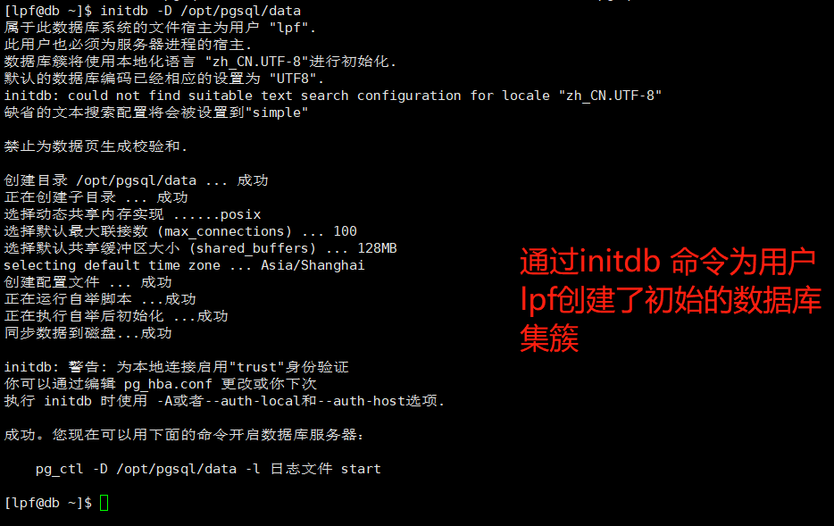
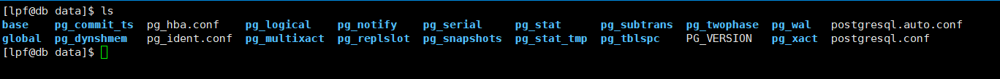
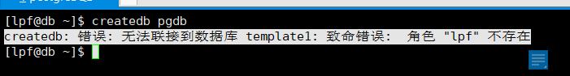

# 操作PostgreSQL数据库

在第一次操作postgreSQL数据库之前需要通过initdb 命令来为数据库创建集簇。命令执行如下

 

初始化的数据库集簇的目录结构如下：

## 遇到的问题：

1. 通过 createdb 数据库名 来创建数据库的时候，报如下的错误

   createdb: 错误: 无法联接到数据库 template1: 致命错误:  角色 "lpf" 不存在

    

出现这个错误的原因是，管理员没有为你创建PostgreSQL用户的账号。

