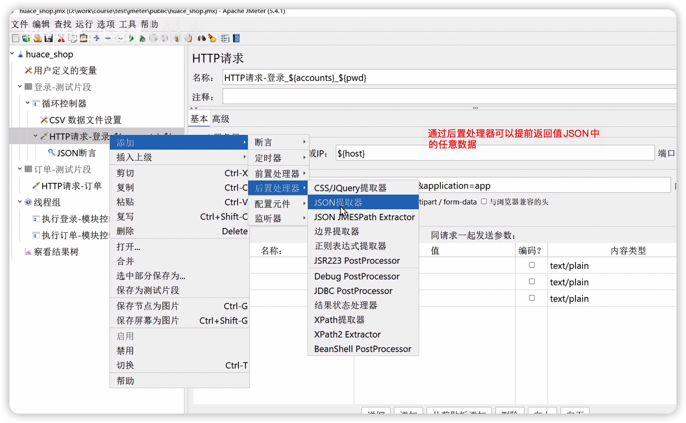

# Jmeter 学习

## 基础配置：

用jmeter开发压测脚本时，遇到返回的中文出现乱码时如何解决？

原因分析：jmeter默认的格式解析方式是ISO-8859-1，是不支持中文解析的，所以接口返回的中文会乱码。

想要解决该问题的一个有效方法是：在jmeterde配置文件/bin/jmeter.properties中找到sampleresult.default.encoding配置项，将默认的ISO-8859-1改为utf-8,同时需要把前边的#去掉，保存并退出后。重启jmeter乱码问题就解决了


## 分模块测试

在jmeter中借助测试片段来实现分模块测试时遇到的测试用例复用的问题。 

### 测试片段

测试片段是为了在模块化测试中，不同开发直接进行配合的。 

添加方式：

```text
选中测试计划---》 添加---> 测试片段---》 测试片段
```

单独的测试片段是不能执行的，可以在具体的http请求中进行调研。、


## Jsonpath提取器


Jsonpath 提取器的用法：

* $ 代表根节点

  ​	例如获取 json中data节点中的access_token 的取值

  ```
  $.data.access_token
  ```

* 获取字节的

  ​	例如获取json下access_token节点的取值,注意，这里需要有双引号

  ```
  $["access_token"]
  ```

* 取得浮躁阶段的值（结合下标和字节点用法）

​			例如, json数据下tags节点下的第17个数据中name的取值。

```
$.tags[17].name
```


## 变量

Jmeter中的变量包括定义在用户自定义变量组件中的变量，以及其他组件中的变量（比如csv数据读取组件中定义的变量）


添加后效果如下：


### 使用项目计划内的测试片段

使用编写好的测试片段


### 使用测试计划外的测试片段：

* 新键一个Jmeter工程，在其中新建测试片段，比如登陆的测试片段，然后保存为jmx文件。 

* 接着在另一个Jmeter工程中，通过include 控制组件来引入其他的测试片段。 

  

​			


## Jmeter中变量的使用

Jmeter中的变量有用户定义的变量和通过csv数据组件将csv中的数据定义为变量。 

这些变量应用范围很广泛，可以应用在断言中，也可以应用在标题中。 


## Jmeter中的断言

常用的断言包括： 响应断言，Json断言，正则表达式断言

### 响应断言

响应断言一般会添加状态断言和业务断言两个断言。 

状态断言一般是对http请求状态的断言。

业务断言一般是对具体业务逻辑处理结果的断言。 


### JSON断言

### 正则表达式断言


这里，我们以Json断言为例，进行说明


一个http请求下面可以有多个断言，从不同的角度来对返回值进行判断。


## Jmeter调试

可以借助调试取样器或者借助Fiddler 来完成。 

​		借助Fiddler操作步骤

* 在http请求的高级中，设置代理地址为Fiddler的地址
* 在fiddler的请求前，设置拦截。

## DDT:  数据驱动测试 

**文件参数化**

循环控制器的作用和使用方法


## 业务闭环

在自动化测试过程中，为了让脚本每次执行的结果都一样，需要让业务构成一个闭环，让执行完之后，数据库中主要表的数据都恢复原样，需要在最后，将新增的数据删除。 


业务一般都是围绕CRUD进行维护。

常见的业务操作：

### 新增：

​			在新增的时候，因为存在一些唯一性约束，因此，一般在相关字段后面添加一些随机数。 

### 修改：

### 查询：

### 删除：

### 批量删除：

​		需要借助forEach 控制器来控制，同时最好借助一个定时器来避免并发问题。

### 文件上传

​	方式一： 在mime 写； multipart /form-data 

​	方式二：勾选上post，使用 multipart/form-data， 然后在高级里面选择【Java】


 


## Jmeter录制和创建脚本

Jmeter在没有接口文档的情况下，如何使用Jmeter录制和创建脚本

* 抓包 （效率比较低）

* badboy（过时）

* jmeter自带的http代理服务器（推荐）

  操作步骤如下：

  1. 新建线程组

  2. 新建代理服务器：测试计划---> 非配置元件---> 代理服务器

     端口：8888

     目标控制器：设置为你录制的目标线程组

     Type：默认httpClient4

  3. 点击【启动】按钮，运行代理服务器

  4. 客户端设置： 让客户的的请求通过代理服务器发送

     windows系统： 

     在控制面板--》internete选项--〉 连接--》局域网配置 中设置端口等信息。 

     注意：这里在录制脚本完成之后，需要关闭客户端的设置。

* 调试接口测试脚本

  


## Jmeter执行数据库操作

* 在jmeter的lib 目录下引入对应的jar包

* 新建Jdbc Connection Configuration

  ​	这里配置的其实是一个数据库连接池 

* 新建一个取样器--Jdbc Request 

* 创建Bean shell 来对结果进行处理

  ​	例如可以将结果定义到全局变量当中。


## Jmeter非GUI命令详解

* -n 使用非GUI方式，不能单独使用，必须和-t（指定jmeter的脚本） 一起使用

```shell
$> jmeter -n -t xxx.jmx
```

​		执行上面的脚本，只会生成一个jmeter的log日志，几乎没有什么价值。 

* a

## Jmeter中组件的介绍

### 线程

### 配置元件

### 监听器

### 定时器

### 前置处理器

### 后置处理器

### 断言

### 测试片段

### 非测试元件


## 其他（暂时不确定该放哪里）


## Jmeter + Ant + Jenkins 实现接口自动化


## 扩展

* 所有加密搞定
* 签名
* beanshell精通
* java语言


## 其它：


测试分类；

* 功能测试
* 接口测试
* 自动化测试（性能测试，安全测试，大数据测试）
* 测试开发


**自动化最核心的就是搭建自动化测试框架（相当于更加强大的工具）。最终只需要在这个项目里面写用例即可（python + pytest+ yaml用例 + logging + jenkins + 数据驱动 + allure报告）**


在Jmeter 中可以执行Python脚本。 


自动化并不是某一种技术，而是利用软件/硬件 替代部分人工操作，目的是提高效率。 

用工具是培养你的自动化思维，不同的工具，实现的功能基本一致，只不过有些可能操作比较简单，有些操作比较繁琐，但是，重点是思维的培养，以及一种具体


用户自定义变量的位置：


通过**逻辑控制器**中的循环控制器来遍历文件中所有的数据进行测试。 





