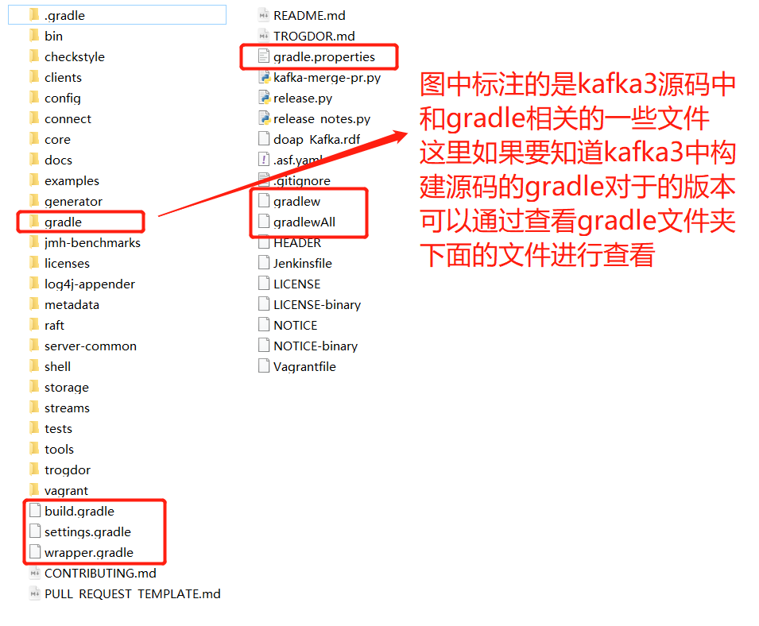
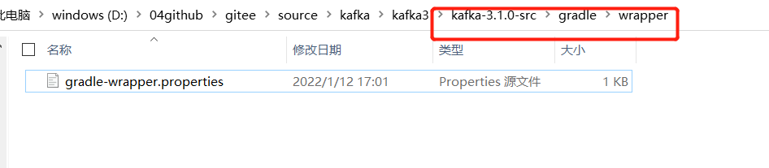
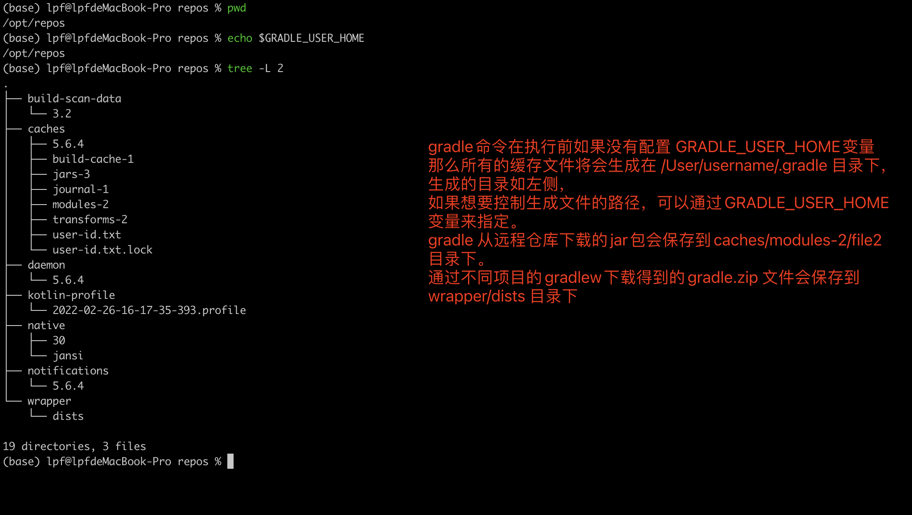
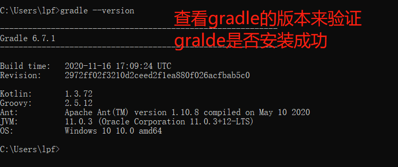
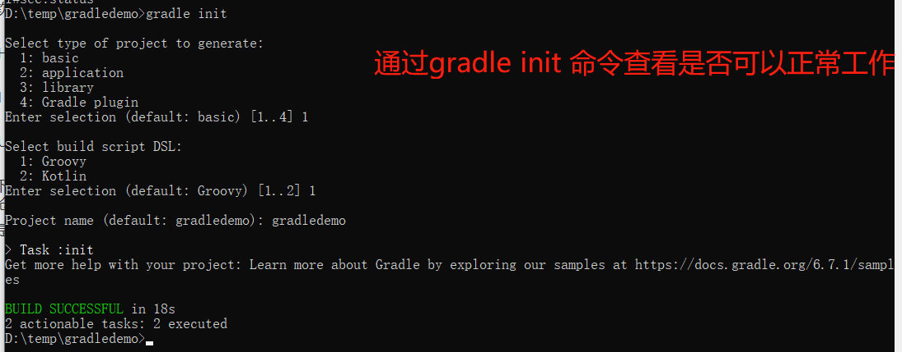

# Gradle 软件的安装

以下内容主要是针对自己一些工作学习中的经验进行编写，和大众的操作可能存在一些差异。

首先，安装 Gradle 软件，需要根据具体的情况来进行分析，如果是搭建源码阅读环境的时候，需要安装 Gradle 环境，那么会根据要阅读的源码来确定下载具体哪个版本的安装包。

如果是自己要使用 gradle 来构建项目，有两种选择，第一种是直接下载最新版本的 gradle，另一种我的做法就是参考 Spring 源码中使用的 gradle 是哪个版本的，来和它保持一致。 主要是 Spring 在使用 gradle 构建一个大型的项目的过程中，会对 gradle 进行很多的深入研究，我们可以从它的构建文件中，学习很多东西，来帮助我们解决一些问题，一味的找最新版本不一定是好的。

## 安装 JDK 环境

gradle 的运行依赖于 JDK。

## 确定源码中使用的 gradle 的版本

因为最近在看 kakfa3 的源码，且 kafka3 正好也是使用 gradle 进行构建的，因此这里就以 gradle3.1.0 源码为例进行说明.





一般会直接去源码目录下， kafka-3.1.0-src/gradle/wrapper/gradle-wrapper.properties 文件中查看源码构建使用的 gradle 的版本。

该文件中的内容如下：

```properties
distributionBase=GRADLE_USER_HOME
distributionPath=wrapper/dists
distributionSha256Sum=a8da5b02437a60819cad23e10fc7e9cf32bcb57029d9cb277e26eeff76ce014b
distributionUrl=https\://services.gradle.org/distributions/gradle-7.2-all.zip
zipStoreBase=GRADLE_USER_HOME
zipStorePath=wrapper/dists
```

从文件中，可以知道构建 kafka3 源码时使用的是 gradle-7.2-all.zip 这个版本的软件。

那么我们在搭建 kafka3 源码的时候，也是建议使用这个版本的软件。

## 安装 gradle 软件

一般确定好要安装的 gradle 的软件版本之后，会直接去 gradle 的官网 （https://gradle.org/ ） 去下载指定版本的安装包。

下载之后一般需要配置三个环境变量：

### 配置 **GRADLE_HOME** 变量

该变量主要是指向 Gradle 的安装目录下，配置该变量，注意是为了后续 Gradle 版本变更的时候，可以快速的进行调整 。

下次变更 Gradle 版本的时候，只有将 GRADLE_HOME 指向新的 gradle 安装路径即可。

没什么特别要注意的。 这里不是针对小白看的文档，所以不做详细说明。

在 linux 系统下，在/etc/profile 文件的最后一行添加如下配置（这里后面的路径以实际安装的路径为准）

```
export GRADLE_HOME = /usr/local/software/gradle/
```

在 window 系统中，自行百度吧。

### 配置 PATH 变量

配置该变量主要是为了可以在任何路径下可以直接找到 Gradle 的软件。

在 window 系统下，将 %GRADLE_HOME/bin 目录添加到系统的 PATH 路径下。

在 Linux 下，在 /etc/profile 文件的最后一行添加如下的配置

```
export PATH=$PATH:$GRADLE_HOME/bin
```

### 配置 GRADLE_USER_HOME 环境变量

配置该变量，注意是为了控制 gradle 下载下来的一些依赖的保存路径。个人喜欢为 Gradle 单独设置一个本地仓库的地址，而不是和 maven 的本地仓库公用，而且，及时将 GRADLE_USER_HOME 配置的路径下，不仅仅保存的是下载的依赖，还有一些 其他的内容。

这里以 mac 系统下的内容做一下展示：



在 Windows 下，配置方式不细说，自行查询。

在 Linux 下，在/etc/profile 文件的最后一行添加如下配置：

```
export GRADLE_USER_HOME=/opt/data/repo_gradle
```

在 linux 下需要注意，需要给该路径设置恰当的权限。如果不知道怎么设置，直接执行如下命令

```shell
$> chmod 777 -R /opt/data/repo_gradle
```

## 修改 gradle 下载依赖为国内仓库

切换到 Gradle 的安装路径下，

在 $GRADLE_HOME/gradle/init.d/init.gradle 文件中，添加或替换为如下的内容

```conf
allprojects{
    repositories {
        def ALIYUN_REPOSITORY_URL = 'http://maven.aliyun.com/nexus/content/groups/public'
        def ALIYUN_JCENTER_URL = 'http://maven.aliyun.com/nexus/content/repositories/jcenter'
        all { ArtifactRepository repo ->
            if(repo instanceof MavenArtifactRepository){
                def url = repo.url.toString()
                if (url.startsWith('https://repo1.maven.org/maven2')) {
                    project.logger.lifecycle "Repository ${repo.url} replaced by $ALIYUN_REPOSITORY_URL."
                    remove repo
                }
                if (url.startsWith('https://jcenter.bintray.com/')) {
                    project.logger.lifecycle "Repository ${repo.url} replaced by $ALIYUN_JCENTER_URL."
                    remove repo
                }
            }
        }
        maven {
            url ALIYUN_REPOSITORY_URL
            url ALIYUN_JCENTER_URL
        }
    }
}
```

## 验证 Gradle 是否安装成功

执行如下的命令

```shell
$> gradle  --version
```

显示效果如下：



一般情况下，可以查看到 gradle 的版本，就说明 gradle 配置的没有什么问题了

但是我们可以跟进一步来进行验证

切换到一个空的路径下，执行如下的命令

```shell
$> gradle init
```

如果效果如下，



并且在 $GRADLE_USER_HOME 目录下创建了多个文件夹，则说明 gradle 是可以正常工作的。

## Gradle 的相关资料

https://books.didispace.com/GradleUserGuide/ gradle 官方文档的翻译版

https://github.com/DONGChuan/GradleUserGuide gradle 官方文档翻译版在 github 上面的托管的地址

## 在内网中使用 Gradle 注意事项

1. 根据配置好的 gradle 项目目录下的 gradle/wrapper/gradle-wrapper.properties 的 distributionUrl 中 gradle 的版本来下载恰当的 gradle 版本
2. 将下载好的 gradle 解压，并配置 GRADLE_HOME 环境变量指向刚刚解压后的路径。
3. 配置 GRADLE_USER_HOME ，指向将来 gradle 依赖和插件的存放路径，将这个指向的地址和 maven 的本地仓库建议分别设置为两个地址。（也可以保存一致）
4. 编辑上面说的 gradle-wrappeer.properties 中 distributionUrl 的取值，设置为我们下载的 gradle 压缩包的绝对路径，访问协议为 file。 如下

```
distributionUrl=file:///d:/software/gradle/gradle-7.5.2.zip
```

5. 切换到 gradle 项目下，执行 gradle tasks 或者其它的 gradle 命令，就可以正常使用 gradle 了。

## 变更记录

| 内容                                                    | 类型   | 时间               |
| ------------------------------------------------------- | ------ | :----------------- |
| Gradle 软件的安装                                       | 初始化 | 2022-03-15(星期二) |
| 新增了对 gradle 依赖 JDK 的安装以及 gradle 安装后的验证 | A      | 2022-03-15(星期二) |
| 新增 gradle 官网文档翻译版的阅读地址                    | A      | 2022-03-15(星期二) |
| 新增 内网环境下使用 gradle 的一些内容                   | A      | 2022-12-06(星期二) |

A：append
