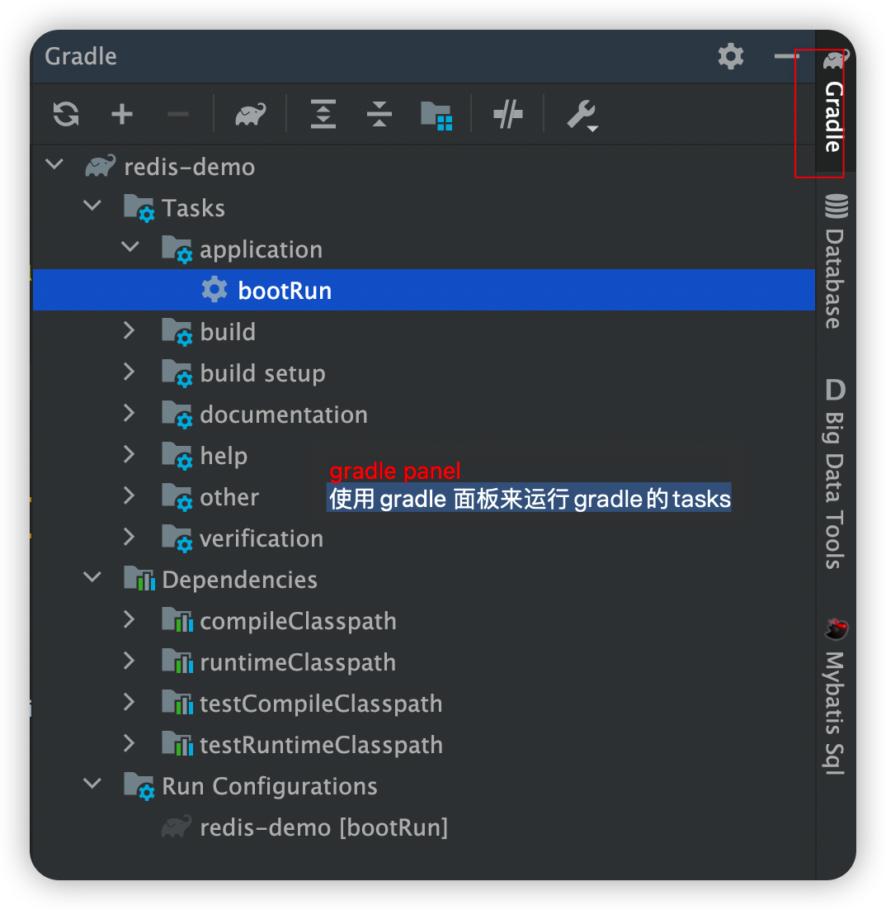
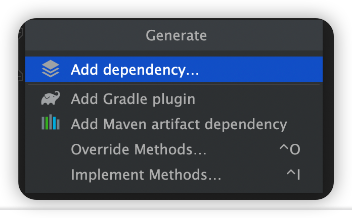

# Idea构建运行Gradle项目的一些建议

* Tip2: Use the Gradle panel to run tasks 
  * 使用Gradle的面板来运行任务
  

* Tip3: Customise your Gradle task executions 

* Tip4: Automatically import changes to build.gradle
  * 根据build.gradle 来自动更新变更内容
Tip5: Use idea to search for build dependencies 
  * 使用idea的搜索功能来提那件构建时的依赖信息
  * 定位到build.gradle 文件 右键，选择Generate
  
  * 之后就可以搜索相关的依赖了。 
  * 

